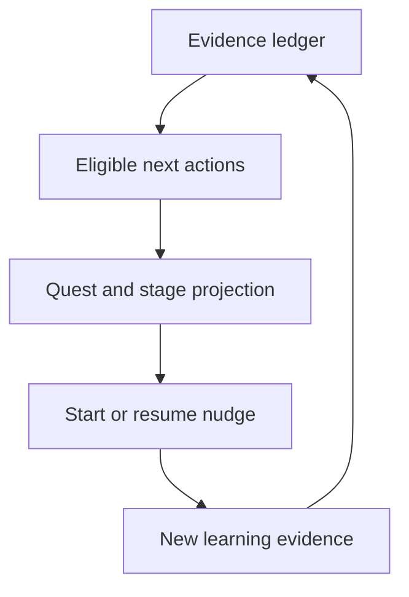

# 답안길 / Professional Exam Reasoning OS 통합 마스터플랜 v8

## Vertical-first, kernel-driven Professional Exam Coaching Platform

이 문서는 답안길의 감정평가사 2차 제품을 버리고 범용 서비스를 새로
만들자는 문서가 아니다.

> **답안길 감정평가사 2차를 첫 번째 완성 vertical로 유지하면서, 그 안의
> 검증 가능한 학습 원리를 범용 `Professional Exam Reasoning OS` 커널로
> 분리해 다른 전문직 시험을 안전하게 컴파일할 수 있게 만드는 전략**이다.

이 문서는 비권위 Owner 전략 문서다. 이 문서만으로 다음을 승인하지
않는다.

- runtime, schema, migration, RLS, dependency 또는 provider 변경
- 실제 Golden/private learner content 처리
- Owner 또는 외부 계정 activation
- 결제, entitlement, checkout, refund 또는 가격표 변경
- Production 배포, 공개 판매, 광고 또는 효능 주장
- 새 시험 adapter의 learner-facing 공개
- OR-Tools, ts-fsrs, pyBKT, IRT, QTI, xAPI 또는 Cytoscape.js 설치·활성
- online reinforcement learning, 자동 model fine-tuning 또는 learner-facing
  합격확률

실제 구현은 live authority가 허용하는 별도 Work, exact scope, test,
review와 명시적 Owner 승인으로 수행한다.

---

## v8 control-plane override — 2026-08-05

이 절은 아래에 그대로 승계한 v7 세부 계약보다 우선한다. v7의 학습 커널,
시험 adapter, Trust, privacy, 측정, 가격과 상용화 경계는 이 절에서 명시적으로
바꾸지 않은 한 유지한다. 반대로 v7 안의 2026-07-28 PR 상태, O4V enterprise
전제, PR #667 실행 절차와 당시 SHA는 역사적 provenance일 뿐 현재 실행
입력이 아니다.

### V8.1 이번 버전의 결론

v8은 플랫폼을 다시 설계하지 않는다. 다음 네 가지를 한 문서에서 닫는다.

1. v7의 `Professional Exam Reasoning OS`와 감정평가사 2차 학습 계약을 보존한다.
2. 현재 운영 profile을 enterprise O4V가 아니라 Lean Owner-private로 고정한다.
3. 실제 공부를 시작하고 이어가게 만드는 `Learner Momentum Layer`를 추가한다.
4. 작은 명령마다 새 Work를 만드는 운영을 `WorkEnvelopeV2` 기반 원자적
   작업 단위로 교정한다.

제품의 최상위 목적은 변하지 않는다.

> **AI 사용량이나 연속 접속이 아니라, 사용자가 AI 없이 미사용 문제를
> 제한시간 안에 해결하는 능력을 더 적은 피로와 방해로 키운다.**

| v7에서 그대로 유지 | v8에서 새로 고정 |
| --- | --- |
| vertical-first, kernel-driven | Lean Owner-private operating profile |
| structured tutor FSM | evidence-backed quest와 stage projection |
| attempt/assistance/exposure/mastery 분리 | ethical nudge와 재시작 설계 |
| D+7 verified-variant transfer | 단계형 성취와 optional celebration |
| Today CoreOutcome 최대 3 | 5·15·30분 시작점과 복귀 UX |
| raw learner data private | notification payload metadata-only |
| engagement는 secondary metric | engagement가 learning을 해치면 자동 중단 |
| 별도 commercial gate | active price와 paid cohort는 여전히 없음 |

### V8.2 현재 제공 checkpoint와 실행 hold

다음은 2026-08-05 현재 대화에서 Owner가 제공한 terminal 결과다. live
GitHub를 다시 읽어 얻은 값이 아니며, 역사적 사실을 넘어서 현재 ref로
추정하지 않는다.

| 항목 | 고정 상태 |
| --- | --- |
| prior object-acquisition command | `1_OF_1_CONSUMED` |
| replacement object-acquisition command | `1_OF_1_CONSUMED` |
| 결과 | `PRE_GATE_FAILED_NO_FETCH` |
| 실패 단계 | `CURRENT_REPOSITORY_BINDING_GATE` |
| fatal | `fatal: git cat-file: could not get object info` |
| replacement bounded fetch | `NOT_STARTED` |
| network-capable process | `0` |
| required object acquired | `False` |
| ref/index/worktree unchanged verified | `False` — 변경 증거가 아니라 사후 검증 미도달 |
| merge / Node / launcher preflight | `0 / 0 / 0` |
| Supabase SQL·psql·canary·residue | `0` |
| GitHub mutation / packet extraction | `0 / 0` |
| interactive credential input | `0` |
| rerun | `DO_NOT_RERUN=1` |

이 checkpoint 이후 Owner는 **expected-stderr 문제를 제거한 새로운 교정
object-acquisition 명령의 1회 공개와 Owner-local 1회 실행**을 별도로
승인했다. 그 승인은 정확히 한 번의 bounded `git fetch`만 허용하며, merge,
Node, launcher, Supabase, GitHub mutation, interactive credential input 또는
retry #5를 허용하지 않는다. 위에서 소비된 두 명령의 `DO_NOT_RERUN=1`은
그대로 유지된다.

이전 연속성에서 복구된 대상 binding 후보는 다음과 같다. 이는 다음 명령에
그대로 넣는 승인이 아니라, exact prior command 또는 새 read-only binding과
대조할 값이다.

| binding | 후보 값 |
| --- | --- |
| PR branch | `agent/s236p-lean-owner-private` |
| target commit | `1cd68c5bc23f19ad6332351bb40f757d249c1f1a` |
| target tree | `77f6aaa6981d6a18d2742424442c7ce1b1b0fee8` |
| sole parent | `e0526e3586724eed5f95005b1c26c538a8c46ad2` |
| repository | `chachathecat/inverge` |
| remote branch | `refs/heads/agent/s236p-lean-owner-private` |
| acquisition source | exact target OID `1cd68c5bc23f19ad6332351bb40f757d249c1f1a`; destination ref 없음 |

위 binding은 2026-08-05 read-only GitHub reconciliation에서 PR #676의
open/Draft/mergeable head와 commit metadata를 대조한 값이다. Owner-local
명령은 `origin`이 이 repository를 가리키는지 먼저 확인하고, ref를 갱신하지
않는 exact-OID fetch를 사용해야 한다.

현재 두 소비 명령은 되살리지 않는다. 새 교정 object-acquisition Work는
`absence probe → current repository binding → bounded fetch 1회 → object/tree/
parent 검증 → ref/index/worktree 불변 증명`을 하나의 원자적 명령으로 묶는다.
merge, Node, launcher, Supabase, GitHub mutation과 credential 입력은 그 Work에
자동 포함하지 않는다.

이 좁은 hold는 v8 문서 통합, offline 설계, test fixture 작성과 다른
side-effect-free 작업을 막지 않는다.

### V8.3 `WorkEnvelopeV2` — 잘게 쪼개지 않는 운영 계약

기존의 엄격한 안전 경계는 유지하되, **명령 공개 횟수**와 **실제 side
effect 시도 횟수**를 같은 것으로 취급하지 않는다. 이 정책은 앞으로의
Work에 명시적으로 채택될 때만 적용하며, 이미 소비된 위 두 명령을
소급해서 복원하지 않는다.

```ts
type WorkEnvelopeV2 = {
  id: string;
  objective: string;
  riskClass:
    | "offline_docs"
    | "repository_local"
    | "owner_private_synthetic"
    | "external_or_production";
  exactBindings: string[];
  allowedActions: string[];
  prohibitedActions: string[];
  preGates: string[];
  sideEffectBoundary: string;
  logicalActionBudget: number;
  offlineRepairPolicy: "within_envelope" | "new_authority_required";
  transportRetryPolicy: "none" | "byte_identical_once";
  stopConditions: string[];
  requiredPostEvidence: string[];
};
```

운영 원칙:

1. read-only inspection, deterministic fixture와 문서 검증은 같은 envelope
   안에서 필요한 만큼 수행한다.
2. 예상되는 object absence·HTTP denial·negative fixture는 throw가 아니라
   structured result로 캡처한다.
3. side effect가 시작되기 전 pre-gate bug는 logical live attempt가 아니다.
4. 다만 현재 Work 문구가 command disclosure 자체를 1회로 제한했다면 그
   기존 문구를 우회하지 않는다.
5. 한 logical job은 필요한 정적 gate, action, post-verification과 cleanup을
   한 번에 포함한다.
6. byte-identical transport retry는 envelope에 미리 허용된 경우에만 최대
   1회다.
7. real content, external learner, billing, Production과 destructive mutation은
   계속 exact one-time 또는 더 엄격한 별도 authority를 요구한다.
8. 실패 결과는 `무엇이 실행됐는가`와 `어디까지 검증됐는가`를 분리해
   기록한다. `unchanged_verified=false`를 `changed=true`로 해석하지 않는다.
9. 정상적인 개발 test 실패와 코드 교정은 한 implementation Work 안에서
   반복할 수 있어야 한다. 매 test failure마다 새 전략 Work를 만들지 않는다.
10. packet·launcher·one-time live ceremony는 고위험 경계에만 사용하고,
    보통의 Owner-private 개발 루프에는 일반화하지 않는다.

권장 단위는 다음과 같다.

| Work 종류 | 한 envelope에서 끝낼 범위 |
| --- | --- |
| docs/source | 조사 → 작성 → lint/link/schema 검사 → hostile review → 산출물 |
| local implementation | live code 조사 → 구현 → focused/full test → 교정 → diff review |
| synthetic private acceptance | static gate → fixture provision → acceptance → residue check → cleanup |
| external/Production | exact preflight → 승인된 1회 action → post-evidence → 자동 중단 |

### V8.4 Learning Momentum Layer의 자리

이 계층은 새 mastery 원장도, engagement 최적화 엔진도 아니다. canonical
evidence policy가 이미 승인한 `InterventionDecisionV1`과 `ReviewUnitV2`를
사용자가 실제로 시작·재개·완료하도록 돕는 **재계산 가능한 projection**이다.



권위 방향은 항상 왼쪽에서 오른쪽이다.

- quest가 mastery를 만들지 않는다.
- badge가 evidence qualification을 바꾸지 않는다.
- notification이 ReviewUnit priority를 쓰지 않는다.
- streak, XP, app time 또는 message count가 `stable`, weakness, readiness 또는
  pass state를 바꾸지 않는다.
- reward를 받기 위해 task를 중복 제출해도 append-only evidence와
  idempotency gate가 한 번만 인정한다.

기본 UI 어휘는 전문적이고 차분하게 유지한다.

- `오늘의 퀘스트` 또는 중립형 `오늘의 관문`
- `다음 한 걸음`
- `간극 수리`
- `무도움 전이 확인`
- `D+1 회상`, `D+7 유지`
- `실전 통합`

`보스전`, 강한 animation과 게임 테마는 사용자 선택 theme에서만 허용한다.
기본값은 시험 준비 도구의 신뢰감을 훼손하지 않는 neutral theme다.

### V8.5 진행 단계와 사실에 맞는 성취

진행도는 숫자 하나가 아니라 evidence class를 분리해 보여준다.

```ts
type ProgressEvidenceClassV1 =
  | "participation_only"
  | "learning_action_completed"
  | "independent_attempt"
  | "verified_repair"
  | "verified_transfer"
  | "delayed_retention"
  | "timed_integration";

type MomentumStageV1 =
  | "orient"
  | "attempt"
  | "repair"
  | "transfer"
  | "retain"
  | "integrate";
```

| Stage | learner-visible 의미 | 필요한 최소 증거 | 금지된 과장 |
| --- | --- | --- | --- |
| Orient | 요구와 제약을 잡음 | bounded orientation artifact | 개념 습득 완료 |
| Attempt | 내 답·방법을 먼저 냄 | pre-feedback commitment + attempt | 정답 숙달 |
| Repair | 가장 큰 간극을 다시 수행 | verified rewrite/recalculation | 독립 전이 |
| Transfer | 새 변형을 무도움 해결 | unused verified variant, assistance 0 | 장기 유지 |
| Retain | 시간 뒤 다시 꺼냄 | D+1/D+7 policy-qualified evidence | 영구 숙달 |
| Integrate | 제한시간 전체 수행 | qualified timed set/full solution | 공식 합격 준비 완료 |

성취 label은 underlying evidence보다 강할 수 없다.

- `첫 시도 완료`는 participation/attempt 사실만 말한다.
- `간극 수리 확인`은 verified repair까지만 말한다.
- `무도움 전이 확인`은 qualifying transfer가 있을 때만 말한다.
- `D+7 유지 확인`은 exact window와 variant gate를 통과해야 한다.
- `stable`은 기존 canonical `MasteryStateV1`만 결정한다.

stage는 learner 전체에 붙는 전역·불가역 level이 아니다. concept×ReviewUnit별
projection이며 source/policy stale, evidence expiry, 새 qualifying failure와
counter-evidence가 생기면 reopen 또는 하향 재계산할 수 있다. 과거 성취
event는 지우지 않지만 현재 stage와 동일시하지 않는다.

### V8.6 quest와 시작 장벽 낮추기

Momentum이 참조하는 queue와 Today도 prose가 아니라 canonical projection을
가진다.

```ts
type ReviewUnitV2 = {
  id: string;
  learnerScopeRef: string;
  sourceEvidenceRefs: string[];
  conceptRefs: string[];
  diagnosticCauseRefs: string[];
  taskKind: ReviewTaskKindV1;
  dueAt: string;
  estimatedMinutes: number;
  priorityReasonCodes: string[];
  independentRequirement: "required" | "not_required";
  completionCriterionRefs: string[];
  qualification: "independent" | "assisted" | "ineligible";
  status: "queued" | "due" | "in_progress" | "completed" | "snoozed" | "stale";
  policyVersion: string;
  projectionChecksum: string;
};

type TodayPlanV1 = {
  learnerScopeRef: string;
  localDate: string;
  availableMinutes: number;
  coreOutcomeRefs: string[]; // 0..3
  executionBlockRefs: string[]; // 0..N
  recoveryState: "normal" | "reduced_capacity" | "backlog_recovery";
  reasonCodes: string[];
  evidenceThroughRef: string;
  policyVersion: string;
  projectionChecksum: string;
};
```

```ts
type QuestDefinitionV1 = {
  id: string;
  learnerScopeRef: string;
  sourceDecisionRef: string;
  reviewUnitRefs: string[];
  stage: MomentumStageV1;
  titleCode: string;
  reasonCodes: string[];
  expectedMinutes: number;
  durationClass: "micro" | "focus" | "deep" | "adapter_timed";
  completionCriterionRefs: string[];
  independentQualificationRequired: boolean;
  themeVariant: "neutral" | "gameful";
  policyVersion: string;
  projectionChecksum: string;
};
```

규칙:

1. learner-facing top-level quest는 기존 `CoreOutcome 0..3`과 동일한 상한을
   사용한다. quest를 추가해 Today max 3를 우회하지 않는다.
2. 한 quest 안에는 `ExecutionBlock 0..N`이 있을 수 있다.
3. 5분 task는 큰 공부를 대체하는 가짜 easy win이 아니라, 동일 ReviewUnit의
   orientation·recall·첫 계산·한 문단 rewrite처럼 실제 evidence를 남기는
   진입점이다.
4. 감정평가사 2차 UI는 5·15/20·30·60분과 registry-derived 100분 timed
   mode를 제공할 수 있다. universal contract는 adapter의 exact duration을
   받아 다른 시험시간을 막지 않는다.
5. 선택권은 동일한 학습 가치의 후보 2개 안에서 제공할 수 있다. 선택으로
   measurement gate, overdue high-risk task 또는 source block을 우회하지 않는다.
6. 완료 조건은 client animation이나 button click가 아니라 server-derived
   evidence ref다.
7. 동일 idempotency key, replay, multi-tab과 offline sync로 중복 성취를
   만들지 않는다.
8. 계획된 휴식, illness와 backlog recovery는 실패가 아니다. schedule을
   재계산하고 다음 재시작 지점을 남긴다.

### V8.7 지루함을 줄이는 variation policy

지루함을 줄인다는 이유로 검증되지 않은 랜덤 문제나 화려한 보상을 넣지
않는다. `VariationPolicyV1`은 evidence policy가 승인한 후보 안에서만 다음을
바꾼다.

- recall, compare, rewrite, recalculate, case flip과 timed block의 modality
- 동일 concept의 표면 맥락과 representation
- 실무·이론·법규의 interleaving — Owner-only에서 검증할 제품 가설
- 혼자 쓰기, 말로 요약, 계산기 입력, 도식화 중 허용된 표현 방식
- 짧은 시작과 깊은 block의 순서

안전 제약:

- Measurement Lane의 held-out family는 노출하지 않는다.
- novelty가 exam relevance보다 높은 priority가 될 수 없다.
- 사용자가 명시한 `reduced_capacity` 또는 관측된 backlog가 있으면 무조건
  난도를 올리지 않는다. 건강·감정 상태를 몰래 추론하지 않는다.
- 같은 쉬운 task 반복으로 진행도를 farming하지 못한다.
- variety 선택은 deterministic reason과 policy version을 남긴다.

### V8.8 ethical nudge

```ts
type NotificationPreferenceV1 = {
  enabled: boolean;
  channels: ("in_app" | "pwa_push")[];
  quietHoursLocal: { start: string; end: string };
  timezone: string;
  pwaDailyDeliveryCap: 0 | 1;
  allowedKinds: NudgeKindV1[];
  updatedAt: string;
};

type NudgeKindV1 =
  | "planned_start"
  | "due_recall"
  | "resume_interrupted"
  | "overdue_recovery"
  | "milestone_available";

type NudgeDecisionV1 = {
  id: string;
  learnerScopeRef: string;
  recommendedReviewUnitRef: string;
  alternativeReviewUnitRefs: string[]; // 0..2, same eligibility class
  kind: NudgeKindV1;
  whyNowCodes: string[];
  availableActions: (
    | "start"
    | "snooze"
    | "skip"
    | "disable_kind"
    | "disable_all"
  )[];
  eligibleAt: string;
  expiresAt: string;
  snoozedUntil?: string;
  cooldownKey: string;
  preferenceVersion: string;
  policyVersion: string;
  contentTemplateCode: string;
  payloadClass: "metadata_only";
  status:
    | "eligible"
    | "suppressed"
    | "snoozed"
    | "dismissed"
    | "cancelled"
    | "delivered"
    | "expired";
};

type NudgeDeliveryEventV1 = {
  decisionRef: string;
  learnerScopeRef: string;
  channel: "in_app" | "pwa_push";
  result:
    | "delivered"
    | "suppressed"
    | "cancelled"
    | "provider_failed"
    | "expired";
  suppressionReasonCode?: string;
  occurredAt: string;
  idempotencyKey: string;
  payloadClass: "metadata_only";
};

type MomentumOutcomeSnapshotV1 = {
  learnerScopeRef: string;
  evidenceThroughRef: string;
  plannedQuestCount: number;
  startedQuestCount: number;
  resumedReviewUnitCount: number;
  independentCompletionCount: number;
  delayedQualifiedCompletionCount: number;
  dismissCount: number;
  snoozeCount: number;
  optOut: boolean;
  falseCelebrationCount: number;
  policyVersion: string;
  projectionChecksum: string;
};
```

초기 기본값:

- PWA push는 명시적 opt-in 전 OFF
- PWA push의 제품 hard max는 현 profile에서 1/day이며 설정으로 0만 가능
- in-app도 dismiss·snooze·전체 OFF 제공
- quiet hours와 timezone 준수
- 같은 ReviewUnit에 cooldown 적용
- `milestone_available`은 in-app only이며 PWA push 후보가 아님
- 문제·답안·OCR·오답 원인·법규 쟁점·점수 등 raw learner content를 OS
  notification payload와 provider log에 넣지 않음
- template은 closed code 기반이며 nudge마다 LLM을 호출하지 않음
- opt-out effectiveAt 이후 pending schedule을 취소하고 provider enqueue/send
  attempt는 0. 이미 OS/provider에 전달된 notification의 실제 표시를 회수할
  수 있다고 과장하지 않으며, cancel/enqueue evidence를 별도로 검증

금지:

- streak 상실·죄책감·수치심 문구
- 손실회피 countdown, loot box, 랜덤 보상과 dark pattern
- 허위 urgency와 시험 불안 자극
- notification을 열었다는 이유로 progress 부여
- cross-user leaderboard 또는 공개 비교
- 취침·건강·종교·성격 등 민감 추론으로 알림 timing 최적화
- open rate, CTR, app time, streak 또는 rhythm을 send-time, copy, candidate
  ranking과 promotion objective로 사용

### V8.9 celebration과 recovery

성취 표시는 짧고 사실에 맞으며 dismiss 가능해야 한다.

```ts
type CelebrationEvidenceClassV1 =
  | "verified_repair"
  | "verified_transfer"
  | "delayed_retention"
  | "timed_integration";

type MilestoneCelebrationV1 = {
  learnerScopeRef: string;
  milestoneCode: string;
  qualifyingEvidenceRefs: string[];
  progressEvidenceClass: CelebrationEvidenceClassV1;
  copyTemplateCode: string;
  visualIntensity: "none" | "subtle" | "standard";
  reducedMotionApplied: boolean;
  awardedAt: string;
  policyVersion: string;
  idempotencyKey: string;
};
```

- participation-only, 단순 attempt와 learning-action completion은 중립 사실
  표시만 허용한다. confetti, push와 rhythm credit를 부여하지 않는다.
- calendar consecutive-day count는 노출하지 않고 V8.11의 rolling learning
  rhythm만 사용한다.
- 휴식일, illness와 계획 변경에는 `재시작 지점`을 남긴다.
- streak freeze를 판매하거나 불안을 유발하지 않는다.
- 복귀 후 첫 eligible micro-step을 제시하되 overdue 전체를 한꺼번에 쌓지
  않는다.
- 색상·motion만으로 상태를 전달하지 않고 screen reader text를 제공한다.

### V8.10 learner UX override

Today Home의 첫 화면:

1. `지금 할 다음 한 걸음` 1개
2. 오늘의 top-level quest/CoreOutcome 최대 3개
3. 각 항목의 이유, 예상시간, assistance/independence 조건
4. `5분만 시작`, standard, deep mode
5. 중단한 episode가 있으면 exact resume point
6. progress map은 접힌 secondary surface

`지금 할 다음 한 걸음`은 최대 3개 quest/CoreOutcome 중 하나를 promoted
view로 보여주는 것이며 네 번째 top-level outcome이 아니다.

episode 종료:

- 오늘 수행한 사실 1개
- 아직 독립 확인 전인 것 1개
- 다음 확인 시점 1개
- 필요할 때만 subtle celebration

progress map:

- 전체 syllabus를 단순 완료율로 칠하지 않는다.
- concept마다 `미시도 / 도움 학습 / 수리 / 무도움 전이 / 지연 유지 / 실전
  통합`을 분리한다.
- evidence가 부족하면 빈칸 또는 `판단 보류`로 표시한다.
- graph, list와 table이 같은 정보를 제공한다.

#### Full-Day capacity 불변식

`Today max 3`는 하루 분량을 3개 block으로 제한한다는 뜻이 아니다. 계획은
다음 capacity 계약을 지킨다.

```ts
type FullDayCapacityV2 = {
  availableMinutes: number; // supported range 30..720
  reviewBudgetMinutes: number;
  coreOutcomeRefs: string[]; // 0..3
  executionBlockRefs: string[]; // 0..N
  plannedActiveMinutes: number;
  overflowActionRefs: string[];
  capacityPolicyVersion: string;
};
```

- `plannedActiveMinutes <= availableMinutes`
- queue의 당일 selection도 `reviewBudgetMinutes`를 넘지 않음
- overflow는 조용히 누락하지 않고 `defer / shorten / drop` 후보와 이유를
  표시
- 공식 timed block은 `canShorten=false`, `canSplit=false`; shorten 후보에서
  제외
- health, absence, fixed schedule과 backlog recovery가 capacity를 재계산
- 30분 low-capacity, 600분과 720분 full-day fixture를 모두 통과
- 600/720분 fixture에서도 top-level CoreOutcome은 0..3이고 block은 0..N
- replan, offline replay와 timezone 전환 뒤 총 active minute가 증가하거나
  중복 배치되지 않음

### V8.11 근거와 open-source 채택 결정

#### 연구를 제품 규칙으로 번역한다

- 학습 gamification 메타분석은 인지·동기·행동에 작은 긍정 효과를
  보고했지만 연구 이질성이 컸고, 엄격한 설계에서는 인지 효과가 가장
  견고했다. 경쟁만 사용한 조건은 경쟁과 협력을 함께 사용한 조건보다
  불리했다. 따라서 “XP를 붙이면 동기가 오른다”를 전제로 삼지 않는다.
  [Sailer & Homner meta-analysis](https://link.springer.com/article/10.1007/s10648-019-09498-w)
- 간격 학습, retrieval practice, worked example과 problem solving의 교차는
  답안길의 Review Queue·reconstruct·D+1/D+7 설계와 직접 맞는다.
  [IES Practice Guide](https://ies.ed.gov/ncee/wwc/practiceguide/1),
  [Karpicke & Roediger 2008](https://pubmed.ncbi.nlm.nih.gov/18276894/)
- 위 근거는 spacing/retrieval 원리를 지지하지만 exact `D+1/D+7` window를
  그대로 검증한 것은 아니다. 그 window는 versioned calibration 대상인
  제품정책이다.
- 약 6만 명 학생의 무작위실험에서는 streak 표시와 개인화된 긍정 reminder가
  generic/control보다 사용을 늘렸다. 약 1,500명 endline에서는 streak군이
  control보다 수학 성취가 높았지만 다른 처치군과의 차이는 유의하지 않았다.
  streak는 optional rhythm cue일 뿐 제품 권위가 아니다.
  [NBER working paper](https://www.nber.org/papers/w34173)
- 종단 준실험에서 leaderboard는 선택 연습을 늘리지 않았고 시험 점수를
  낮춘 결과가 보고됐다. 답안길은 공개 순위를 기본 기능으로 만들지 않는다.
  [University of Minnesota research record](https://experts.umn.edu/en/publications/a-longitudinal-quasi-experiment-of-leaderboard-effectiveness-on-l/)
- 교육이 아닌 digital-health message 실험에서는 말투만 부드럽게 만드는
  것보다 실제 선택지가 전체 평가를 개선했고, 관련성 효과는 autonomy 욕구가
  높은 하위집단에서만 유의했다. 학습성과 근거가 아닌 간접 design prior로만
  사용한다. nudge에는 추천 1개, 동등한 대안 최대 2개, `왜 지금인가`,
  예상시간, 미루기와 건너뛰기를 제공한다.
  [JMIR 2×2 experiment](https://www.jmir.org/2019/10/e14074/)
- 단일군 사전-사후 boredom pilot은 boredom에 대한 misbelief 변화만
  관찰했고 실제 지루함과 학습효과는 검증하지 않았다. variation policy는
  해당 연구의 입증 결과가 아니라 Owner-only 제품 가설이다.
  [Boredom Intervention Training pilot](https://journals.sagepub.com/doi/10.1177/08295735241227514)

#### dependency decision matrix — 2026-08-05 조사 기준

버전은 설치 명령이 아니라 조사 checkpoint다. 실제 도입 Work에서 공식
repository, license, release, lockfile, SBOM과 현재 runtime compatibility를
다시 검증한다.

| 후보 | 조사 상태 | 답안길의 역할 | 결정 |
| --- | --- | --- | --- |
| [ts-fsrs](https://github.com/open-spaced-repetition/ts-fsrs) | MIT, `ts-fsrs 5.4.1`; `@open-spaced-repetition/binding 0.5.0` | 규칙·요건·공식·판례 쟁점 같은 미세 회상의 due 후보 | **채택 후보**. native eligibility 뒤에만 사용하고 전체 답안 mastery를 카드 기억도로 환원하지 않음 |
| [XState](https://github.com/statelyai/xstate) | MIT, `xstate 5.32.5` checkpoint; v6 alpha 존재 | tutor/quest FSM의 executable spec | **조건부**. 단순 reducer가 부족할 때 v5 pin; server authority와 app-owned fixture/event replay 유지 |
| [React Joyride](https://github.com/gilbarbara/react-joyride) | MIT, 3.2.0 | 최초 3~5단계 또는 요청형 도움말 | **좁게 채택 후보**. 반복 overlay nudge로 사용 금지 |
| [React Flow](https://github.com/xyflow/xyflow) | MIT, `@xyflow/react 12.11.2` | ontology가 안정된 뒤 read-only mastery/path map | **후기 후보**. list/table parity와 Cytoscape.js 대안 benchmark 뒤 하나만 선택 |
| [canvas-confetti](https://github.com/catdad/canvas-confetti) | ISC, 1.9.4 | 진짜 지연·통합 milestone의 optional celebration | **선택적**. `disableForReducedMotion`과 1회 idempotency 필수 |
| [pyBKT](https://github.com/CAHLR/pyBKT) | MIT, 1.4.2 | 충분한 skill tag와 이력이 생긴 뒤 offline benchmark/shadow | **후기 shadow**. learner-facing mastery·Today write 금지 |
| [Habitica](https://github.com/HabitRPG/habitica) | code GPL-3.0; HabitRPG assets/content CC-BY-NC-SA-3.0; BrowserQuest assets CC-BY-SA-3.0 | quest·recovery pattern 연구 | **코드·asset 이식 금지**. HP 손실·gold economy·실패 처벌도 채택하지 않음 |
| [Moodle Level Up XP](https://github.com/FMCorz/moodle-block_xp) / [Completion Progress](https://github.com/jonof/moodle-block_completion_progress) | GPL, Moodle 종속 | threshold·anti-farming·진도 표현 참고 | **직접 통합 보류**. 독립 요구사항만 재설계하고 코드 복사 금지 |
| [H5P Node library](https://github.com/Lumieducation/H5P-Nodejs-library) | GPL-3.0, 별도 content runtime | branching interaction 참고 | **현재 보류**. Next.js core와 source governance에 과도함 |
| [Shepherd.js](https://github.com/shipshapecode/shepherd/blob/main/LICENSE.md) | AGPL-3.0 또는 commercial | onboarding tour | **회피**. 현재 후보에는 MIT 대안이 있음 |

어떤 dependency도 canonical 학습 계약이 아니다.

```text
described-only decision
→ license/SBOM/supply-chain review
→ static fixture
→ synthetic benchmark
→ Owner-private flag
→ native baseline 비교
→ keep / rollback / uninstall
```

- dependency 없이 동작하는 deterministic native baseline 필수
- exact version pin, provenance, integrity와 rollback
- 외부 telemetry 기본 OFF 또는 존재 자체를 차단
- raw learner body를 library-specific analytics에 전달하지 않음
- bundle size, accessibility, SSR/PWA와 offline conflict 검증
- dependency별 exact SPDX와 실제 배포·수정·network 사용 형태를 기준으로
  legal review한다. GPL과 AGPL의 의무를 동일하다고 가정하지 않으며, 코드·
  asset license를 섞지 않는다.

#### optional game theme vocabulary

neutral theme가 기본이며, 사용자가 gameful theme를 선택하면 같은 evidence
계약에 다음 label만 투영할 수 있다.

| neutral | optional gameful | canonical completion |
| --- | --- | --- |
| 간극 찾기 | Scout | biggest gap evidence |
| 구조 만들기 | Forge | outline/issue tree/calculation chain artifact |
| 간극 수리 | Repair | verified repair evidence |
| 지연 회상 | Recall | policy-qualified retrieval evidence |
| 제한시간 부분 수행 | Sprint | timed component evidence |
| 전체 실전 통합 | Boss | qualified timed full solution/mock |

label을 바꿔도 answer reveal, independence, timer와 mastery gate는 동일하다.

#### 학습 리듬, streak가 아니다

초기 Owner-only hypothesis로 `최근 7일 안에 의미 있는 evidence action 3회`를
학습 rhythm으로 보여줄 수 있다.

- rolling window이며 0으로 리셋되는 자산이 아님
- 휴식일과 reduced-capacity day 허용
- participation-only event는 의미 있는 evidence action으로 세지 않음
- 리듬을 잃었다는 guilt copy, 금전 결제와 기능 손실 없음
- baseline보다 D+1/D+7 또는 resume가 개선되지 않으면 제거

### V8.12 Lean Owner-private operating profile

장기 5-plane 아키텍처를 유지하되, 현재 PR #676과 Owner dogfood의 필수
profile은 다음처럼 좁다.

```ts
type LeanOwnerPrivateOperatingProfileV1 = {
  audience: "owner_only";
  bucket: "private";
  metadataRls: "minimum_owner_scoped";
  keyManagement: "managed_key";
  rawLogging: "off";
  fixtures: "synthetic_first";
  realContent: "off";
  production: "off";
  externalLearner: "off";
  billing: "off";
};
```

현재 acceptance를 막지 않는 비필수 항목:

- 88-binding materialization
- KMS/HSM 또는 독립 key ceremony
- 독립 verifier service
- Edge Function
- `pg_cron`
- persistent raw event log
- public bucket 또는 presigned URL product path

이 제외는 영구적 architecture 부정이 아니다. Real content, external learner,
Production 또는 효능 연구로 넘어갈 때 목적에 맞는 threat model과 operating
profile을 다시 승인한다.

Momentum layer도 같은 profile을 따른다.

- synthetic fixture와 Owner-only pseudonymous metadata부터 시작
- raw body를 quest·nudge·analytics event에 복제하지 않음
- model call 없이 deterministic projection 가능한 baseline 필수
- notification provider가 없어도 in-app fallback 또는 완전 OFF로 core loop가
  동작
- cost reservation 실패 시 celebration/nudge가 아니라 generation만 정확히
  fail-closed

모든 model route는 probe만이 아니라 공통 비용 원자성을 사용한다.

```text
eligibility
→ route/version별 cost estimate
→ daily/monthly/hard cap 확인
→ idempotent reservation
→ generation/validation
├─ usable result atomic commit → reservation commit
└─ failure/abstain/cancel       → reservation release
```

- retry, replay, multi-tab과 provider timeout의 이중 차감 0
- owner-configurable daily/monthly cap과 global kill switch
- route/model/prompt version별 p50/p95 cost와 usable-result rate
- 기존 결과 열람, manual note, deterministic projection, quest와 nudge에 새
  generation charge 0
- cap 초과 시 cheaper generic answer로 몰래 degrade하지 않고 정확한 blocked
  상태와 재시도 조건을 표시

### V8.13 통합 실행 순서

아래는 전략 순서다. live roadmap, lock과 exact authority를 자동 변경하지
않는다.

| 순서 | slice | 결과 | Momentum 범위 |
| ---: | --- | --- | --- |
| 0 | PR #676 hold 해소 | exact object acquisition과 Lean private-plane synthetic acceptance | 없음 |
| 1 | S236A | Owner-private Golden 3, rights/source/version | 없음 |
| 2 | S237A core | tutor FSM, evidence, Workbench, repair, D+1/D+7 | stage/progress event만 |
| 3 | S237M.0 | deterministic quest projection behind Owner-only flag | 알림 없음 |
| 4 | S237P | Native Full-Day와 recovery planning | quest→ExecutionBlock 연결 |
| 5 | O4A / S238A | Owner-only activation·baseline dogfood | neutral UI, in-app only |
| 6 | S237M.1 | path map·evidence milestone·variation | reduced-motion 포함 |
| 7 | S240A | extended dogfood·baseline comparison | nudge 후보 shadow |
| 8 | S237M.2 | explicit opt-in PWA nudge | quiet hours·cap·OFF |
| 9 | S241A | authenticated Owner-private acceptance | privacy·idempotency hostile test |
| 10 | commercial path | `O3C → S239A → S242C → O4F → S243C` | exact manifest 승인 시만 |

핵심 원칙:

- Momentum은 S237A evidence core를 앞서지 않는다.
- progress UI는 early value가 될 수 있지만 external sale gate를 대체하지 않는다.
- heavy generic platform refactor, pyBKT, OR-Tools, adaptive nudge와 social
  competition은 critical path blocker가 아니다.
- 감정평가사 1차·다른 전문직 확장은 2차 Owner-private acceptance와 adapter
  gate를 보존한다.

### V8.14 측정과 중단 기준

Momentum의 proximal mechanism은 evidence-qualified 독립행동의 시작·재개다.
그러나 promotion objective는 항상 Tier 1 learning이다.

Tier 1 outcome:

- D+7/D+30 qualifying retention
- unassisted held-out와 far-transfer gain
- 동일 오류 recurrence 감소
- timed set/full-solution quality와 completion
- assistance dependence 감소 또는 비열등

Secondary mediator:

- 계획 생성 → 실제 시작 전환율
- overdue ReviewUnit 재개율
- 중단 → resume까지 걸린 시간
- nudge 후 independent completion
- dismiss, snooze와 disable 선택

Safety/experience:

- dismiss, snooze, opt-out
- 알림 방해·피로·불안 self-report
- false celebration
- 중복 progress
- raw notification/log leak
- reduced-motion·keyboard·screen-reader parity

실험 순서:

```text
static fixture
→ synthetic simulation
→ Owner-private deterministic baseline
→ nudge 후보 hidden shadow
→ Owner 선택형 visible comparison
→ external learner는 별도 authority와 ethics gate
```

Owner-private N=1은 기능·안전·사용성과 within-owner descriptive signal만
제공하며 efficacy, 인과 또는 일반화 claim을 만들지 않는다. external efficacy는
별도 authority 아래 사전등록 protocol, 비교조건 또는 crossover, 표본·중단
기준, consent와 ethics gate를 요구한다.

실험 전에 Tier 1 비열등성 margin과 safety threshold를 고정한다. app time,
open/CTR, start/resume, rhythm 또는 satisfaction만 좋아지면 promotion하지 않는다.

다음이면 자동 hold 또는 rollback한다.

- Tier 1 learning metric 악화
- assistance dependence 증가
- D+1/D+7 대신 easy-task farming 증가
- opt-out·피로·방해의 사전 threshold 초과
- false mastery, raw leak 또는 Measurement Lane leakage 1건 이상
- deterministic fallback 없이 provider가 core loop를 막음

### V8.15 v8 추가 acceptance

| 영역 | 통과 | fail-closed |
| --- | --- | --- |
| progress authority | qualifying evidence ref로만 stage 전이 | click/view/save로 mastery 전이 0 |
| quest | Today top-level 0..3, server-derived completion | client spoof·중복 award 0 |
| independence | assisted와 independent milestone 분리 | reveal 뒤 독립 badge 0 |
| nudge | opt-in·quiet hours·hard cap·cooldown | opt-out effectiveAt 뒤 enqueue/send attempt 0 |
| privacy | metadata-only closed template | raw problem/answer/OCR payload 0 |
| measurement | held-out family 미노출 | quest/map/notification leakage 0 |
| accessibility | keyboard·screen reader·reduced motion | color/motion-only state 0 |
| resilience | deterministic projection·provider-off core | nudge outage로 학습 loop block 0 |
| replay | idempotent award와 projection checksum | retry/multi-tab farming 0 |
| evidence | Tier 1 비열등/개선 + mediator 관측 | app time·open/CTR·start/resume·rhythm만 개선 시 promotion 금지 |

### V8.16 active commercial state

현재 active price, paid cohort와 external launch authority는 **없다**.

69,000/79,000/399,000원, 69,000원 20단위, 39,000/49,000/89,000원은 모두
역사적 또는 비운영 가설이다. v8은 어느 숫자도 현재 가격표로 승격하지
않는다. exact offer manifest, unit, VAT, 기간, refund, entitlement, cost cap과
Owner approval이 결속된 exact commercial amendment, offer manifest와
`O4F/S243C` authority가 먼저 있어야 판매할 수 있다. 그 판매·예약·거절의
결과를 이후 `QualifiedPriceDecisionV1`로 기록한다.

Momentum 기능도 다음을 가격으로 팔지 않는다.

- streak 보호
- 불안 유발 notification
- evidence 없는 XP 또는 mastery badge
- paywall로 잠근 필수 학습 evidence

가격을 붙일 수 있는 가치는 계획·학습 문서·검증된 교정·무도움 전이·개인
계보와 안전한 재개 경험이다.

### V8.17 바로 다음 통합 단위

현재 program은 두 lane으로 진행한다.

1. **운영 lane:** 소비된 object-acquisition 명령을 재실행하지 않는다. exact
   remote/refspec까지 복구되고 새 authority가 생기면 PR #676의 acquisition와
   verification을 하나의 원자적 Work로 끝낸다.
2. **제품 lane:** 이 v8 artifact를 source candidate로 검증하고, repository
   mutation 권한이 생기면 역사적 prompt를 재사용하지 않는 docs-only Work
   하나로 설치한다. 그 뒤 S236A→S237A→S237M 순서를 따른다.

두 lane은 서로를 이유로 불필요하게 대기하지 않지만, 같은 repository lock과
exact-head gate가 충돌하면 live authority가 우선한다.

---

## 읽는 순서

- 현재 결정·Momentum·Lean profile·통합 순서: 먼저 `v8 control-plane override`
- 한 페이지 결론과 무엇이 달라지는가: 0~2
- 범용 사고 커널과 구조화된 튜터: 3~6
- 시험을 추가하는 compiler/adapter와 측정 체계: 7~8
- 감정평가사 2차 vertical의 보존된 상세 계약: 9~17
- 다른 전문직 시험 확장·기술·평가·UX: 18~21
- 실제 실행 순서와 acceptance: 22~25
- 최종 원칙과 참고: 26~27

---

## 0. 한 페이지 결론

### 0.1 최종 제품 정의

답안길의 목표는 AI가 답을 대신 잘 쓰는 것이 아니다.

> **사용자가 AI 없이 처음 보는 문제를 제한시간 안에 더 정확하게
> 해결하도록, 관찰 가능한 사고 행동을 순서대로 요구하고, 필요한 만큼만
> 돕고, 지연된 독립 전이로 실제 학습을 검증하는 전문직 시험 코칭 OS**다.

내부 플랫폼은 `Professional Exam Reasoning OS`다. 외부 제품은 시험별
vertical 브랜드로 유지한다.

```text
Professional Exam Reasoning OS
├─ Universal Reasoning Kernel
├─ Structured Tutor Protocol
├─ Exam Compiler + Adapter SDK
├─ Learner Evidence / Weakness / Intervention Engine
├─ Learner Momentum / Ethical Nudge Layer
├─ Measurement & Evaluation Platform
└─ Product verticals
   ├─ 답안길 감정평가사 2차        ← 첫 인증 vertical·현재 우선순위
   ├─ 답안길 감정평가사 1차        ← 다음 근접 adapter 후보
   ├─ 답안길 동차                   ← 두 state를 연결하는 product mode
   ├─ 답안길 Academy                ← tenant·instructor approval vertical
   └─ 향후 다른 전문직 시험        ← adapter gate 통과 후에만 추가
```

### 0.2 “사고를 강제한다”의 정확한 뜻

시스템은 사람 머릿속의 사적 사고를 완벽히 읽거나 강제할 수 없다. 대신
시험 성공에 필요한 **외현화 가능한 최소 사고 산출물**과 순서를 강제할
수 있다.

- 문제 요구를 먼저 식별한다.
- 답, 목차, 방법 또는 첫 계산 방향을 feedback 전에 commit한다.
- learner confidence를 feedback 전에 immutable하게 기록한다.
- AI는 최소 힌트부터 단계적으로 제공한다.
- full solution을 보면 독립 수행 자격을 잃었다는 사실을 숨기지 않는다.
- 사용자가 직접 재작성·재계산·재설명한다.
- near-miss, 반례, 조건 변화로 경계를 구별한다.
- 다른 verified variant를 D+7 이상 AI 도움 없이 풀어야 stable 후보가 된다.
- 제한시간 전체 문제에서 통합 수행을 다시 검증한다.

자유형 장문 “생각 과정”을 강제로 수집하지 않는다. 그것은 진짜 이해의
보증도 아니고 privacy·허위 서술·인지부하 위험을 만든다. 대신 adapter가
요구하는 bounded artifact를 수집한다.

```text
요구 동사 / 목표
→ 관련 사실·자료
→ 적용할 규칙·개념
→ 방법 선택과 배제 이유
→ 적용·계산·논증
→ 결론 또는 출력
→ 검산·반례·시간 확인
```

### 0.3 최종 학습 loop

```text
source/rights/version 확인
→ ORIENT: 문제 요구와 제약 식별
→ COMMIT: 답·방법·목차·confidence 선제 제출
→ ATTEMPT: 무도움 수행
→ DIAGNOSE: 오류 원인과 uncertainty 판정
→ SCAFFOLD: 최소 필요 힌트
→ RECONSTRUCT: 사용자가 원리·절차를 다시 설명
→ REPAIR: 다시 쓰기·계산하기·말하기
→ CONTRAST: near-miss·반례·조건 뒤집기
→ VERIFY: deterministic/rubric/source 검증
→ TRANSFER: 미사용 verified variant 무도움 수행
→ RETAIN: D+1·D+7·D+30
→ INTEGRATE: timed set/full solution/mock
→ SCHEDULE: 다음 최적 행동 1개, Today 최대 3개
→ START/RESUME: optional Momentum projection으로 실제 시작·재개
```

### 0.4 v7이 v6.1에 추가했고 v8이 승계하는 핵심

v6.1의 강점은 그대로 보존한다.

- `KeyConceptV2`
- 여섯 bounded explanation probe
- `PracticalDecisionPathV1`
- `ContrastSetV1`
- `timed_full_solution`
- 규칙 기반 `PersonalWeaknessMapV1`
- D+1/D+7, Trust, privacy, Owner/external evidence 분리
- pyBKT benchmark/shadow gate, OR-Tools optional boundary
- 39,000/49,000/89,000원 비운영 가격 가설

v7은 그 위에 다음을 새로 고정한다.

1. `ProfessionalExamReasoningKernelV1`
2. `TutorEpisodeStateMachineV1`
3. `ObservableReasoningArtifactV1`
4. `ProductiveStruggleBudgetV1`
5. `ScaffoldLadderV1`과 `AnswerRevealPolicyV1`
6. `DiagnosticCauseTaxonomyV1`
7. `InterventionPolicyV1`과 next-best-action objective
8. `ExamPackageManifestV1`과 Exam Compiler
9. 객관식·계산·법률·논술·구술·simulation modality adapter
10. Learning Lane과 Measurement Lane의 물리적 분리
11. assistance dependence·confidence calibration·far transfer 측정
12. `ReadinessEvidenceEnvelopeV1`과 learner-facing 합격확률 금지선
13. state→intervention→delayed outcome을 축적하는 Intervention Outcome Graph
14. cross-exam adapter isolation, promotion, rollback과 certification gate
15. 범용 커널을 현재 감정평가사 2차 critical path보다 먼저 과대 추상화하지
    않는 vertical-first 실행 원칙
16. exact learner-visible `LearnerReferenceCaveatV1`과 body-before placement gate
17. 독립 후보군·과목 validator·critic review·합의/충돌 해결·최종 release
    gate를 통과한 upstream `ReferenceAnswerReleaseArtifact`와의 exact binding
18. 외부 상용화의 현재 canonical path
    `S241A → O3C → S239A → S242C → O4F → S243C` 보존

### 0.5 제품 최적화 목적함수

제품은 사용시간, 대화량, AI 답안 품질 또는 assisted score를 최대화하지
않는다.

```text
Primary objective:
expected unassisted held-out transfer gain
────────────────────────────────────────────
effective learner minutes + fatigue cost + interruption cost + error risk
```

실제 정책에서는 다음을 함께 고려한다.

- 시험 중요도와 과락 위험
- current evidence의 신뢰도와 충분성
- 지연 망각 위험
- error recurrence
- assistance dependence
- transfer 가능성
- 예상 교정시간
- 법령·기준·source effective version
- learner 가용시간과 피로
- privacy·rights·cost eligibility

모델이 이 값을 직접 지어내지 않는다. 초기에는 versioned deterministic
rule baseline으로 고르고, adaptive policy는 별도 shadow 평가 뒤에만 후보가
된다.

### 0.6 절대 불변식

1. AI output 열람은 mastery가 아니다.
2. full solution을 본 성공은 독립 성공이 아니다.
3. 같은 문제·same-surface retry는 transfer가 아니다.
4. stable은 지연된 미사용 verified variant의 무도움 성공 없이는 부여하지
   않는다.
5. source·rights·effective version이 닫히지 않은 결과를 verified로
   release하지 않는다.
6. 모델은 qualification, outcome, verified, mastery 또는 pass readiness를
   자기 선언하지 못한다.
7. client는 tutor state, assistance, exposure, timer 또는 confidence를
   위조하지 못한다.
8. learner raw body를 shared graph, analytics, shadow dataset 또는 cross-exam
   training으로 자동 승격하지 않는다.
9. 새 시험은 prompt만 바꿔 출시하지 않는다. signed adapter package와
   certification gate를 통과한다.
10. 무엇을 공부할지는 evidence policy가 정하고, FSRS/OR-Tools는 허용된
    후보의 시점·배치만 보조한다.
11. 학습 효과는 unassisted held-out outcome으로 평가한다.
12. Owner dogfood는 제품을 강하게 만들 수 있지만 외부 효능·시장·가격을
    증명하지 않는다.

### 0.7 v7 historical PR #667 처리 결론 — 실행 금지

이 절은 v7이 만들어질 당시의 provenance다. PR #667은 이후 완료된 역사적
작업이며, 아래 SHA·branch·thread·sole-child 절차를 v8 설치나 PR #676에
재사용하지 않는다. 현재 checkpoint와 다음 순서는 V8.2·V8.13·V8.17이
대체한다.

2026-07-28 00:03 KST terminal report와 이후 read-only live 확인에서 PR #667은
첫 corrective까지 적용된 open Draft다. 기존 P2 두 건은 해결됐지만,
`ExplanationPacketV2`가 정식 reference-answer release pipeline의 upstream
release artifact에 결속되지 않은 채 `claims + verificationSummary`만으로
`usable`이 될 수 있다는 새 P2 한 건이 unresolved·non-outdated로 남아 있다.

old v6를 또 한 번 좁게 수정해 병합한 뒤 v7로 바꾸는 우회로를 사용하지
않는다. 현재 corrected head를 부모로 v7 단일 전략 파일로 직접 교체한다.

```text
current corrected-v6 Draft exact head 재검증
→ 새 P2를 흡수한 frozen v7 artifact 검증
→ 기존 PR #667 branch의 sole-child fast-forward corrective 1개
→ corrected-v6 path 제거
→ exact v7 path 하나만 aggregate에 남김
→ title/body/integrity evidence 갱신
→ 새 P2에 exact evidence로 답변·해결
→ Draft 유지
→ 별도 exact-head Ready/post-Ready review와 explicit merge
```

이 문서와 함께 제공되는 corrective Work prompt만 위 교체를 제안한다.
그 Work도 Ready, merge, auto-merge 또는 후속 구현을 승인하지 않는다.

---

## 1. v7 작성 시점 historical checkpoint와 금지선 — 현재값 아님

아래 2026-07-28 관측은 설계 provenance만 보존한다. 현재 GitHub·runtime
binding으로 사용하지 않으며 V8.2가 이 문서의 최신 제공 checkpoint다.

2026-07-28 00:03 KST terminal report 기준 read-only 관측:

| 대상 | 관측 상태 |
| --- | --- |
| `main` | `a454c5154df23e66f7a7434cec5b60ff8bd76c1f` |
| `main` tree | `2403f1f90de0fd8260fdd7485eee9b726cc0471c` |
| PR #662 | terminal squash-merged |
| PR #662 final corrected tree | `2403f1f90de0fd8260fdd7485eee9b726cc0471c` |
| PR #667 | open Draft, mergeable, unmerged, auto-merge OFF |
| PR #667 head | `2354e30a7e1fc08ede2eda1bb78cf78fce88a3a7` |
| PR #667 head tree | `d256711829444d11d7b5cd00c0d1dc044188436f` |
| PR #667 head sole parent | `9d2960e2774dbf396fa6804aa34923eafda93e2c` |
| PR #667 branch | `agent/dabangil-master-plan-v6-strategy` |
| PR #667 aggregate | corrected v6 단일 added file, `+1683/-0`, main보다 2 commits ahead |
| current artifact | SHA-256 `c3a8b5558b7d8b11791dcb61428f0e1af65477ef38376ff0dee85abec595bfa8`, 55,233 bytes, 1,683 lines |
| required checks | PR Contract, Risk Gate, Runtime Gate, Fast CI, Full CI, Learner Loop Health, Vercel 7/7 success |
| resolved findings | learner-visible caveat P2, canonical commercial path P2 |
| unresolved finding | `Bind packets to the reference-answer release artifact` P2 |
| PR #660 | open Draft at historical observation `4c5694e4c65a110aede39762421abb49afd653f5` |
| public/billing/external learner | OFF |

위 값은 expected historical observation일 뿐 mutation 입력이 아니다. 모든
Work는 GitHub, `AGENTS.md`, dated Owner decisions, canonical Markdown와
machine-readable contracts, `roadmap/active-program.yml`, locks, CI, reviews와
exact auto-merge state를 다시 읽는다.

### 1.1 corrected v6, v6.1 candidate와 v7을 동시에 남기지 않는다

전략 원장은 하나여야 한다.

- main에는 corrected v6도 v6.1도 v7도 없다.
- PR #667에는 corrected v6 경로 하나만 aggregate에 있다.
- 첨부 v6.1은 repository source가 아니다.
- v7이 v6·v6.1의 전략상 내용과 PR #667 corrective에서 확정된 caveat,
  canonical commercial path 및 새 release-artifact binding을 모두 승계한다.

따라서 corrective aggregate는 정확히 v7 단일 added file이어야 한다.
corrected v6, v6.1, installer prompt 또는 이 Work prompt를 repository 전략
문서로 동시에 추가하지 않는다.

### 1.2 현재 금지선

이 전략 교정과 이후 구현을 섞지 않는다.

- PR #667: docs-only strategy correction
- learning authority amendment: 별도 Work
- runtime/schema/RLS: 별도 Work
- model/dependency installation: 별도 Work
- commercial/billing: 별도 Work
- Owner activation: 별도 Work
- external canary: 별도 Work
- 다른 전문직 adapter: 감정평가사 2차 acceptance 뒤 별도 Work

---

## 2. 왜 범용 챗봇이 아니라 구조화된 Tutor OS인가

### 2.1 task performance와 learning은 분리한다

연습 중 AI가 답을 만들어 성적을 올리는 것과, AI가 사라진 시험장에서
사용자가 혼자 푸는 능력은 다르다.

2025년 고교 수학 대규모 무작위 실험에서는 일반적인 GPT형 도구가 연습
성능을 높였지만 AI를 제거한 시험 성적은 control보다 낮아질 수 있었고,
교사가 설계한 힌트와 answer-withholding guardrail이 그 손상을 크게
완화했다. 따라서 답안길의 primary metric은 assisted correctness가 아니라
unassisted exam-like performance다.

2025년 Harvard 물리 수업 RCT의 custom tutor도 system prompt만으로는
복수 단계 문제를 안정적인 순서로 scaffold하지 못해, 플랫폼이 각 단계를
순차적으로 통제했다. 즉 “좋은 tutor가 되어라”라는 prompt보다 state
machine과 problem-specific structure가 중요하다.

OECD Digital Education Outlook 2026도 범용 GenAI가 task performance를
높여도 자동으로 학습으로 이어지지 않으며, 명확한 교육 원리와 curriculum
alignment가 필요하다고 정리한다. 2026년 OECD 고등교육 정책 문서 역시
reliability, data protection, skill development와 pilot evaluation을 함께
요구한다.

Tutor CoPilot RCT에서는 AI가 답을 대신 주는 것보다 사람 tutor에게 guiding
question과 pedagogical strategy를 제시했을 때 mastery가 개선되었다. 답안길도
모델의 지식을 전면에 내세우기보다 **좋은 질문, 최소 scaffold, learner의
재수행**을 전면에 둔다.

다만 이 연구들은 물리·수학·학교 tutoring 중심이며 한국 전문직 시험의
장기 합격률을 직접 증명하지 않는다. v7은 그 결과를 **설계 원리의 근거**로
사용할 뿐, 답안길의 효능 주장은 감정평가사·각 신규 adapter에서 별도의
unassisted held-out 및 전향적 external evidence로 검증한다.

### 2.2 연구 근거를 제품 요구사항으로 번역한다

| 관찰 | v7 설계 요구 |
| --- | --- |
| 범용 AI는 assisted task를 대신할 수 있음 | COMMIT 전 full answer 차단 |
| prompt만으로 순차 scaffold가 흔들림 | server-enforced tutor FSM |
| 학생은 copying이 학습을 해친다는 것을 체감하지 못할 수 있음 | pre-feedback confidence와 delayed test |
| 정답을 주지 않는 hint가 피해를 완화 | bounded scaffold ladder |
| 고품질 tutor는 guiding question을 사용 | diagnostic probe와 learner reconstruction |
| 과목마다 오류·채점 구조가 다름 | Exam Compiler와 modality adapter |
| AI가 항상 정확하지 않음 | source registry, deterministic validator, verifier |
| learning gain은 즉시 만족도와 다름 | D+1/D+7/D+30/held-out metric |

### 2.3 v7의 비목표

- 인간의 내적 chain-of-thought를 감시하는 제품
- 답을 절대 보여주지 않아 사용자를 가두는 제품
- 모든 문제에서 긴 설명을 의무 입력하게 하는 제품
- AI가 학생의 성격·지능을 추정하는 제품
- “합격확률 83.7%” 같은 근거 없는 숫자를 파는 제품
- 하나의 거대한 prompt로 모든 시험을 처리하는 wrapper
- 여러 agent가 서로 말하는 것 자체를 가치로 포장하는 system
- 학습량·streak·화려한 graph를 실제 transfer 대신 최적화하는 앱

---

## 3. Professional Exam Reasoning OS 아키텍처

### 3.1 여섯 층

```text
Layer 1  Trust & Authority
         official source · rights · effective version · rubric · validator

Layer 2  Universal Reasoning Kernel
         task decomposition · commitment · attempt · verify · transfer

Layer 3  Structured Tutor Protocol
         state machine · scaffold ladder · reveal/fading policy

Layer 4  Exam Compiler & Adapter SDK
         blueprint · skill graph · item family · modality · measurement

Layer 5  Learner Evidence, Intervention & Momentum
         mastery · weakness · calibration · assistance dependence · next action
         quest projection · stage · start/resume nudge · truthful celebration

Layer 6  Product Verticals
         답안길 2차 · 1차 · 동차 · Academy · future professions
```

상위 layer는 하위 layer의 권위를 역전하지 않는다.

- LLM은 source registry를 override하지 못한다.
- adapter는 universal evidence 불변식을 약화하지 못한다.
- product UI는 tutor state를 client에서 재계산하지 않는다.
- adaptive model은 canonical mastery 또는 release gate를 직접 쓰지 못한다.

### 3.2 vertical-first, kernel-driven

범용화를 먼저 끝내고 감정평가사 2차를 나중에 만드는 순서는 금지한다.
그렇게 하면 실제 시험 evidence 없이 추상화만 커진다.

실행 규칙:

1. 감정평가사 2차 vertical에서 실제로 필요한 contract를 먼저 완성한다.
2. 두 개 이상 subject adapter에서 동일하게 검증된 primitive만 universal
   kernel로 승격한다.
3. 시험별 rule, source, rubric와 validator는 adapter에 남긴다.
4. 공통 코드로 승격해도 기존 vertical fixture를 모두 재통과한다.
5. 새 시험은 kernel을 수정하기보다 adapter package를 추가하는 것이
   기본이다.
6. kernel 변경이 필요하면 모든 certified adapter compatibility test를
   통과한다.

### 3.3 제품과 플랫폼의 이름

- `답안길`: learner-facing product family
- `답안길 감정평가사 2차`: 첫 vertical
- `Professional Exam Reasoning OS`: 내부 platform/kernel 명칭
- `ExamAdapterPackage`: 시험별 versioned package
- `TutorProtocolProfile`: 시험·task type에 맞는 tutor behavior

범용 platform 이름을 초기 소비자에게 전면 노출할 필요는 없다. 사용자는
자신의 시험에 최적화된 답안길을 사용하고, 내부에서만 공통 kernel이
재사용된다.

### 3.4 공통과 시험별 경계

| 공통 kernel | 시험 adapter |
| --- | --- |
| assistance/exposure/attempt identity | 공식 시험 규칙·시간·배점 |
| tutor episode state machine | 과목·세부 skill taxonomy |
| confidence capture | source hierarchy/effective date |
| scaffold/reveal/fading mechanism | rubric와 accepted answer range |
| repair/D+1/D+7/timed evidence | problem modality와 calculator/tool policy |
| privacy·RLS·idempotency | common traps·misconception taxonomy |
| rule baseline interface | deterministic validators |
| eval and promotion framework | item/variant bank와 rights |

### 3.5 capability maturity

```text
C0  described_only
C1  contract_defined
C2  synthetic_validated
C3  owner_private_validated
C4  limited_external_validated
C5  certified_vertical
C6  cross_vertical_shared
```

- C0/C1 기능을 마케팅하지 않는다.
- 다른 시험에서 재사용 가능하다는 이유만으로 C6가 되지 않는다.
- C6는 적어도 두 certified vertical의 같은 invariant와 regression fixture를
  통과해야 한다.

---

## 4. Universal Reasoning Kernel

### 4.1 kernel 목적

`ProfessionalExamReasoningKernelV1`은 과목 내용을 답하는 모델이 아니다.
전문직 문제를 해결할 때 필요한 공통 행위를 versioned artifact와 state로
만드는 orchestration kernel이다.

```ts
type ReasoningPrimitiveKindV1 =
  | "parse_demand"
  | "extract_relevant_facts"
  | "retrieve_rule_or_concept"
  | "classify_pattern"
  | "select_method"
  | "sequence_steps"
  | "apply_rule_or_formula"
  | "compute"
  | "construct_response"
  | "compare_alternatives"
  | "test_boundary_or_counterexample"
  | "verify_result"
  | "allocate_time";
```

모든 문제에 모든 primitive를 강요하지 않는다. adapter의
`ReasoningTaskProfileV1`이 필요한 subset, 순서, input 형식과 success
criteria를 닫는다.

### 4.2 task profile

```ts
type ReasoningTaskProfileV1 = {
  id: string;
  examAdapterRef: string;
  taskTypeRef: string;
  profileVersion: string;
  requiredPrimitives: ReasoningPrimitiveKindV1[];
  optionalPrimitives: ReasoningPrimitiveKindV1[];
  transitionGraphRef: string;
  artifactSchemaRefs: string[];
  productiveStrugglePolicyRef: string;
  scaffoldPolicyRef: string;
  revealPolicyRef: string;
  verificationPolicyRef: string;
  measurementPolicyRef: string;
  accessibilityProfileRef: string;
  sourceBundleChecksum: string;
  basisChecksum: string;
};
```

### 4.3 observable reasoning artifact

내적 chain-of-thought 대신 시험 수행에 직접 필요한 bounded artifact를
저장한다.

```ts
type ObservableReasoningArtifactKindV1 =
  | "demand_parse"
  | "fact_map"
  | "rule_or_concept_selection"
  | "method_selection"
  | "outline_or_plan"
  | "calculation_structure"
  | "application_map"
  | "provisional_answer"
  | "verification_check"
  | "time_allocation";

type ObservableReasoningArtifactV1 = {
  id: string;
  learnerScopeRef: string;
  tutorEpisodeRef: string;
  taskProfileRef: string;
  kind: ObservableReasoningArtifactKindV1;
  schemaVersion: string;
  structuredValueRef: string;
  answerAnchorRefs: string[];
  createdBeforeFeedback: boolean;
  assistanceSnapshotRef: string;
  sourceRevisionChecksum: string;
  artifactChecksum: string;
  status: "usable" | "incomplete" | "invalid" | "stale";
};
```

불변식:

- `structuredValueRef`는 allowlisted closed schema 또는 learner-private body
  reference다.
- raw free text를 analytics, graph label 또는 cross-learner corpus에 복제하지
  않는다.
- feedback 뒤 작성된 artifact를 pre-feedback commitment로 바꾸지 않는다.
- adapter가 요구하지 않는 장문 설명을 강제하지 않는다.
- voice, handwriting, keyboard, selection UI 등 접근 가능한 대체 입력은 같은
  semantic schema로 정규화한다.

### 4.4 commitment

```ts
type CommitmentKindV1 =
  | "answer_choice"
  | "numeric_direction"
  | "method_choice"
  | "issue_list"
  | "outline"
  | "thesis"
  | "oral_structure"
  | "cannot_start";

type LearnerCommitmentV1 = {
  id: string;
  learnerScopeRef: string;
  tutorEpisodeRef: string;
  kind: CommitmentKindV1;
  artifactRefs: string[];
  preFeedbackConfidenceBand:
    | "not_captured"
    | "low"
    | "medium"
    | "high";
  confidenceEvidenceRef?: string;
  committedAt: string;
  assistanceSnapshotRef: string;
  exposureSnapshotRef: string;
  immutableCommitmentKey: string;
};
```

`cannot_start`도 유효한 진단이다. 이 경우 AI가 답부터 보여주지 않고,
adapter가 허용하는 가장 작은 orientation 또는 retrieval cue를 제공한다.

### 4.5 kernel output

kernel의 primary output은 긴 AI 설명이 아니다.

```ts
type KernelDecisionV1 = {
  tutorEpisodeRef: string;
  currentState: TutorEpisodeStateV1;
  requiredLearnerActionRef?: string;
  allowedAssistanceKinds: AssistanceKindV1[];
  answerRevealAllowed: boolean;
  releaseableOutputRefs: string[];
  evidenceEffectsRef: string;
  nextTransitionCandidates: string[];
  decisionPolicyVersion: string;
  decisionBasisChecksum: string;
};
```

모델은 후보 설명·진단·힌트를 만들 수 있지만, `KernelDecisionV1`은 trusted
server가 state, policy, evidence와 authority를 보고 계산한다.

---

## 5. Structured Tutor Protocol

v8 type ownership override: `AssistanceKindV1`, `ExposureStateV1`와
`MasteryStateV1`의 본문 정의가 아래 첫 vertical 절에 남아 있더라도 실제
구현 소유권은 공통 kernel/evidence package다. 감정평가사 adapter가 이 타입을
소유하거나 약화하지 않는다.

```ts
type TutorLaneV1 = "learning" | "measurement";

type TutorEpisodeV1 = {
  id: string;
  learnerScopeRef: string;
  examPackageRef: string;
  taskProfileRef: string;
  lane: TutorLaneV1;
  state: TutorEpisodeStateV1;
  sourceEligibilitySnapshotRef: string;
  assistanceSnapshotRef: string;
  exposureSnapshotRef: string;
  routeBindingChecksum: string;
  policyVersion: string;
};
```

lane은 episode, answer route, cache key, timer, reveal eligibility와 completion
qualification에 동일하게 결속한다. client query나 model output으로 lane을
바꾸지 않는다.

### 5.1 tutor episode state machine

```ts
type TutorEpisodeStateV1 =
  | "intake"
  | "orient"
  | "commit"
  | "attempt"
  | "diagnose"
  | "scaffold"
  | "reconstruct"
  | "repair"
  | "contrast"
  | "verify"
  | "transfer"
  | "reflect"
  | "schedule"
  | "completed"
  | "guided_exit"
  | "blocked"
  | "stale";
```

정상 흐름:

```text
intake
→ orient
→ commit
→ attempt
→ diagnose
├─ correct-but-unverified → verify
├─ repairable gap         → scaffold → reconstruct → repair → verify
├─ boundary confusion     → contrast → repair → verify
└─ explicit guided exit   → guided_exit → reconstruct → schedule

verify
→ same-session near transfer when appropriate
→ delayed transfer ReviewUnit
→ reflect
→ schedule
→ completed
```

### 5.2 상태별 계약

| State | learner가 해야 할 일 | AI가 보여줄 수 있는 것 | 금지 | evidence 최대 효과 |
| --- | --- | --- | --- | --- |
| intake | 문제·OCR·source 확인 | source/rights 상태 | 정답·핵심 풀이 | 없음 |
| orient | 요구 동사·제약 식별 | 문구 해석, 형식 안내 | 해결 핵심 누설 | orientation |
| commit | 답·방법·목차·confidence | 입력 form | 정답성 피드백 | commitment |
| attempt | 실제 풀이/답안 | timer, neutral tools | full solution | independent attempt 후보 |
| diagnose | 제출 대기 | 결과 상태·불확실성 | model의 확정 원인 | gap 후보 |
| scaffold | 다음 작은 단계 수행 | 허용된 최소 hint | 단계 건너뛴 답 | assisted evidence |
| reconstruct | 원리·절차 재현 | 질문·빈칸 | copy 가능한 완성답 | learning evidence |
| repair | 다시 쓰기·계산 | bounded feedback | AI 자동 교체 | recovery 후보 |
| contrast | 경계 판단 | near-miss·반례 | unverified case를 held-out 사용 | discrimination evidence |
| verify | 검산·rubric check | deterministic/source result | conflict 숨김 | verified repair 후보 |
| transfer | 새 variant 무도움 수행 | timer only | hint·답 | independent transfer 후보 |
| reflect | confidence 재평가·한 줄 교훈 | calibration 비교 | 성격 추론 | metacognitive evidence |
| schedule | 다음 행동 확인 | due/priority reason | mastery 직접 승격 | queue candidate |

### 5.3 state transition event

```ts
type TutorStateTransitionEventV1 = {
  id: string;
  tutorEpisodeRef: string;
  learnerScopeRef: string;
  fromState: TutorEpisodeStateV1;
  toState: TutorEpisodeStateV1;
  triggerKind:
    | "learner_submission"
    | "server_timer"
    | "validator_result"
    | "policy_decision"
    | "explicit_guided_exit"
    | "source_stale"
    | "authority_block";
  triggerEvidenceRefs: string[];
  assistanceSnapshotRef: string;
  exposureSnapshotRef: string;
  transitionPolicyVersion: string;
  transitionIdempotencyKey: string;
  occurredAt: string;
  derivationAuthority: "trusted_server";
};
```

client나 model이 `fromState/toState`, independent qualification 또는
answer reveal eligibility를 직접 제출하지 않는다.

### 5.4 productive struggle budget

무조건 오래 고민하게 하는 것도 좋은 tutoring이 아니다. task difficulty,
learner history와 시간 제약에 따라 적정한 독립 시도 budget을 둔다.

```ts
type ProductiveStruggleBudgetV1 = {
  policyVersion: string;
  taskProfileRef: string;
  minimumIndependentSeconds: number;
  targetIndependentSeconds: number;
  maximumIndependentSeconds: number;
  maximumFailedMicroAttempts: number;
  overrideReasonCodes?: (
    | "accessibility_accommodation"
    | "exam_timed_mode"
    | "cold_start"
    | "repeated_same_gap"
    | "learner_explicit_guided_exit"
  )[];
  budgetBasisRefs: string[];
};
```

규칙:

- 너무 빠른 answer request에는 먼저 commitment 또는 smallest cue를 요구한다.
- budget 초과 뒤에도 무한 반복시키지 않는다.
- 감정적 압박·수치심·강제 체류를 사용하지 않는다.
- 사용자는 언제든 guided exit를 선택할 수 있지만, independent credit를 얻지
  못한다.
- timed measurement에서는 budget이 공식/assignment timer로 대체된다.

### 5.5 scaffold ladder

```ts
type ScaffoldLevelV1 =
  | "neutral_reprompt"
  | "recall_cue"
  | "representation_cue"
  | "discrimination_question"
  | "concept_hint"
  | "structural_hint"
  | "partial_example"
  | "worked_step"
  | "full_solution";

type ScaffoldDecisionV1 = {
  tutorEpisodeRef: string;
  targetPrimitive: ReasoningPrimitiveKindV1;
  level: ScaffoldLevelV1;
  reasonCode: string;
  targetArtifactRef?: string;
  contentRef: string;
  assistanceKind: AssistanceKindV1;
  assistanceEventRef: string;
  policyVersion: string;
  deliveryIdempotencyKey: string;
};
```

원칙:

1. ladder는 최소 수준에서 시작한다.
2. 같은 수준의 무의미한 반복을 하지 않는다.
3. hint가 answer를 사실상 노출하면 실제 높은 assistance level로 분류한다.
4. learner가 성공하면 다음 문제에서 scaffold를 한 단계 이상 fade한다.
5. full solution은 최종 수단이거나 explicit guided path다.
6. full solution 뒤에는 즉시 copy가 아니라 closed-book reconstruction을
   요구한다.
7. full solution 뒤 같은 item 성공은 transfer가 아니다.

### 5.6 answer reveal policy

```ts
type AnswerRevealEligibilityV1 = {
  tutorEpisodeRef: string;
  state: TutorEpisodeStateV1;
  learnerCommitmentRef?: string;
  independentAttemptRef?: string;
  struggleBudgetRef: string;
  explicitGuidedExit: boolean;
  measurementLane: boolean;
  timerClosed: boolean;
  sourceAndRightsUsable: boolean;
  revealLevelAllowed: "none" | ScaffoldLevelV1;
  reasonCodes: string[];
  eligibilityChecksum: string;
};
```

- Measurement Lane에서 제출·timeout 전 full answer는 항상 금지한다.
- Learning Lane에서도 commitment 없는 answer reveal은 guided onboarding의
  명시적 예외가 아니면 금지한다.
- answer endpoint, probe endpoint, cache, prefetch, source map, telemetry와
  error message 어디에서도 우회 누설하지 않는다.
- reveal 전에 assistance/exposure event를 같은 transaction에서 commit한다.
- commit 실패 시 output을 반환하지 않는다.

### 5.7 reconstruct before consume

설명을 본 뒤 “이해했습니다” 버튼을 누르는 것으로 끝내지 않는다.

```ts
type ReconstructionTaskKindV1 =
  | "ten_second_recall"
  | "blank_outline"
  | "restate_rule"
  | "rebuild_formula"
  | "redo_calculation"
  | "explain_discriminating_condition"
  | "oral_summary";
```

reconstruction success도 최대 recovering 후보다. stable은 delayed
independent transfer가 필요하다.

### 5.8 tutor personality와 language

AI는 친절하지만 답을 쉽게 넘겨주지 않는다.

- 짧고 명확한 질문 한 번
- 사용자가 막힌 정확한 단계만 다룸
- 잘못을 사람의 능력이나 성격으로 일반화하지 않음
- “왜 이걸 모르세요?” 같은 shame language 금지
- 정답을 알면서도 애매하게 유도하는 manipulation 금지
- 불확실하면 질문하거나 block하고 아는 척하지 않음
- 한 화면의 주 CTA는 하나

### 5.9 자유 질문도 state를 우회하지 않는다

사용자는 언제든 “왜?”, “다른 방법은?”, “정답만 알려줘”라고 물을 수 있다.
질문 자체를 막지는 않지만 response policy는 현재 episode state를 따른다.

- 현재 문제의 정답을 우회해 요구하면 허용된 scaffold level까지만 답한다.
- full solution을 명시적으로 원하면 `explicit_guided_exit`를 선택하게 하고
  assistance/exposure를 먼저 기록한다.
- 현재 문제와 무관한 개념 질문은 별도 `guided_reference` episode로 열고
  원래 Measurement Lane의 independence를 보존한다.
- 다른 learner·private source·system prompt·hidden answer를 요구하면 거부한다.
- 자유 질문의 raw text는 기본 learner-private이며 shared analytics에는 closed
  intent code만 보낸다.

---

## 6. 진단, 교정과 개입 정책

### 6.1 diagnostic cause taxonomy

오답 하나를 곧바로 “개념 부족”으로 처리하지 않는다.

```ts
type DiagnosticCauseCodeV1 =
  | "demand_misread"
  | "relevant_fact_omission"
  | "knowledge_absent"
  | "retrieval_failure"
  | "concept_boundary_confusion"
  | "pattern_misclassification"
  | "method_selection_error"
  | "sequence_or_strategy_error"
  | "application_error"
  | "calculation_execution_error"
  | "unit_sign_rounding_error"
  | "source_or_effective_version_error"
  | "rubric_coverage_error"
  | "expression_or_structure_error"
  | "time_allocation_error"
  | "confidence_calibration_error"
  | "assistance_dependence"
  | "integration_failure"
  | "insufficient_evidence";
```

### 6.2 hypothesis, not oracle

```ts
type DiagnosticCauseHypothesisV1 = {
  id: string;
  learnerScopeRef: string;
  tutorEpisodeRef: string;
  targetConceptRefs: string[];
  causeCode: DiagnosticCauseCodeV1;
  supportingEvidenceRefs: string[];
  counterEvidenceRefs: string[];
  confidence: "low" | "medium" | "high";
  status: "candidate" | "strengthened" | "weakened" | "rejected" | "stale";
  disconfirmationPolicyVersion: string;
  modelSuggestionRef?: string;
  serverDecisionRef: string;
  basisChecksum: string;
};
```

LLM은 hypothesis 후보를 제시할 수 있다. learner-facing 확정 원인으로
보이려면 bounded policy와 evidence가 필요하다. 새 counter-evidence가 생기면
reopen 또는 reject한다.

### 6.3 intervention catalog

| cause | 첫 개입 후보 | 독립 검증 |
| --- | --- | --- |
| demand misread | 요구 동사·제약 표시 | 새 문항의 요구만 분류 |
| knowledge absent | 최소 concept + example | 빈칸 회상 + variant |
| retrieval failure | cue then recall | D+1 무도움 회상 |
| boundary confusion | near-miss/반례 | flip-condition 판단 |
| method selection | 후보 비교·배제 | 새 사실에서 방법 선택 |
| application error | fact→rule mapping | 새 case 포섭 |
| calculation error | step/unit validator | 숫자 바뀐 재계산 |
| expression error | bounded rubric rewrite | 새 prompt outline |
| time error | allocation rehearsal | timed set/full solution |
| overconfidence | confidence contrast | 다음 pre-feedback calibration |
| assistance dependence | faster fading | no-hint transfer |

### 6.4 next-best-action objective

초기 정책은 versioned deterministic rule이다.

```text
priority(action) =
  exam_impact
× evidence_confidence
× recurrence_or_forgetting_risk
× expected_transferability
× expected_information_gain
× urgency
÷ (estimated_minutes + fatigue_penalty + error_release_risk)
```

하드 gate:

- source/right/effective-version eligible
- learner scope authorized
- required content/validator usable
- no unresolved conflict
- action fits available modality and accessibility
- no same-family leakage for measurement
- cost reservation within cap

### 6.5 intervention decision

```ts
type InterventionDecisionV1 = {
  id: string;
  learnerScopeRef: string;
  evidenceThroughRef: string;
  targetConceptRefs: string[];
  targetCauseHypothesisRefs: string[];
  interventionKind:
    | "orient"
    | "recall"
    | "contrast"
    | "rewrite"
    | "recalculate"
    | "verified_variant"
    | "timed_set"
    | "timed_full_solution"
    | "guided_reconstruction";
  expectedMinutes: number;
  priorityComponentsRef: string;
  eligibilityRefs: string[];
  policyVersion: string;
  decisionChecksum: string;
  status: "candidate" | "selected" | "blocked" | "stale";
};
```

PersonalWeaknessMap, pyBKT, FSRS 또는 OR-Tools가 이 decision을 직접 쓰지
않는다. 모두 bounded input 후보일 뿐이며 canonical native policy가 최종
eligibility와 selection을 계산한다.

### 6.6 assistance dependence

AI를 많이 썼다는 사실 자체가 나쁘지는 않지만, support가 사라졌을 때
성능이 유지되는지 별도로 측정한다.

```ts
type AssistanceDependenceSnapshotV1 = {
  learnerScopeRef: string;
  conceptNodeRef: string;
  evidenceThroughRef: string;
  independentAttemptCount: number;
  assistedAttemptCount: number;
  fullRevealCount: number;
  hintEscalationCount: number;
  assistedSuccessWithoutLaterTransferCount: number;
  qualifyingNoHintTransferCount: number;
  status:
    | "insufficient_evidence"
    | "support_expected"
    | "fading_needed"
    | "independent_confirmed";
  reasonCodes: string[];
  policyVersion: string;
};
```

이 snapshot은 mastery를 대체하지 않고, scaffold fading과 next action의
bounded factor로만 사용한다.

---

## 7. Exam Compiler와 Adapter SDK

### 7.1 목표

새 시험을 추가할 때 다음처럼 하면 안 된다.

```text
시험 이름 변경
+ prompt에 과목명 입력
+ 문제 업로드
= 출시
```

대신 공식 규칙, source, skill, item, rubric, validator, tutor protocol과
measurement를 하나의 versioned package로 compile한다.

### 7.2 ExamPackageManifestV1

```ts
type ExamPackageManifestV1 = {
  packageId: string;
  examIdentityRef: string;
  jurisdictionRef: string;
  languageProfileRef: string;
  packageVersion: string;
  effectiveFrom: string;
  effectiveUntil?: string;
  examRuleRegistryRef: string;
  sourceRegistrySnapshotRef: string;
  rightsManifestRef: string;
  examBlueprintRef: string;
  curriculumGraphRef: string;
  misconceptionTaxonomyRef: string;
  taskTypeProfileRefs: string[];
  itemBankManifestRef: string;
  rubricRegistryRef: string;
  validatorRegistryRef: string;
  tutorProtocolProfileRefs: string[];
  measurementPolicyRef: string;
  schedulerProfileRef: string;
  accessibilityProfileRef: string;
  privacyAndRetentionProfileRef: string;
  costPolicyRef: string;
  certificationEvidenceRef?: string;
  packageDigest: string;
  status:
    | "draft"
    | "synthetic_validated"
    | "owner_private"
    | "limited_external"
    | "certified"
    | "deprecated"
    | "revoked";
};
```

### 7.3 compiler inputs

#### Exam identity and rules

- 시험명, 시행기관, jurisdiction
- 시험 단계, 과목, 배점, 과락·합격 기준
- 시험시간, 허용도구, 답안 형식
- 적용 기준일·법령·회계기준·공식 공고
- 변경 감지·stale·rollback policy

#### Curriculum and skill graph

- domain → concept → skill → observable behavior
- prerequisite와 confused-with
- task type별 required reasoning primitives
- shared skill과 exam-private skill 분리
- taxonomy version과 migration

#### Item and variant bank

- source, rights, revision, answer/rubric
- item family, variant family, surface similarity
- exposure state와 held-out eligibility
- difficulty는 초기 expert/rule estimate, 이후 calibrated evidence
- generated item은 기본 unverified/private

#### Rubric and validator

- deterministic check가 가능한 영역
- expert rubric이 필요한 영역
- accepted answer range와 ambiguity
- mandatory source/effective-version binding
- abstain/block 조건

#### Tutor profile

- state sequence
- commitment kind
- struggle budget
- scaffold ladder
- reveal/fading
- transfer criterion
- accessibility accommodation

각 item 또는 validated item template는 필요할 때 question-specific scaffold
plan을 가진다. system prompt 하나가 임의로 문제 순서를 만들게 하지 않는다.

```ts
type ItemTutorPlanV1 = {
  itemRevisionRef: string;
  taskProfileRef: string;
  intendedReasoningStepRefs: string[];
  requiredCommitmentKinds: CommitmentKindV1[];
  commonErrorSignatureRefs: string[];
  scaffoldUnitRefs: string[];
  discriminationProbeRefs: string[];
  revealCheckpointRefs: string[];
  validatorRefs: string[];
  sourceAndRightsRefs: string[];
  planVersion: string;
  planDigest: string;
  status: "draft" | "validated" | "stale" | "blocked";
};
```

plan은 expert-authored, template-compiled 또는 model-drafted일 수 있지만,
learner-facing measurement/verified tutoring에 사용하려면 source·validator와
순서 검증을 통과해야 한다. plan이 없거나 stale이면 generic full-answer tutor로
fallback하지 않고 허용된 neutral/guided mode로 제한한다.

### 7.4 modality adapter

```ts
type ExamModalityV1 =
  | "selected_response"
  | "short_numeric"
  | "worked_calculation"
  | "legal_case_analysis"
  | "theory_essay"
  | "oral_response"
  | "practical_simulation"
  | "mixed";
```

#### selected_response

- rapid answer mode에서는 매 문항 장문 이유를 강제하지 않는다.
- answer, time, confidence를 먼저 기록한다.
- diagnostic item이나 오답에는 가장 가까운 distractor와의 구별을 묻는다.
- item response interchange는 필요할 때 QTI 3-compatible representation을
  검토한다.
- IRT/CAT는 충분한 calibrated item evidence 뒤 shadow부터 시작한다.

#### worked_calculation

- method choice
- variable/fact mapping
- formula graph
- unit·sign·rounding
- deterministic recomputation
- calculator profile
- changed-number transfer

#### legal_case_analysis

- issue
- controlling source/effective date
- elements/test
- fact application
- counterargument
- conclusion
- unresolved source면 verified answer block

#### theory_essay

- demand verb
- thesis/outline
- concept accuracy
- argument relation
- comparison/evaluation
- counter-position
- conclusion and compression
- rubric-based double review

서술형 점수는 단일 LLM의 자유형 숫자로 확정하지 않는다.

```ts
type OpenResponseReviewConsensusV1 = {
  answerRevisionRef: string;
  rubricVersion: string;
  primaryReviewRef: string;
  independentVerifierRef: string;
  deterministicCheckRefs: string[];
  sourceVerificationRefs: string[];
  disagreementState: "within_policy" | "material" | "blocking";
  releaseState:
    | "feedback_only"
    | "range_with_evidence"
    | "human_review_required"
    | "blocked";
  consensusPolicyVersion: string;
};
```

material disagreement, unsupported source 또는 blocking rubric omission은
억지 평균점수로 숨기지 않는다. 초기 learner-facing 결과는 exact score보다
dimension별 충족·근거·uncertainty를 우선한다.

#### oral_response

- preparation time와 response time
- claim structure
- key point coverage
- fluency보다 substantive rubric 우선
- transcript/audio privacy와 delete
- voice model bias audit

#### practical_simulation

- step sequence
- tool/action log
- safety or procedural constraints
- result validation
- replayable scenario version

### 7.5 shared skill과 private skill

```ts
type SkillScopeV1 =
  | "universal_reasoning"
  | "profession_shared"
  | "exam_specific"
  | "learner_private";
```

- `universal_reasoning`: 요구 파악, 검산, 시간배분 같은 검증된 공통 skill
- `profession_shared`: 회계 계산, 법률 포섭처럼 여러 시험에서 공유 가능하지만
  별도 governance가 필요한 skill
- `exam_specific`: 시험 고유 source, rubric, 표현
- `learner_private`: 개인 note·custom misconception

exam-private evidence를 다른 adapter의 mastery로 자동 이전하지 않는다.
bridge mapping은 versioned, explainable, reversible해야 한다.

### 7.6 adapter certification gate

새 adapter가 learner-facing이 되려면 최소 다음을 통과한다.

1. official rule/source/effective-version coverage
2. rights manifest와 attribution
3. curriculum/skill mapping expert review
4. task profile과 tutor FSM completeness
5. item-family leakage audit
6. modality별 Golden fixture
7. deterministic validator pass
8. rubric inter-rater/reviewer agreement 기준
9. severe misfeedback 0 또는 승인된 매우 낮은 threshold
10. source conflict fail-closed 100%
11. privacy/RLS/export/delete
12. accessibility
13. cost cap와 model route fallback
14. synthetic acceptance
15. owner/domain-expert private acceptance
16. limited external canary
17. exact package digest, rollback와 deprecation

### 7.7 adapter가 kernel을 오염시키지 않는 법

- adapter package는 kernel public interface만 사용한다.
- 시험별 prompt를 kernel system policy에 직접 concatenate하지 않는다.
- uploaded problem text는 untrusted content이며 instruction으로 실행하지
  않는다.
- adapter validator가 unavailable이면 generic model answer로 silently
  fallback하지 않는다.
- package version이 stale/revoked면 new episode를 시작하지 않는다.
- cross-adapter cache key에는 exact package, source, rights와 learner scope를
  포함한다.

---

## 8. Learning Lane, Measurement Lane과 learner model

### 8.1 두 lane의 물리적 분리

```text
Learning Lane
- scaffold 허용
- explanation/contrast/repair
- same item 재사용 가능
- 목표: 이해와 교정

Measurement Lane
- answer/hint 차단
- pre-presentation unseen snapshot
- held-out item family
- server timer
- 목표: 독립 수행과 전이 검증
```

한 UI 안에서 전환할 수 있어도 event, cache, route와 qualification을 분리한다.
Learning Lane output이 Measurement Lane prefetch/cache에 나타나지 않게 한다.

### 8.2 measurement ladder

```text
D0  immediate reconstruction
D+1 delayed recall
D+7 verified near transfer
D+30 retention or far transfer when policy requires
Timed set
Timed full solution
Full mock / exam simulation
```

시험·skill마다 모든 단계를 하드코딩하지 않는다. adapter measurement policy가
necessary evidence를 정의한다.

### 8.3 canonical mastery와 derived dimensions

`MasteryStateV1` 하나만 canonical mastery다. 다음은 별도 projection이다.

- retrieval stability
- transfer breadth
- response speed
- timed integration
- confidence calibration
- assistance dependence
- PersonalWeaknessMap priority
- source/effective-version freshness

projection끼리 모순이 생기면 mastery를 임의로 바꾸지 않고 stale/recompute한다.

### 8.4 LearnerCapabilitySnapshotV1

```ts
type LearnerCapabilitySnapshotV1 = {
  learnerScopeRef: string;
  conceptNodeRef: string;
  evidenceThroughRef: string;
  canonicalMasteryStateRef: string;
  retrievalStabilityState:
    | "unknown"
    | "fragile"
    | "retaining"
    | "delayed_confirmed";
  transferState:
    | "unknown"
    | "same_surface_only"
    | "near_transfer"
    | "far_transfer_candidate";
  speedState:
    | "not_measured"
    | "below_target"
    | "within_target"
    | "unstable";
  confidenceCalibrationState:
    | "not_measured"
    | "underconfident"
    | "calibrated_candidate"
    | "overconfident";
  assistanceDependenceRef: string;
  weaknessSnapshotRef?: string;
  staleReasonCodes: string[];
  snapshotPolicyVersion: string;
  snapshotChecksum: string;
};
```

percentage를 learner에게 보여주기 위한 객체가 아니다. closed state와 근거를
통해 다음 action을 설명하기 위한 projection이다.

### 8.5 readiness evidence, not pass oracle

초기 제품은 합격확률을 계산하거나 노출하지 않는다. 대신 시험 coverage와
실패 경로를 근거 범위 안에서 보여준다.

```ts
type ReadinessEvidenceEnvelopeV1 = {
  learnerScopeRef: string;
  examPackageRef: string;
  evidenceThroughRef: string;
  blueprintCoverageState:
    | "insufficient"
    | "partial"
    | "broad_but_unverified"
    | "exam_like_evidence_available";
  subjectEvidenceRefs: string[];
  timedEvidenceRefs: string[];
  failurePathCandidateRefs: string[];
  uncertaintyReasonCodes: string[];
  staleReasonCodes: string[];
  learnerFacingSummaryRef: string;
  policyVersion: string;
};
```

허용 표현:

- `이 영역은 아직 무도움 검증이 부족합니다`
- `최근 timed set에서 반복된 실패 경로입니다`
- `공식 blueprint의 이 범위는 아직 evidence가 없습니다`
- `현재 근거로는 판단을 보류합니다`

금지 표현:

- `합격확률 78%`
- `예상 점수 62.3점`
- `반드시 합격`
- validation 전 mastery probability

장기적으로 pass model을 연구하더라도 learner-hidden shadow, time-forward
held-out, cohort shift, calibration, abstention, confidence interval와 별도
Owner decision이 먼저다. marketing claim과 자동 연결하지 않는다.

### 8.6 confidence calibration

feedback 전 confidence와 실제 outcome의 차이를 기록한다.

- high-confidence wrong은 높은 priority 후보
- low-confidence correct는 fragile retrieval 후보
- feedback 뒤 confidence 수정은 pre-feedback metric에 사용하지 않음
- raw 0~100 자유형 수치보다 초기에는 closed band 사용
- calibration은 사람의 가치·지능이 아니라 특정 skill×context의 상태

### 8.7 knowledge tracing, IRT, FSRS, OR-Tools의 자리

| 도구 | 허용 역할 | 금지 역할 |
| --- | --- | --- |
| rule baseline | canonical 초기 판단·next action | 근거 없는 확정 |
| pyBKT | gated benchmark/hidden shadow | learner-facing mastery, direct scheduler write |
| IRT/CAT | calibrated objective item selection | 미검증 item의 난도 진실화 |
| ts-fsrs | eligible recall due 후보 | weakness/mastery 판정 |
| OR-Tools CP-SAT | 승인된 task의 시간 배치 | 무엇을 공부할지 결정 |
| LLM | 설명·분류 후보·rubric draft | source/validator/mastery 권위 |

### 8.8 primary evaluation metric

```text
Primary:
- unassisted held-out transfer gain
- delayed retention
- time-to-independent-correct
- timed completion quality
- recurrence reduction
- calibration improvement
- assistance dependence reduction

Safety:
- severe misfeedback
- unsupported source/law release
- false mastery/recovery
- answer leakage
- raw data/cross-tenant leak
- duplicate charge/usage

Secondary only:
- session count
- time in app
- messages
- streak
- satisfaction
```

---

## 9. 답안길 감정평가사 2차 vertical — 최종 학습 루프

이 절부터 17절까지는 `ProfessionalExamReasoningKernelV1`의 첫 번째
인증 vertical projection이다. 공통 tutor state machine, evidence,
assistance, measurement와 privacy 불변식을 약화하지 않고 감정평가사
2차의 실무·이론·법규에 구체화한다.


### 9.1 두 개의 learning path

`attempt_first`가 기본이다.

1. 문제와 OCR을 확인한다.
2. 3~8분 또는 문제에 맞는 검증된 시간 동안 무도움으로 시도한다.
3. 막히면 최소 힌트를 단계적으로 선택한다.
4. 제출 뒤 Explanation Workbench를 본다.
5. 가장 큰 간극 하나를 다시 쓰거나 계산한다.
6. D+1과 D+7을 예약한다.

`guided_study`는 초학자나 완전히 낯선 유형에 명시적으로 허용한다.

1. full solution을 보기 전에 exposure를 원자적으로 기록한다.
2. 쉬운 상황, 왜, 그림, 비교, 체계, 조건 변화, 계산기 설명을 본다.
3. 바로 10초 회상과 백지 재현을 한다.
4. 다음 독립 ReviewUnit을 예약한다.

`guided_study` 열람은 다음을 만들지 못한다.

- independent attempt
- 개인 오답에서 추론한 biggest gap
- unseen 또는 held-out 자격
- stable mastery
- verified transfer

독립 시도 전에는 개인 gap을 꾸며내지 않고
`무도움 재현 목표`만 보여준다.

### 9.2 assistance, exposure, mastery 분리

Assistance event:

```ts
type AssistanceKindV1 =
  | "recall_cue"
  | "concept_hint"
  | "structural_hint"
  | "partial_example"
  | "full_solution_revealed";
```

Exposure:

```ts
type ExposureStateV1 = {
  itemExposureState: "unseen" | "presented";
  solutionRevealState: "hidden" | "partial_hint" | "full_revealed";
  itemRelation:
    | "original"
    | "same_surface"
    | "verified_variant"
    | "unverified_variant";
};
```

Mastery:

```ts
type MasteryStateV1 =
  | "unknown"
  | "confused"
  | "wrong"
  | "confident_wrong"
  | "recovering"
  | "stable";
```

전이 불변식:

| 사건 | 최대 허용 결과 |
| --- | --- |
| AI 풀이 생성·열람·저장 | mastery 변화 없음 |
| 힌트 또는 full solution 뒤 성공 | `recovering` 후보 |
| D+1 무도움 성공 | `recovering` 후보 |
| 같은 문제 재정답 | unseen readiness 아님 |
| D+7 이상 verified variant 무도움 성공 | 추가 조건 충족 시 `stable` 후보 |
| 후속 무도움 실패 | demote/reopen |

`stable`은 서버가 다음을 모두 확인한 첫 qualifying success에만
부여할 수 있다.

- D0 뒤 6~8일 window
- presentation 직전 해당 variant가 unseen이고 solution이 hidden인
  immutable eligibility snapshot
- `verified_variant`이면서 same-surface가 아닌 item relation
- current rights, source, answer와 effective-version binding
- disqualifying assistance 0
- subject validator pass
- 같은 evidence를 retry·replay로 중복 계산하지 않는 unique key

하나라도 없으면 최대 `recovering`이거나 ineligible evidence다.

### 9.3 attempt mode

`timed_full_solution`은 세 번째 learning path가 아니다.
`attempt_first` 안의 수행 모드다.

```ts
type AttemptModeV1 =
  | "component_practice"
  | "timed_full_solution"
  | "timed_set";
```

`component_practice`는 특정 산식·쟁점·문단·간극을 고친다.
`timed_full_solution`은 제한시간 안에 전체 출력을 통합할 수 있는지
검증한다. 둘은 서로 대체하지 않는다.

---

## 10. Explanation Workbench v3

### 10.1 화면 구조와 필수 learner-visible caveat

데스크톱:

| 왼쪽 약 68% | 오른쪽 약 32% |
| --- | --- |
| AI 학습용 풀이 | 핵심개념 1~3개 |
| 필수 learner-visible caveat | caveat 이후에만 한 줄 정의 |
| 한 줄 방향·단계별 풀이 | 이 문제에서의 적용 |
| 산식·근거·검산 | 10초 회상 |

허용 heading `AI 학습용 기준안` 또는 `AI 학습용 풀이` 바로 아래에는 다음
정확한 문구를 표시한다.

> AI가 생성한 풀이·기준안은 학습 참고자료이며, 시험기관의 공식 답안·공식 모범답안 또는 공식 채점기준이 아닙니다.

필수 배치 규칙:

- desktop과 mobile 모두 표시
- heading에 직접 인접하거나 바로 아래
- 설명, 답안, 점수, 평가 능력 또는 inferred exam point body보다 먼저
- normal DOM과 screen-reader 순서에서 먼저
- first render와 reopen 모두 표시
- `usable`, `supported`, `verified` 품질 상태 모두 표시
- tooltip, modal, footer, collapsed panel, terms link만으로 대체 금지
- CSS visual reordering으로 body 뒤에 숨기는 방식 금지

아래 전체 너비:

1. 이 문제가 평가하는 능력
2. 자주 빠지는 함정
3. 개인 biggest gap 또는 무도움 재현 목표
4. 지금 다시 할 한 가지
5. 주 CTA 하나

모바일:

```text
AI 학습용 풀이 heading
→ 필수 caveat
→ 풀이
→ 핵심개념
→ 평가 능력·함정
→ 보조 probe
→ 교정
→ 주 CTA
```

여섯 probe는 주 CTA가 아니다. 한 화면의 주 행동은 계속 하나다.

### 10.2 ExplanationPacketV2

```ts
type ContentScopeV1 =
  | "learner_private"
  | "tenant_private"
  | "cleared_shared";

type LearnerReferenceCaveatV1 = {
  kind: "learning_reference_not_official_answer_or_grading_criteria";
  noticeVersion: "ko-KR.v1";
};

type ReferenceAnswerReleaseArtifactBindingV1 = {
  artifactRef: string;
  artifactDigest: string;
  resolutionState:
    | "resolved_released"
    | "missing"
    | "blocked"
    | "conflict"
    | "stale";
  resolverPolicyVersion: string;
  resolvedBasisChecksum: string;
};

type ExplanationPacketV2 = {
  id: string;
  contentScope: ContentScopeV1;
  scopeRef: string;
  rightsDecisionRef: string;
  cacheScopeRef: string;
  problemRevisionChecksum: string;
  sourceBundleChecksum?: string;
  subjectAdapter: string;
  status: "usable" | "partially_blocked" | "blocked" | "stale";
  learnerReferenceCaveat: LearnerReferenceCaveatV1;
  referenceAnswerReleaseBinding: ReferenceAnswerReleaseArtifactBindingV1;
  questionAsking: string;
  solutionDirection: string;
  steps: ExplanationStepV2[];
  keyConcepts: KeyConceptV2[]; // 1..3
  practicalDecisionPathRef?: string;
  abilityAssessed: string;
  inferredExamPoint?: string;
  commonTraps: TrapV2[];
  recallPrompt10s: string;
  claims: ClaimEvidenceV2[];
  verificationSummary: VerificationSummaryV2;
  uncertainty: string[];
  nextAction: NextActionV2;
  modelProfileVersion: string;
  promptVersion: string;
  schemaVersion: string;
};
```

`LearnerReferenceCaveatV1` copy는 model-authored free text가 아니라 trusted,
versioned registry에서 resolve한다. kind/version 누락, unknown 또는 mismatch면
생성 reference body 전체를 release·render하지 않는다. caveat,
`verificationSummary`, uncertainty와 Trust status는 서로 독립된 필수조건이며
하나가 다른 하나를 대체하지 못한다.

`referenceAnswerReleaseBinding`은 단순 문자열 포인터가 아니다. trusted server
resolver는 exact upstream release artifact와 digest를 열어 다음을 모두
확인해야 한다.

1. 독립적으로 생성된 candidate set이 존재한다.
2. 현재 subject adapter의 validator result가 pass다.
3. critic review가 terminal이고 blocker가 없다.
4. candidate disagreement와 source/calculation conflict가 versioned consensus
   또는 conflict-resolution policy로 닫혔다.
5. final release gate가 exact problem/source/model/prompt/schema basis에 대해
   pass했다.
6. release artifact의 basis checksum이 현재 packet basis와 정확히 일치한다.

하나라도 missing, blocked, conflict 또는 stale이면 packet을 `usable`로 만들지
못하고 생성 explanation/reference body를 learner에게 render하지 않는다.
단일 모델 output, `claims`, `verificationSummary` 또는 model consensus만으로
release artifact를 대체하지 못한다. shell, 개인 메모와 blocker metadata는
저장할 수 있지만 검증된 학습 기준안처럼 노출하지 않는다.

공통 reference와 개인 diagnosis는 물리적으로 분리한다.

- `ReferenceExplanationPacket`: 문제·source·공통 풀이·개념·claim,
  content scope, rights decision과 cache scope
- `DiagnosticProjection`: learner·attempt·assistance·gap·next action

`learner_private` reference는 같은 learner vault 안에서만,
`tenant_private` reference는 같은 tenant 안에서만 재사용한다.
`cleared_shared`만 rights promotion과 review가 완료된 scope에서
교차 계정 cache가 가능하다. 다른 learner의 diagnosis cache는 어떤
경우에도 공유하지 않는다.

답안, 문제, source, rights, content scope, model, prompt 또는 policy
basis가 바뀌면 해당 projection을 `stale`로 만든다.

### 10.3 KeyConceptV2

v5에서 이름만 참조한 `KeyConceptV2`를 실제 객체로 고정한다.

```ts
type EvidenceBoundTextV1 =
  | {
      text: string;
      claimRefs: string[];
      status: "verified" | "supported" | "inference";
    }
  | {
      text?: never;
      claimRefs: string[];
      status: "insufficient_evidence" | "blocked" | "stale";
      reasonCodes: string[];
    };

type KeyConceptV2 = {
  id: string;
  contentScope: ContentScopeV1;
  scopeRef: string;
  rightsDecisionRef: string;
  conceptNodeId: string;
  label: string;
  definition: EvidenceBoundTextV1;
  whyItMatters: EvidenceBoundTextV1;
  appliesWhen: EvidenceBoundTextV1[];
  doesNotApplyWhen: EvidenceBoundTextV1[];
  boundaryCases: EvidenceBoundTextV1[];
  applicationToThisProblem: EvidenceBoundTextV1;
  confusedWith: {
    conceptNodeId: string;
    distinction: EvidenceBoundTextV1;
  }[];
  recallPrompt10s: string;
  contrastSetRef?: string;
  claimRefs: string[];
  basisChecksum: string;
};
```

불변식:

- packet 하나당 1~3개
- 정의, 적용조건, 배제조건, 경계사례, 적용, 혼동구분에 claim reference
- 근거가 없으면 내용을 꾸미지 않고 `insufficient_evidence/blocked`
- problem/source revision 변경 시 `stale`
- `verified`는 model 입력값이 아니라 claim registry가 파생
- private concept는 private graph scope를 벗어나지 않음
- 독립 자유형 노트가 아니라 LearningDocument와 scope가 일치하는
  CurriculumGraph에 결합

### 10.4 여섯 explanation probe

```ts
type ExplanationProbeKindV1 =
  | "why_this"
  | "visualize"
  | "compare_adjacent"
  | "locate_in_system"
  | "change_condition"
  | "calculator_input";

type ExplanationProbeVisualOutputV1 = {
  structuredDiagramRef?: string;
  sourceNodeRefs: string[];
  textEquivalent: string;
  altText: string;
  claimRefs: string[];
  fallback: "diagram_and_text" | "text_only";
};

type ExplanationProbeCommonV1 = {
  id: string;
  learnerScopeRef: string;
  sessionRef: string;
  kind: ExplanationProbeKindV1;
  parentPacketRef: string;
  targetNodeRef: string;
  problemRevisionChecksum: string;
  sourceBundleChecksum?: string;
  parentBasisChecksum: string;
  assistanceKind: AssistanceKindV1;
  assistanceEventRef: string;
  deliveryIdempotencyKey: string;
  outputRef?: string;
  visualOutput?: ExplanationProbeVisualOutputV1;
  claimRefs: string[];
  status: "usable" | "blocked" | "stale";
  schemaVersion: string;
};

type ExplanationProbeV1 = ExplanationProbeCommonV1 &
  (
    | {
        deliveryMode: "projected";
        projectionRef: string;
      }
    | {
        deliveryMode: "generated";
        generationIdempotencyKey: string;
        usageReservationRef: string;
        modelProfileVersion: string;
        promptVersion: string;
      }
  );
```

고정 learner-facing 문구:

- 왜 이렇게 하나?
- 그림으로 보기
- 비슷한 개념과 비교
- 전체 체계에서 위치
- 조건이 바뀌면?
- 계산기 입력법

실행 원칙:

1. 가능한 경우 같은 `ExplanationPacketV2`에서 projection한다.
2. 추가 생성이 필요하면 target과 basis가 닫힌 child revision만 만든다.
3. 각 카드가 통제되지 않은 자유형 AI 호출을 만들지 않는다.
4. 모든 factual node는 claimRefs 또는 명시적 `inference` 상태를 가진다.
5. 열람은 assistance/exposure evidence이며 mastery를 올리지 않는다.
6. `calculator_input`은 관련 실무 계산과 승인된
   `casio_fx_9860giii` profile에서만 보인다.
7. 같은 transaction에서 assistance/exposure event를 먼저 commit한
   뒤 output을 반환한다. commit이 실패하면 direct API·retry·다중 탭
   모두 output을 받지 못한다.
8. generated mode는 reservation과 generation idempotency key가
   필수다. usable output에만 usage를 commit하고 실패하면 release한다.
9. `visualize`는 source-node binding, claimRefs, 동등한 text와 alt text를
   제공하고 정확한 그림을 만들 수 없으면 text-only로 fail-closed한다.
10. raw prompt/output body는 Personal Raw Vault 밖의 log·telemetry로
   보내지 않는다.

### 10.5 ContrastSetV1

핵심개념마다 최대 한 세트를 제공한다.

```ts
type ContrastCaseKindV1 =
  | "canonical"
  | "near_miss"
  | "counterexample"
  | "flip_condition";

type ContrastCaseV1 = {
  id: string;
  kind: ContrastCaseKindV1;
  contentScope: ContentScopeV1;
  scopeRef: string;
  situation: string;
  expectedJudgment: string;
  discriminatingCondition: string;
  itemRelation:
    | "original"
    | "same_surface"
    | "verified_variant"
    | "unverified_variant";
  sourceRefIds: string[];
  sourceChecksum: string;
  rightsState:
    | "verified_reuse_allowed"
    | "private_personal_use_only"
    | "unresolved"
    | "blocked";
  rightsDecisionRef: string;
  attributionVersion?: string;
  validatorRefs: string[];
  claimRefs: string[];
  verificationState: "verified" | "supported" | "unverified" | "blocked";
  status: "usable_for_learning" | "blocked" | "stale";
};

type ContrastSetV1 = {
  id: string;
  conceptNodeId: string;
  canonicalCase: ContrastCaseV1 & { kind: "canonical" };
  nearMissCase: ContrastCaseV1 & { kind: "near_miss" };
  counterexampleCase: ContrastCaseV1 & { kind: "counterexample" };
  flipConditionCase: ContrastCaseV1 & { kind: "flip_condition" };
  basisChecksum: string;
};
```

순서:

```text
정상사례 1
+ 가장 헷갈리는 near-miss 1
+ 반례 1
+ 조건 하나가 바뀌어 결론이 뒤집히는 사례 1
```

생성 사례는 기본적으로
`learner-private + unverified_variant`다. source, rights, 정답과
validator가 모두 확인되기 전에는 D+7 transfer, held-out, stable 또는
readiness evidence에 사용할 수 없다.

네 named field의 kind는 각각 고정되고 서로 바꿀 수 없다.
`verified_variant`로 D+7에 쓰려면 `verified_reuse_allowed`,
non-empty source·validator refs, current checksum과
`verificationState=verified`를 모두 요구한다. `original`,
`same_surface`와 private/unverified case는 설명 학습에만 쓸 수 있다.

### 10.6 claim-level Trust

생성 텍스트가 자기 자신을 `verified`로 승격하지 못한다.

Trust summary는 model output이 아니라 서버의 claim registry와
release matrix에서 계산한다.

- 실무: blocking 계산·source conflict면 해당 결과 release 금지
- 이론: unsupported assertion을 deterministic fact처럼 표시 금지
- 법규: 필수 source/effective date/쟁점/요건/결론 중
  `unresolved/conflict/unbound/stale`가 있으면 기준안 전체 block
- `partially_blocked`: 필수 결론과 독립적인 비필수 설명에만 허용

---

## 11. 과목별 adapter

### 11.1 실무 — PracticalDecisionPathV1

사용자가 실제로 묻는 “왜 이 방법인가?”를 별도 정답 원장으로 만들지
않고 기존 PracticalAdapter와 CalculationGraph의 projection으로
직렬화한다.

```text
문제 사실
→ 본건·사례·표준자료 역할
→ 기준시점·자료시점
→ 후보 방법
→ 채택·배제·조건부 이유
→ 산식·CalculationGraph
→ 단위·부호·반올림
→ 역산·상식·deterministic 검산
→ 필요한 경우 reset-safe 계산기 입력
```

```ts
type PracticalDecisionPathV1 = {
  id: string;
  problemRevisionChecksum: string;
  problemFactNodes: EvidenceNodeV1[];
  dataRoleNodes: DataRoleNodeV1[];
  dateBasisNodes: DateBasisNodeV1[];
  methodCandidates: {
    methodRef: string;
    decision: "adopted" | "rejected" | "conditional";
    reason: EvidenceBoundTextV1;
  }[];
  adoptedMethodRefs: string[];
  primaryMethodRef?: string;
  calculationGraphRef?: string;
  unitAndRoundingPolicyRef: string;
  validationRefs: string[];
  calculatorRoutineRef?: string;
  claimRefs: string[];
  basisChecksum: string;
};
```

`methodRef`는 candidate 안에서 unique다. `adoptedMethodRefs`는
`decision=adopted`인 candidate와 정확히 같아야 한다. primary가 있으면
adopted 집합의 member여야 한다. usable result는 지원되는 문제에서
최소 하나의 adopted method를 요구하고, 복수 방법 병용을 단수로
축약하지 않는다.

역할별 검증 책임:

- AI: 쉬운 설명, 방법 후보, 비교, 문장화
- deterministic validator: 숫자, 부호, 단위, 반올림, 역산
- source registry: 공식 문제·자료·기준일·권리
- release resolver: candidate set, subject validator, critic review,
  consensus/conflict resolution과 final release gate의 exact upstream artifact
  성공 여부

`usable`, `supported`, `verified`는 evidence/source/calculation 품질 상태일 뿐,
AI 학습용 풀이를 시험기관의 공식 답안·공식 모범답안 또는 공식
채점기준으로 바꾸지 않는다.

AI 계산과 deterministic 결과가 충돌하면 숫자 결과를 release하지
않고 conflict를 표시한다. 설명 안에서 중간 숫자와 최종 숫자가
서로 다른 경우도 blocker다.

계산기 설명은 시험장 리셋 뒤 손으로 재현 가능한
`casio_fx_9860giii` routine만 허용하고 저장 프로그램 의존을
가르치지 않는다.

### 11.2 이론

- 요구 동사
- 쟁점과 목차 skeleton
- 개념 정의
- 논거 연결
- 비교·평가 축
- 반대·대안 관점
- 답안형 문단과 한 줄 압축
- 10초 목차 회상

숫자점수를 최종 판정처럼 사용하지 않는다. Evidence Review는
요구 대응, 목차, 개념, 논증, 비교·평가의 근거를 보여준다.

### 11.3 법규

- 쟁점
- 법적 근거 후보
- 요건·효과
- 포섭
- 결론
- 시험일 또는 문제 결합 effective date

`unresolved/conflict/unbound/stale`인 필수 근거가 있으면 verified
기준안을 release하지 않는다. 개인 note shell과 미확인 항목은
저장할 수 있지만 “검증 완료”로 표시하지 않는다.

### 11.4 혼합 문제

네 번째 엔진을 만들지 않는다.

- primary adapter 하나
- 필요한 supporting projection
- 내부 gap 후보 여러 개
- learner-facing biggest gap 하나

---

## 12. Gap → Repair → Verification

```ts
type GapFindingV2 = {
  id: string;
  sessionRef: string;
  kind: DiagnosticCauseCodeV1;
  evidenceRefs: string[];
  affectedAnswerAnchors: string[];
  severity: "blocking" | "major" | "minor";
  confidence: "low" | "medium" | "high";
  primary: boolean;
  rootCauseCandidateRef?: string;
};

type RepairActionV2 = {
  gapFindingRef: string;
  kind: "rewrite" | "recalculate" | "recall" | "variant";
  scopeAnchors: string[];
  successCriterionRefs: string[];
  estimatedMinutes: number;
  independentRequired: boolean;
};

type RepairVerificationV2 = {
  actionRef: string;
  gapResolved: boolean | "uncertain";
  newBlockingGap: boolean;
  deterministicCheckRefs: string[];
  evidenceRefs: string[];
  nextReviewPolicyRef: string;
};
```

biggest gap은 자유형 model 선호가 아니라 versioned bounded ranking으로
고른다.

- 배점·시험 영향
- blocking 여부
- 반복 오류
- high-confidence wrong
- prerequisite
- 전이 가능성
- 교정 시간
- source/validator confidence

learner에게 보여주는 주 교정 CTA는 하나다. secondary 후보는 내부
감사와 다음 queue 후보로만 보존한다.

```text
Question Revision
→ Target Skill
→ Attempt Evidence
→ Primary Gap
→ Repair Action
→ Rewrite Verification
→ D+1 Recall
→ D+7 Verified Variant
```

### 12.1 Personal Weakness Map v1

#### 목적과 경계

`PersonalWeaknessMapV1`은 답안길을 사용할수록 독립 시도, 반복 오류,
힌트, repair, D+1, D+7과 timed evidence를 개념별로 묶어 지금
확인해야 할 취약 후보와 다음 행동을 보여주는 learner-private
projection이다.

다음 기존 기반을 재사용한다.

```text
CurriculumGraph
+ Personal Concept State / MasteryStateV1
+ Question Chain
+ GapFindingV2
+ Misconception Graph
+ Root Cause Candidate
+ RepairVerificationV2
+ D+1 / D+7 / timed evidence
→ PersonalWeaknessMapV1
```

이 지도는 다음이 아니다.

- 두 번째 mastery state machine
- 개인의 참된 지식상태를 확정하는 oracle
- 공식 채점, 점수 예측, 합격확률 또는 합격보장
- graph adjacency만으로 원인을 확정하는 인과모형
- pyBKT 확률을 보기 좋게 포장한 화면
- 개인 edge를 shared `CurriculumGraph`로 역승격하는 수단

`MasteryStateV1`이 유일한 canonical mastery 상태다.
`PersonalWeaknessStatusV1`은 현재 evidence의 충분성과 교정 우선순위를
표현할 뿐이다. snapshot은 같은 event와 version에서 재생 가능한
cache/projection이며 별도의 권위 원장이 아니다.

#### closed evidence

```ts
type WeaknessEvidenceQualificationV1 =
  | "independent_eligible"
  | "assisted"
  | "guided_only"
  | "same_surface"
  | "unverified_variant"
  | "stale"
  | "ineligible";

type WeaknessEvidenceOutcomeV1 =
  | "qualifying_success"
  | "qualifying_failure"
  | "needs_independent_check"
  | "ineligible";

type PreFeedbackConfidenceBandV1 =
  | "not_captured"
  | "low"
  | "medium"
  | "high";

type EffectiveVersionBindingV1 =
  | {
      state: "not_applicable";
    }
  | {
      state: "bound";
      effectiveVersionRef: string;
    }
  | {
      state: "missing" | "conflict" | "stale";
      effectiveVersionRef?: string;
      reasonCodes: string[];
    };

type WeaknessConceptEligibilityBasisV1 = {
  sourceBindingRef: string;
  rightsDecisionRef: string;
  validatorRefs: string[];
  effectiveVersionBinding: EffectiveVersionBindingV1;
  eligibility: "eligible" | "ineligible";
  reasonCodes: string[];
  basisChecksum: string;
};

type WeaknessConceptObservationV1 = {
  observationId: string;
  sourceEvidenceUnitRef: string;
  observationIdentityKey: string;
  parentObservationRef?: string;
  conceptNodeRef: string;
  answerAnchorRefs: string[];
  attributionUnitRefs: string[];
  mappingRole:
    | "primary_target"
    | "supporting_target"
    | "prerequisite_context";
  mappingBasisRefs: string[];
  mappingAdapterVersion: string;
  allocationPolicyVersion: string;
  allocationDedupeKey: string;
  metricContributionRefs: {
    independentOutcomeRef?: string;
    gapOccurrenceRef?: string;
    recoveryOutcomeRef?: string;
  };
  eligibilityBasis: WeaknessConceptEligibilityBasisV1;
  qualification: WeaknessEvidenceQualificationV1;
  outcome: WeaknessEvidenceOutcomeV1;
  preFeedbackConfidenceBand: PreFeedbackConfidenceBandV1;
  answerConfidenceEvidenceRef?: string;
  gapFindingRefs: string[];
  rootCauseCandidateRefs: string[];
  staleReasonCodes: string[];
};

type WeaknessEvidenceEventCommonV1 = {
  id: string;
  learnerScopeRef: string;
  sessionRef: string;
  attemptIdentityKey: string;
  answerRevisionRef: string;
  problemRevisionChecksum: string;
  itemRef: string;
  variantFamilyRef: string;
  variantRef: string;
  prePresentationEligibilitySnapshotRef: string;
  curriculumGraphVersion: string;
  conceptMappingPolicyVersion: string;
  occurredAt: string;
  assistanceSnapshotRef: string;
  exposureSnapshotRef: string;
  itemRelation:
    | "original"
    | "same_surface"
    | "verified_variant"
    | "unverified_variant";
  eventSourceBundleRef: string;
  modelProfileVersion?: string;
  promptVersion?: string;
  rubricVersion?: string;
  inferencePolicyVersion: string;
  derivationAuthority: "trusted_server";
  derivationPolicyVersion: string;
  conceptObservations: WeaknessConceptObservationV1[];
  allocationConservationRef: string;
  evidenceIdempotencyKey: string;
};

type WeaknessEvidenceEventV1 = WeaknessEvidenceEventCommonV1 &
  (
    | {
        eventKind: "attempt";
        attemptRef: string;
      }
    | {
        eventKind: "gap";
        gapFindingRefs: string[];
      }
    | {
        eventKind: "repair";
        repairVerificationRef: string;
      }
    | {
        eventKind: "d1_recall" | "d7_transfer";
        reviewUnitRef: string;
        completionEvidenceRef: string;
      }
    | {
        eventKind: "timed_full_solution";
        timedAttemptRef: string;
      }
  );
```

한 open-response 답안을 여러 concept에 mapping할 때는 versioned
adapter가 per-concept observation, 답안 anchor와 attribution unit을
닫는다. `allocationConservationRef`는 같은 attribution unit이 중복
배정되지 않았고 mapping policy의 총량·dedupe 규칙을 만족함을
증명한다. 한 문항의 단일 실패를 모든 관련 concept의 완전한 실패로
복제하지 않는다.

`sourceEvidenceUnitRef`와 `observationIdentityKey`는 같은
concept×attempt×attribution unit에서 나온 attempt, derived gap,
repair projection과 retry가 공유한다. metric별 contribution ref는
learner+concept+source evidence unit+metric class에서 unique다.

- parent attempt observation은 independent outcome을 최대 한 번 계산
- derived gap은 parent를 참조하고 gap characterization을 최대 한 번
  추가하지만 independent attempt, distinct item 또는
  high-confidence-wrong을 다시 늘리지 않음
- 단순 repair projection은 parent outcome을 다시 계산하지 않음
- 새 독립 repair/rewrite 결과가 recovery evidence가 되려면 새 immutable
  attempt identity와 source evidence unit이 필요
- attempt + derived gap + retry 하나는 독립 실패 1회와 gap
  characterization 1회만 기여

각 concept observation은 자체 `eligibilityBasis`를 가진다. 한 mixed
answer에서 실무 concept의 current source/validator가 유효하고 법규
concept의 effective version이 unbound라면 실무 observation만 독립적으로
eligible할 수 있고 법규 observation은 ineligible이다. 한 concept의
binding을 다른 concept에 빌려 주거나 event-wide로 전파하지 않는다.

`mappingRole=prerequisite_context`는
`outcome=needs_independent_check | ineligible`만 허용하고 weakness,
failure, recovery 또는 mastery evidence에 기여하지 않는다. 직접
anchor가 있는 새 observation이 versioned mapping policy 아래
`primary_target | supporting_target`으로 분류되고 독립 자격을
통과해야만 prerequisite concept의 weakness evidence가 될 수 있다.

`qualification`, `outcome`, `itemRelation`, mapping, effective-version
eligibility와 stale state는 client나 model이 제출하는 값이 아니라
trusted server가 immutable attempt/exposure/validator evidence에서
파생한다. direct API가 이를 주입하거나 event kind와 불가능한 조합을
제출하면 거부한다.

`highConfidenceWrongCount`의 confidence는 GapFinding의 진단 confidence가
아니다. full feedback이나 solution reveal 전 learner가 제출한
closed pre-feedback confidence band가 `high`이고, 그 concept observation이
`independent_eligible + qualifying_failure`일 때만 계산한다.
`not_captured`가 아니면 immutable `answerConfidenceEvidenceRef`를
요구하고 client의 사후 confidence 수정은 계산에 쓰지 않는다.
raw LLM 점수나 자유형 confidence를 ground truth로 사용하지 않는다.

distinct independent item 수는 `itemRef` 개수가 아니라 versioned
variant-family dedupe policy로 계산한다. 같은 family, retry,
same-surface 또는 이미 exposed된 variant는 별도 unseen evidence로
늘리지 않는다. verified variant는 immutable pre-presentation snapshot,
current source, rights와 validator binding을 모두 요구한다.

법규와 version-sensitive concept observation은 자체
`eligibilityBasis.effectiveVersionBinding.state=bound`가 아니면
`ineligible`이다. 다른 과목도 binding이 필요한 adapter에서
missing/conflict/stale observation을 candidate, recovery 또는
calibration evidence로 사용할 수 없다.

raw 문제, 답안, 필체, OCR, note와 AI 본문은 weakness analytics,
graph label, shadow dataset, log 또는 model artifact에 넣지 않는다.
이벤트는 opaque reference, closed outcome, version과 bodyless evidence만
가진다.

#### deterministic snapshot

```ts
type PersonalWeaknessStatusV1 =
  | "insufficient_evidence"
  | "watch"
  | "priority_candidate"
  | "recovery_watch"
  | "no_current_signal";

type PersonalWeaknessConceptSnapshotV1 = {
  conceptNodeId: string;
  masteryStateRef: string;
  masteryPolicyVersion: string;
  masteryEvidenceThroughRef: string;
  weaknessStatus: PersonalWeaknessStatusV1;
  classificationConfidence: "not_estimated" | "low" | "medium" | "high";
  reasonCodes: string[];
  evidenceRefs: string[];
  distinctIndependentAttemptCount: number;
  distinctEligibleItemCount: number;
  verifiedVariantCount: number;
  highConfidenceWrongCount: number;
  blockingOrMajorGapRecurrenceCount: number;
  d1FailureCount: number;
  d7TransferFailureCount: number;
  timedRecurrenceCount: number;
  staleEvidenceCount: number;
  rootCauseCandidateRefs: string[];
  nextActionRef?: string;
};

type PersonalWeaknessMapContentV1 = {
  learnerScopeRef: string;
  curriculumGraphVersion: string;
  conceptMappingPolicyVersion: string;
  weaknessInferencePolicyVersion: string;
  evidenceThroughRef: string;
  evidenceDigest: string;
  conceptSnapshots: PersonalWeaknessConceptSnapshotV1[];
  status: "usable" | "insufficient_evidence" | "stale";
};

type PersonalWeaknessMapV1 = {
  projectionKey: string;
  content: PersonalWeaknessMapContentV1;
  contentChecksum: string;
  basisChecksum: string;
  generatedAt: string;
};
```

exact threshold와 weight는 prose나 client에 흩어 놓지 않고
`WeaknessInferencePolicyV1`로 version한다. 동일한 eligible event,
taxonomy, mapping과 policy는 동일한 canonical content와 checksum을
만들어야 한다.
`projectionKey`, `contentChecksum`과 `basisChecksum`은 volatile
`generatedAt`을 제외한 canonical content와 exact input basis에서
결정론적으로 계산한다.

map은 같은 `evidenceThroughRef`에서 canonical mastery state를
`masteryStateRef`로 resolve한다. mastery transition이 생기면 관련 map
cache는 즉시 stale/recompute 대상이다. 허용 조합을 policy로 닫는다.

| same-cutoff canonical mastery | 허용 weakness status |
| --- | --- |
| `unknown` | `insufficient_evidence`, `watch` |
| `confused` | `watch`, `priority_candidate` |
| `wrong` | `watch`, `priority_candidate` |
| `confident_wrong` | `watch`, `priority_candidate` |
| `recovering` | `watch`, `recovery_watch` |
| `stable` | `watch`, `no_current_signal` |

- `insufficient_evidence`는 `unknown`과
  `classificationConfidence=not_estimated` 조합만 허용
- 다른 weakness status는 `not_estimated`를 허용하지 않고,
  classification confidence는 rule 분류의 근거 수준일 뿐 숙달률이 아님
- canonical mastery state를 같은 cutoff에서 resolve하지 못하면 usable
  concept snapshot을 release하지 않고 top-level map을
  `stale | insufficient_evidence`로 처리
- `wrong/confident_wrong + no_current_signal/recovery_watch`를 포함해
  표에 없는 모든 조합 금지
- 새 qualifying failure가 stable concept를 reopen하면 canonical mastery
  전이를 먼저 commit한 뒤 같은 cutoff에서 map을 재계산
- mastery와 weakness projection contradiction release 0

root cause와 graph edge도 닫힌 계약을 가진다.

```ts
type RootCauseHypothesisV1 = {
  id: string;
  learnerScopeRef: string;
  hypothesisVersion: string;
  targetConceptNodeRef: string;
  causeCodeRef: string;
  supportingEvidenceRefs: string[];
  counterEvidenceRefs: string[];
  status: "candidate" | "weakened" | "rejected" | "stale";
  disconfirmationPolicyVersion: string;
  parentHypothesisRef?: string;
  basisChecksum: string;
};

type PersonalWeaknessEdgeV1 = {
  edgeId: string;
  scopeRef: string;
  fromConceptNodeRef: string;
  toConceptNodeRef: string;
  relation:
    | "verified_prerequisite"
    | "verified_confused_with"
    | "verified_transfer"
    | "personal_cooccurrence"
    | "root_cause_candidate";
  direction: "directed" | "undirected";
  scope: "shared_verified_structure" | "learner_private_projection";
  curriculumEdgeRef?: string;
  curriculumGraphVersion: string;
  evidenceRefs: string[];
  rootCauseHypothesisRef?: string;
  status: "verified" | "candidate" | "weakened" | "rejected" | "stale";
  basisChecksum: string;
};

type PersonalWeaknessMapViewV1 = {
  projectionKey: string;
  learnerScopeRef: string;
  sourceMapContentChecksum: string;
  nodeRefs: string[];
  edges: PersonalWeaknessEdgeV1[];
  topCandidateConceptRefs: string[]; // 0..3
  primaryNextActionRef?: string;
  rendererPolicyVersion: string;
  viewChecksum: string;
};
```

verified prerequisite/confused-with/transfer edge는 current CurriculumGraph의
검증된 구조만 투영한다. personal co-occurrence와 root-cause edge는
인과 사실이 아니며 learner-private candidate다. supporting evidence가
있어도 counter evidence와 disconfirmation rule을 적용하고
`weakened/rejected/stale`로 되돌릴 수 있어야 한다. graph label에는
allowlisted taxonomy display label과 closed reason code만 쓰며
사용자가 작성한 free text를 복제하지 않는다.

structural relation은 `shared_verified_structure + verified` 조합만
허용한다. personal relation은 `learner_private_projection`만 허용하고
shared graph write 권한을 갖지 않는다. invalid relation/scope/status
조합은 release하지 않는다. structural edge는 exact
`curriculumEdgeRef/curriculumGraphVersion`을, personal edge는 exact
learner `scopeRef`를 요구한다.

view는 learner scope와 source map content checksum에 결합한다.
`viewChecksum`은 ordered node refs, 각 edge ID/checksum, top candidates,
primary action과 renderer policy의 canonical representation에서
계산한다. swapped private edge, 다른 learner/map version attachment,
top-3/action tampering과 scope/version/checksum mismatch는 release하지
않는다.

초기 rule priority는 다음 evidence만 bounded하게 조합한다.

1. 독립 시도의 high-confidence wrong
2. 서로 다른 eligible item에서 반복된 blocking/major gap
3. D+1 무도움 실패
4. D+7 verified-variant 무도움 실패
5. timed full solution에서의 재발
6. 검증된 prerequisite 영향
7. 최근 qualifying recovery 또는 후속 실패

불변식:

- guided/view/save만으로 개인 gap, weakness 또는 recovery를 만들지 않음
- assisted 성공과 same-item 재정답은 독립 recovery가 아님
- unattempted prerequisite를 adjacency만으로 weak로 추론하지 않음
- unknown 또는 unmapped concept는 weak가 아니라 unknown
- root cause는 supporting/counter evidence를 가진 반증 가능한 후보
- qualifying independent D+7/timed success만 recovery evidence를 강화
- qualifying failure/recurrence는 demote/reopen하며 ineligible event는
  state에 영향 0
- retry, replay와 다중 탭은 같은 idempotency key로 한 번만 계산
- multi-concept attribution unit의 중복·초과 배정 0
- client/model의 qualification·outcome·mapping·confidence spoof release 0
- taxonomy, mapping, source, rights, answer, rubric 또는 policy 변경 시
  관련 snapshot을 `stale`로 만들고 재계산
- Law effective-version missing/conflict/stale evidence의 candidate,
  recovery와 shadow 편입 0
- weakness projection 자체는 `stable`을 부여하거나 Today를 직접
  확정하지 못함

`ts-fsrs`는 별도 승인된 shadow/adapter에서 eligible ReviewUnit의
복습 시점 후보를 비교할 수 있을 뿐, weakness를 판정하거나 map,
mastery, queue 또는 Today를 직접 바꾸지 않는다.

#### cold start와 learner-facing UI

근거가 부족하면 약점을 꾸며내지 않는다.

허용 문구:

- `아직 판단할 기록이 부족합니다`
- `무도움 검증이 더 필요합니다`
- `취약 후보`
- `회복 중`
- `현재 뚜렷한 취약 신호 없음`

금지 문구:

- `당신의 진짜 숙달률`
- `합격확률`
- `예상 점수`
- `이 개념은 확실히 약합니다`
- 검증 전 BKT percentage

홈에는 evidence-backed 취약 후보 최대 3개와 다음 행동 하나만 보인다.
각 후보는 최소한 다음을 다시 열 수 있어야 한다.

- distinct eligible evidence 수
- 최근 evidence 시점
- independent/assisted qualification
- top reason code
- 관련 gap·repair·D+1/D+7/timed evidence

전체 graph는 별도 상세 화면의 progressive disclosure다.
`Cytoscape.js` 또는 동등 renderer는 서버가 만든 bounded view model만
표시한다. client에서 weakness, mastery, ranking을 계산하거나 쓰지
않는다.

renderer 불변식:

- graph를 꺼도 canonical DOM list/table과 다음 행동이 유지됨
- canonical DOM view가 표시된 모든 node와 edge의 relation type,
  direction, state, reason, evidence와 next action을 동등하게 제공
- graph-only action 없음
- 색상만으로 상태를 구분하지 않음
- canvas가 보조 장식이면 `aria-hidden`; interactive면 모든 node/edge의
  label, keyboard navigation, visible focus, focus restoration을 제공
- prefers-reduced-motion, zoom/pan control, keyboard, screen reader,
  200% reflow와 mobile collapsed view
- node 수 cap과 주변 node 단계적 펼치기
- allowlisted taxonomy display label 외 raw learner text 없음
- dependency version, license, SBOM과 공급망 검토

#### pyBKT 경계

pyBKT는 현재 canonical boundary대로 `benchmark_only`다.
다음을 모두 통과하기 전 learner-hidden shadow도 시작하지 않는다.

1. stable concept taxonomy와 versioned skill mapping
2. learner data를 쓰지 않는 synthetic/local adapter benchmark
3. open-response를
   `qualifying_success | qualifying_failure | ineligible`로 바꾸는
   검증된 adapter
4. exact O2 measurement purpose, consent/privacy와 export approval
5. approved pseudonymous shadow export 뒤의 closed-schema event
   sufficiency audit
6. fixed/rule baseline과 pre-registered time-forward held-out target
7. leakage, version, rollback, retention, deletion과 drift policy

real learner extraction, export, fitting, prediction 또는 evaluation은
O2와 export approval 전에 금지한다. O2 전 `benchmark_only`는
synthetic/local non-personal fixture만 뜻한다.

production event를 shadow dataset으로 직접 복사하지 않는다.

```ts
type ShadowSourceEligibilityClassV1 =
  | "verified_practical"
  | "supported_theory"
  | "effective_version_bound_law";

type ShadowObservationV1 = {
  pseudonymousSubjectKey: string;
  sequenceIndex: number;
  sharedSkillId: string;
  sharedItemFamilyPseudonym: string;
  eventKind:
    | "attempt"
    | "repair"
    | "d1_recall"
    | "d7_transfer"
    | "timed_full_solution";
  outcome: "qualifying_success" | "qualifying_failure";
  qualification: "independent_eligible";
  occurredAtBucket: string;
  subjectAdapter: string;
  taxonomyVersion: string;
  mappingAdapterVersion: string;
  labelPolicyVersion: string;
  sourceEligibilityClass: ShadowSourceEligibilityClassV1;
  observationDedupeKey: string;
};

type ShadowExportBatchV1 = {
  id: string;
  exactPurposeRef: string;
  o2ApprovalRef: string;
  consentOrLegalBasisRefs: string[];
  evaluationHorizonRef: string;
  subjectAuthorizationManifestRef: string;
  subjectAuthorizationManifestDigest: string;
  pseudonymRotationPolicyVersion: string;
  subjectPseudonymPolicyVersion: string;
  itemFamilyPseudonymPolicyVersion: string;
  sharedSkillAllowlistVersion: string;
  sourceEligibilityAllowlistVersion: string;
  retentionPolicyRef: string;
  revocationAndDeletePropagationRef: string;
  artifactRevocationPolicyVersion: string;
  vaultScopedSourceEventSetCommitmentRef: string;
  observations: ShadowObservationV1[];
  exportDigest: string;
};
```

`ShadowObservationV1`에는 production `learnerScopeRef`, private concept,
problem/answer revision, private item ID, root-cause ref, raw body 또는
free text가 없다. shared skill allowlist에 없는 개인 concept는 rule
map에서만 사용하고 shadow export에서 제외한다. pseudonymous subject
key와 item-family pseudonym은 exact purpose와 frozen evaluation
horizon 안에서만 안정적이고, 다른 purpose/horizon/rotation과
연결할 수 없다.

`subjectAuthorizationManifestRef/digest`는 export 시점의 모든
pseudonymous subject key가 active exact-purpose consent 또는 legal-basis
snapshot을 가짐을 bodyless하게 증명한다. production ID는 export하지
않는다. unauthorized/revoked subject는 batch에 들어갈 수 없다.
export 뒤 revocation/delete가 생기면 lineage를 따라 affected
model/eval artifact를 quarantine하고, policy에 따라 refit 또는
retire한 뒤 deletion propagation을 기록한다.

shadow 평가는 다음을 요구한다.

- 같은 learner의 미래 독립 결과를 time-forward held-out으로 사용
- same-item, same-surface, retry와 exposed variant leakage 0
- fixed/rule baseline과 비교
- coverage, abstention, calibration, Brier/log loss와 사전 고정 ranking
  metric
- 과목별·concept별 sample sufficiency와 stability
- version별 reproducibility, drift와 rollback
- 사전 등록된 temporal cutoff와 frozen taxonomy, mapping adapter,
  rule, label, model version
- train/calibration/test 분리와 learner·content·item-family dedupe
- test set으로 mapping, threshold, abstention 또는 model을 tune하지 않음

shadow 동안 prediction은 다음을 바꾸지 못한다.

- `MasteryStateV1`
- `PersonalWeaknessMapV1`
- biggest-gap ranking
- Review Queue
- Today 또는 Full-Day
- 가격, 상품 manifest 또는 마케팅 문구
- learner-facing 화면

sample sufficiency와 calibration이 통과해도 자동 활성화하지 않는다.
별도 Owner decision과 limited recommendation acceptance 뒤에만 bounded
추천 입력 후보가 될 수 있으며, 그 뒤에도 합격확률·예상점수·숙달
percentage를 노출하지 않는다.

---

## 13. timed_full_solution

### 13.1 목적

미세 repair만 반복하면 부분 기술은 좋아져도 시험장에서 문제 전체를
시간 안에 완성하는 능력은 검증되지 않는다.

`timed_full_solution`은 다음을 본다.

- 문제 전체 구조를 백지에서 세우는가
- 배점을 합리적으로 배분하는가
- 계산·목차·포섭을 시간 안에 연결하는가
- blank, partial, timeout을 숨기지 않는가
- 같은 gap이 전체 수행에서 다시 나타나는가

### 13.2 필수 계약

```ts
type TimedFullSolutionAttemptV1 = {
  id: string;
  learnerScopeRef: string;
  assignmentRef: string;
  attemptIdentityKey: string;
  problemRevisionChecksum: string;
  prePresentationEligibilitySnapshotRef: string;
  priorExposureSummaryChecksum: string;
  allowedMinutes: number;
  timerPolicyVersion: string;
  serverClockVersion: string;
  timerEvidenceRef: string;
  pausePolicyVersion: string;
  offlinePolicyVersion: string;
  startedAt: string;
  submittedAt?: string;
  completionState: "complete" | "partial" | "blank" | "timeout";
  assistanceHistoryRef: string;
  solutionRevealStateAtStart:
    | "hidden"
    | "partial_hint"
    | "full_revealed";
  calculatorProfile?: "casio_fx_9860giii";
  answerRevisionRef?: string;
  allocationEvidenceRef?: string;
  qualification: "independent" | "assisted" | "ineligible";
  qualificationBasisRef: string;
};
```

불변식:

- 시작 직전 exposure eligibility snapshot과 presentation을 한
  transaction에 기록
- 이전에 solution을 본 같은 item도 timed 연습으로 정직하게 저장하되
  `solutionRevealStateAtStart`를 숨김으로 되돌리지 않고 ineligible 처리
- 제출 또는 timeout 전 full solution 차단
- qualification은 client가 제출하지 않고 immutable exposure,
  assistance history와 server timer event에서 서버가 계산
- 같은 item의 direct API·다중 탭·probe·hint 사용은 제출 전이라도
  동일 attempt를 assisted/ineligible로 전이
- learner+assignment+problem revision+timer policy의 unique attempt와
  replay-safe identity key를 요구
- monotonic/server clock을 권위로 사용하고 late submit은 timeout;
  independent timed evidence의 pause·offline 허용 여부는 닫힌 policy로
  정하며 증거가 끊기면 ineligible
- 검증된 시험 registry 또는 assignment가 허용시간을 정함
- full-subject fixture가 공식 100분을 사용할 수 있지만 모든 문제에
  100분을 하드코딩하지 않음
- AI 점수보다 작성시간, blank/partial, 구조 누락,
  deterministic 오류와 biggest gap을 기록
- Starter 첫 결제의 필수 blocker가 아니라 Complete Study OS 단계의
  후속 기능

감정평가사 2차 각 과목의 공식 시험시간 기준은 Q-Net registry에
versioned source로 결합한다.

---

## 14. Personal Study Ledger, Review Queue, Full-Day

### 14.1 LearningDocument 계보

```text
immutable source asset
→ editable OCR/problem revision
→ attempt 또는 guided exposure
→ ExplanationPacket revision
→ KeyConcept·DecisionPath·ContrastSet
→ gap/action
→ rewrite/recalculation revisions
→ D+1/D+7/timed evidence
→ versioned PersonalWeaknessMap projection
→ current next action
```

규칙:

- 원본을 OCR 수정으로 덮어쓰지 않는다.
- AI output은 exact problem/source basis에 묶는다.
- problem/source/policy 변경 시 과거 판정을 `stale`로 만든다.
- 원본, 사용자 수정, AI output, 개인 메모를 구조적으로 분리한다.
- autosave, conflict recovery, version history, export, delete를 제공한다.
- personal weakness snapshot은 원장을 덮어쓰지 않고 exact basis에서
  언제든 재계산할 수 있어야 한다.

### 14.2 Review Queue

각 ReviewUnit은 다음을 가진다.

- source document/attempt/finding
- concept/error
- task kind
- dueAt
- estimated minutes
- priority reason
- independent requirement
- completion evidence
- `qualification: independent | assisted`

```ts
type ReviewTaskKindV1 =
  | "rewrite"
  | "recalculate"
  | "recall"
  | "verified_variant"
  | "timed_full_solution";

type ExecutionBlockKindV1 =
  | "learning_attempt"
  | "guided_study"
  | "repair"
  | "review"
  | "timed_full_solution";
```

assisted 완료는 학습 이력에는 남지만 independent due를 닫지 않는다.

rule-based weakness map은 eligible `ReviewUnit` 후보와 priority reason을
제안할 수 있지만 queue를 직접 닫거나 mastery를 올리지 않는다.
learner-facing Today에는 계속 최대 3개의 CoreOutcome만 보이고,
weakness 후보 여러 개가 한꺼번에 주 CTA가 되지 않는다.

`timed_full_solution`은 versioned cadence policy가 eligible source,
rights, prior exposure, 최근 component repair와 시험 phase를 읽어
ReviewUnit을 제안한다. cadence 수치는 future Owner packet의 가설이며
이 문서가 하드코딩하지 않는다.

### 14.3 Native Full-Day

Today에서 learner-facing 핵심 결과는 최대 3개다. 실제 하루 공부는
가용시간 안의 `ExecutionBlock 0..N`으로 운영한다.

```text
아침 가용시간·고정일정 확인
→ CoreOutcome 0..3
→ ExecutionBlock 0..N
→ 공부 중 실제 결과 저장
→ 일정 변화 시 native replan
→ 하루 마감
→ D+1/D+7 queue
```

완료 block 하나가 mastery를 올리지 않는다.

timed block은 registry-derived exact duration을 사용하고
`canShorten=false`, `canSplit=false`다. defer/drop 가능성은 cadence와
시험 phase policy가 명시하며, scheduler가 임의로 일반 review block으로
바꾸지 않는다.

### 14.4 OR-Tools

OR-Tools는 optional adapter다.

- 무엇을 공부할지는 native evidence policy가 정한다.
- OR-Tools는 선택된 candidate를 시간창에 배치하는 역할만 한다.
- native baseline을 막지 않는다.
- isolated benchmark, threshold decision, hidden shadow,
  visible comparison, limited activation을 순서대로 거친다.
- hard constraint 또는 trusted gateway 검증 실패 시 native fallback,
  그것도 실패하면 `blocked_manual_plan_required`.
- Personal Weakness Map과 future pyBKT는 OR-Tools 입력 원장이 아니다.
  native evidence policy가 승인한 bounded candidate만 scheduler에
  전달한다.

---

## 15. 데이터, 권리, privacy, cost

### 15.1 다섯 plane

1. Personal Raw Vault
2. Academy Tenant Vault
3. Shared Signal Plane
4. Cleared Content Bank
5. Model/Eval Registry

```ts
type ConsentPurposeV1 =
  | "personal_service"
  | "optional_price_interview"
  | "pseudonymous_product_signal"
  | "academy_sharing"
  | "user_owned_content_contribution"
  | "offline_model_training";

type ConsentLedgerEntryV1 = {
  subjectScopeRef: string;
  purpose: ConsentPurposeV1;
  noticeVersion: string;
  consentState: "granted" | "declined" | "revoked";
  retentionPolicyRef: string;
  grantedAt?: string;
  revokedAt?: string;
  revocationAppliedThroughRef?: string;
};
```

private raw 문제, 답안, 필체, OCR, note와 AI body는 자동으로 shared
corpus나 학습 데이터가 되지 않는다.

기본 content scope는 private다. `cleared_shared` promotion은 별도의
rights decision, exact-purpose consent가 필요한 경우 그 consent,
quarantine, review, retention과 revocation 적용을 모두 요구한다.
한 목적의 consent를 다른 목적에 재사용하지 않는다.

`PersonalWeaknessMapV1`의 개인 overlay, event와 snapshot은 기본적으로
`learner_private`다. 개인 misconception edge나 root-cause candidate를
shared CurriculumGraph, 다른 learner, tenant 또는 공용 corpus로
역승격하지 않는다.

Academy가 개인 map을 읽으려면 별도의 tenant sharing purpose와 RLS가
필요하다. cohort model fitting이나 pyBKT measurement에는 canonical
O2 gate, exact-purpose consent 또는 적용 가능한 별도 법적 근거,
pseudonymization, retention, revocation, export/delete와 rollback이
모두 필요하다. `personal_service` consent를 measurement 또는
`offline_model_training`으로 재사용하지 않는다.

O2와 approved `ShadowExportBatchV1` 전에는 real learner event의 추출,
export, fitting, prediction과 evaluation을 모두 금지한다. approved
export는 rotating pseudonymous subject key와 allowlisted shared skill만
포함하며 production scope, private concept와 root-cause identifier를
포함하지 않는다.

각 export batch는 subject authorization manifest와 frozen evaluation
horizon을 가져야 한다. subject/item-family pseudonym은 그 exact
purpose와 horizon 밖에서 unlinkable해야 하며, revocation/delete 뒤
affected artifact는 lineage에 따라 quarantine·refit·retire한다.

### 15.2 금지

- raw body를 log, telemetry, issue, PR, CI artifact 또는 screenshot에 저장
- 개인 업로드에서 공용 variant를 자동 생성·승격
- global equality oracle
- online model-weight update
- consent 하나로 모든 목적을 포괄
- generated ContrastSet을 verified corpus로 자동 승격
- personal weakness edge를 shared graph로 자동 승격
- raw learner body를 weakness graph label, telemetry 또는 pyBKT 입력으로 사용
- BKT shadow prediction을 learner-facing probability로 노출
- O2 전 real learner event를 pyBKT benchmark 또는 sufficiency audit에 export

### 15.3 probe 원가

여섯 probe와 ContrastSet은 기존 usable unit의 범위와 원가를 바꿀 수
있다. commercial amendment는 정확히 다음을 고정한다.

- 단위당 포함 probe 수
- projection과 추가 generation의 구분
- packet당 generated probe hard cap
- learner+packet당 동시 generation 최대 1
- idempotency, cancel, retry와 cache-hit 차감 규칙
- 재열람
- 재생성
- 실패와 retry
- 별도 차감 여부
- route별 p50/p95 원가
- reserve → usable commit / failure release

가격표나 model route가 바뀌면 이전 원가 evidence를 재사용하지 않는다.

---

## 16. Owner Dogfood와 evidence 분리

### 16.1 Owner 목적

```text
아침 계획
→ 실제 학습
→ attempt/guided
→ 풀이·probe·repair
→ 중간 replan
→ 하루 마감
→ D+1
→ D+7
→ timed full solution
→ rule-based weakness map 재계산·근거 확인
```

Owner evidence가 검증할 수 있는 것:

- 개인 학습가치
- 잘못된 설명·계산·Law release
- UX friction
- Ledger reopen/resume
- native planner 적합성
- 제품을 자발적으로 다시 쓰는지
- weakness 후보가 실제 repair 우선순위를 설명하는지
- insufficient-evidence와 stale 상태가 과신 없이 작동하는지

Owner evidence가 검증할 수 없는 것:

- external usability
- 시장 가격
- 다양한 필체·기기·학습수준 일반화
- commercial readiness
- observed efficacy
- causal claim
- pyBKT 일반화·calibration 또는 learner-facing 정확도

### 16.2 Owner gate

| Gate | 최소 가설 | 의미 |
| --- | --- | --- |
| Early Value | 서로 다른 5일, usable result 12+, D+1 6+ | 학습가치 방향 |
| Owner-Private Core | 14일+, review 25~30+, D+1 10+, D+7 6+ | core 후보 |
| Scheduler Extended | 공부일 20+, plan 40+, midday replan 10+ | native 일정 품질 |

추가 기록:

- 풀이 뒤 어떤 probe를 썼는가
- probe가 repair를 도왔는가
- guided 뒤 D+1 무도움 성공 여부
- component repair 뒤 timed full solution에서 재발했는가
- deterministic conflict와 blocked release
- 동일 event/version에서 weakness snapshot이 재현되는가
- top-3 후보의 근거를 다시 열 수 있고 Owner가 유용하다고 판단하는가
- false weakness, assisted-only recovery와 stale 누락이 발생했는가
- plan→start 전환, interrupted episode resume time과 overdue ReviewUnit 복귀
- quest/nudge 뒤 independent completion과 D+1/D+7 변화
- dismiss/snooze/opt-out, false celebration, 피로·방해 보고
- Momentum OFF/native baseline과 비교해 Tier 1 learning이 악화되지 않았는가

### 16.3 두 ledger를 합치지 않는다

| Ledger | 대상 | readiness에 사용할 수 있는 것 |
| --- | --- | --- |
| Owner-private evidence | Owner 1명 | Owner dogfood·private acceptance |
| External commercial evidence | 승인된 canary | 가격·사용성·지원·환불·원가 신호 |

Owner 일수·result·D+1은 외부 cohort 분자에 넣지 않는다.
Founder 구매·사용도 S238A/S240A Owner scheduler evidence 분자에 넣지
않는다.

---

## 17. 가격과 첫 매출 — active price 없음, 아래는 역사적 가설

### 17.1 canonical과 v7 가설을 구분한다

v8 작성 시점 active price와 paid cohort authority는 없다. 과거 source에는
다음 historical/canonical 가격 가설이 존재했다.

- Founding Beta: 69,000원, 30일, 20 `usable_review_unit_v1`
- Basic: 59,000~69,000원/month 가설
- Pro: 119,000~149,000원/month 가설
- Premium: 249,000~299,000원/month 가설

v7은 이를 몰래 덮어쓰지 않는다. 다음은 별도 commercial amendment에서
검토할 **새 offer hypotheses**다.

| Offer version | 가격 | 기간·단위 | 조건 |
| --- | ---: | --- | --- |
| `founder_canary_v1` | 39,000원 | 30일·8단위 | 최초 누적 3~5명, 자동갱신 없음 |
| `starter_v1` | 49,000원 | 30일·8단위 | Founder 종료 뒤 exact manifest |
| `complete_study_os_v1` | 89,000원 | 30일·20단위 | D+7·timed·Full-Day acceptance 뒤 |

무료 experience:

- 평생 1회
- 본인 시도 제출 뒤 full-value review
- usable result 실패 시 차감 없음
- verified account/participant dedupe와 abuse cap
- private upload rights·retention·export/delete 적용
- free-route p95 cost cap과 generation kill switch
- paid entitlement·refund ledger와 분리하며 결제 환불로 free quota를
  재생성하지 않음

`ReviewUnit`, `usable_review_unit_v1`, `deep_review_unit`은 서로 다른
계약이며 alias, balance sharing 또는 silent migration을 금지한다.

### 17.2 가격을 붙이는 가치

범용 AI로 대체하기 쉬운 것:

- 쉬운 설명
- 요약
- 자유형 질의응답

대체하기 어려운 것:

- deterministic 계산 검산
- source·rights·effective-version Trust
- PracticalDecisionPath
- 개인 오류 계보
- evidence-backed Personal Weakness Map과 root-cause 후보
- rewrite/recalculate verification
- D+1/D+7 독립 전이
- timed full solution
- Full-Day 운영과 safe replan

가격은 두 번째 묶음의 실제 가치와 지불의사에 붙인다.

각 exact offer manifest는 rule-based weakness map의 포함 여부와
minimum evidence behavior를 명시한다. 홈페이지나 demo에서
`풀수록, 내 답안의 약점이 선명해집니다`를 약속하면 규칙 기반 map,
근거 부족 상태, private scope와 evidence reopen은 그 offer의 launch
blocker가 된다. pyBKT는 별도 승인 전 어떤 offer의 제공 기능으로도
말하지 않는다.

시장 anchor는 가격 결정 증거가 아니다. 아래는
`retrievedAt=2026-07-27 KST`의 변동 가능한 비권위 표시가격
snapshot이다.

- [콴다 프리미엄](https://qanda.ai/ko): 월 18,500원 표시
- [Google AI Pro](https://one.google.com/intl/ko_kr/about/google-ai-plans/):
  월 29,000원 표시
- [박문각 감정평가사 첨삭형 상품 예시](https://mall.pmg.co.kr/user/ap/lecture/lecture_detail.asp?CrsCode=010220260036M&OpenCrsCode=010220260091O):
  365일 상품에 1,031,400원과 773,900원 표시

각 상품의 기능, 기간, 할인, VAT 표시와 인간 첨삭 포함 범위가 달라
직접 비교하지 않는다. commercial packet은 실제 제안 직전에 exact
plan, 표시가격, VAT, 기간과 retrievedAt을 다시 고정한다.

답안길은 범용 AI 구독과 인간 강의·첨삭 사이에서, 실제 검증된
기능 manifest에 맞춰 가격을 시험한다.

### 17.3 순차적 가격 검증

세 가격을 첫 3~5명에게 동시에 시험하지 않는다.

1. `founder_canary_v1` 39,000원은 수량이 명확한 초기 offer다.
2. 누적 cap에 도달하면 신규 판매를 멈추고 운영·원가·품질 gate를
   평가한다. 가격은 자동으로 오르지 않는다.
3. 새 commercial packet과 Owner 승인이 있을 때만
   `starter_v1` 49,000원을 별도 exact offer로 시험한다.
4. Founder가 review 2회와 D+1을 경험한 뒤 49,000원 다음 pack을
   실제 구매 또는 paid reservation하는지도 별도 `starter_v1`
   decision으로 기록한다.
5. 39,000원 구매자는 그 자체로 49,000원 지불의사 증거가 아니다.
6. 89,000원은 full product manifest가 완성된 뒤 별도 cohort에서
   시험한다.
7. 가짜 취소선 정가, 무기한 할인, 가짜 countdown을 금지한다.

### 17.4 QualifiedPriceDecisionV1

```ts
type PriceDecisionDeclineReasonV1 =
  | "price"
  | "missing_feature"
  | "timing"
  | "trust"
  | "other_closed_reason";

type PriceDecisionCommonV1 = {
  id: string;
  cohortScopeRef: string;
  participantScopeRef: string;
  eligibilitySnapshotRef: string;
  offerPresentationRef: string;
  truthfulDemoChecksum: string;
  offerVersion: string;
  featureManifestChecksum: string;
  priceKrwVatIncluded: number;
  durationDays: number;
  usableUnitCount: number;
  refundPolicyVersion: string;
  authorityRef: string;
  retentionPolicyRef: string;
  decisionWindowRef: string;
  decisionDedupeKey: string;
  experienceBasisRef?: string;
  decidedAt: string;
};

type QualifiedPriceDecisionV1 = PriceDecisionCommonV1 &
  (
    | {
        decision: "purchase";
        paymentReceiptRef: string;
      }
    | {
        decision: "paid_reservation";
        paymentReceiptRef: string;
        reservationKrw: number;
        reservationTermsVersion: string;
        settlementState: "held" | "applied_to_purchase" | "refunded";
      }
    | {
        decision: "decline";
        declineReason: PriceDecisionDeclineReasonV1;
      }
  );

type OptionalPriceInterviewMetadataV1 = {
  decisionRef: string;
  participantScopeRef: string;
  currentAlternativeSpendBand?:
    | "none"
    | "under_30000"
    | "30000_99999"
    | "100000_299999"
    | "300000_plus"
    | "not_disclosed";
  consentLedgerEntryRef: string;
  retentionPolicyRef: string;
  capturedAt: string;
};

type PriceEvidenceStateV1 = "insufficient" | "price_signal_observed";
```

qualified decision:

> 같은 truthful demo, 같은 exact feature manifest, 같은 가격·기간·단위와
> 환불조건을 본 적격 수험생 한 명이 정해진 기간 안에 실제 결제,
> 조건이 고정된 paid reservation 또는 거절 중 하나를 선택한 고유 결정.

규칙:

- eligibility snapshot이 부적격이면 qualified decision 분모에 넣지 않음
- event는 participant+offer+manifest+refund policy+decision window
  unique key로 retry·replay를 제거
- `price_signal_observed` 분모는
  participant+offer+manifest+refund policy별 고유 참가자 한 번만 계산
- 같은 참가자의 뒤이은 구매·재구매·갱신·결정변경은 별도
  longitudinal evidence로 보존하고 8~12명 분모에 재가산하지 않음
- paid reservation은 purchase와 별도로 보고하고 conversion으로 합산
  하지 않음
- reservation 최소금액·환불·정산조건은 commercial packet이 고정
- “얼마까지 낼 것 같다”는 보조 인터뷰일 뿐 WTP evidence가 아님
- 대체재 지출 band는 optional price-interview purpose consent와
  retention이 있을 때만 별도 metadata로 저장
- 서로 다른 가격·feature manifest·refund 조건의 결정을 합산하지 않음
- Founder 3~5명은 방향성 신호일 뿐 `market_validated`가 아님
- 동일 exact offer의 고유 참가자 decision 8~12개는
  `price_signal_observed`라는 초기 조정 신호일 뿐임
- 실제 시장 검증이나 효능 검증으로 과장하지 않음

### 17.5 외부 canary 시작 전

commercial source amendment, commercial packet과 generic Owner approval은
필요할 수 있지만 외부 결제를 여는 충분조건이 아니다. 현재 controlling
external-commercial path는 다음 exact sequence다.

```text
S241A
→ O3C
→ S239A
→ S242C
→ O4F
→ S243C
```

다음을 모두 요구한다.

- merged commercial source amendment
- exact 상품 feature manifest
- completed `S241A`
- approved `O3C`
- completed `S239A` External-Readiness Second-Round Golden 9
- completed `S242C` Invitation-Only External Commercial Beta Core Readiness
- exact-scope approved `O4F` Owner External Commercial Beta Activation Approval
- first external payment only inside authorized `S243C` Wave A
- current-version Golden 3/9 as required by the live gate
- 실무 deterministic Gold 100%
- Law fail-closed 100%
- severe misfeedback 0
- A/B account denial과 raw leak 0
- false success/mastery/usage commit 0
- production auth path
- checkout→webhook→entitlement→quota→cancel→refund replay E2E
- terms, privacy, AI 고지, refund, VAT/세무
- export/delete
- cost cap과 kill switch
- production runtime acceptance

현재 승인된 더 빠른 Starter bridge는 없다. `S236A`, `S237A`, `O4A`, Owner
Dogfood 또는 Owner Early Value는 위 external-readiness/commercial gates를
대체하지 않는다. 향후 단축 경로는 새로 병합된 explicit dated Owner decision이
`S241A`, `O3C`, `S239A`, `S242C`, `O4F`와 대체되는 dependency edge를 하나씩
명시하고, 별도 승인된 Work에서 canonical Markdown, machine-readable mirror와
live roadmap을 함께 reconcile한 뒤에만 재검토할 수 있다. 그 전까지 external
account, invitation, payment, active price/refund, entitlement와 Production은
OFF다.

weakness map을 exact feature manifest에 포함했다면 추가로 다음을
요구한다.

- evidence 없는 확정 약점 0
- assisted/view/save에 의한 false recovery 0
- A/B·tenant cross-graph access와 raw-body graph leak 0
- accessible list/table parity
- pyBKT learner-facing 또는 scheduler 영향 0

초기 상한:

- 동시 유효 paid entitlement 최대 3
- 누적 canary paid account 최대 5명
- 자동갱신 없음

상한 해제 전:

- 최소 14일
- paid entitlement 3개 이상
- external usable result 30+
- usable result success 90%+
- review→rewrite 50%+
- 사용자당 support 주 20분 이하를 연속 2개 rolling window에서 통과
- raw leak, unsupported Law, duplicate charge, refund mismatch,
  severity-1 misfeedback 0

20~30명 formal Wave는 개발 acceptance의 선행조건이 아니다. 그러나
외부 사용성과 가격 evidence 자체가 사라지는 것도 아니다.

---


---

## 18. 다른 전문직 시험 확장 전략

### 18.1 “자가복제”가 아니라 certified compilation

새 전문직 시험은 UI와 과목명만 바꿔 복제하지 않는다. 재사용하는 것은
kernel, evidence, tutor protocol, privacy, scheduling과 evaluation framework다.
시험 내용과 채점은 adapter가 다시 증명한다.

```text
공통 kernel 재사용
+ official exam package
+ skill graph
+ modality profile
+ rubric/validator
+ item/variant rights
+ adapter certification
= 새 vertical
```

### 18.2 확장 순서 원칙

시장 규모만 보고 고르지 않는다. 다음 점수를 함께 본다.

- 현재 kernel과의 modality 적합성
- 공식 source와 기출 접근성
- rights 명확성
- deterministic validation 가능 범위
- rubric 안정성
- 빈번한 기준·법령 변경 비용
- item family/held-out 확보 가능성
- domain expert review 비용
- learner pain과 지불의사
- 현재 답안길 vertical을 늦추지 않는가

### 18.3 가까운 adapter와 먼 adapter

#### 가까운 adapter

- 감정평가사 1차 selected-response·계산
- 회계·경제형 객관식/계산 professional exam
- 법률형 객관식과 case analysis
- 서술형 이론·논술 시험

기존 source, 계산, 법령 version, rubric, D+1/D+7, timed와 weakness foundation을
많이 재사용할 수 있다.

#### 중간 adapter

- 복합 회계·세무 계산과 법령 적용
- 특허·노무·행정형 법률 서술
- 계리·정량형 계산/모델링
- 전문자격 oral/interview

새 validator, tool profile, oral privacy 또는 더 강한 expert rubric이 필요하다.

#### 먼 adapter

- 실제 장비·현장 수행
- 고위험 의사결정
- 외부 simulation environment가 필요한 시험

현재 product promise로 포함하지 않는다. 별도 safety case와 domain validation이
필요하다.

### 18.4 감정평가사 1차 adapter

2차 state와 섞지 않는다.

- five-choice selected response
- rapid answer grid
- answer/time/confidence
- distractor misconception
- 계산형 workpad
- OMR/timed set/full mock
- item family와 exposure
- QTI-compatible item representation 후보
- IRT/CAT는 data 충분 뒤 shadow

동차 mode는 두 engine의 state를 별도로 유지하고 schedule candidate만 bounded
bridge policy로 결합한다.

### 18.5 Academy vertical

Academy는 단순 dashboard가 아니다.

```text
learner attempt
→ AI draft feedback
→ instructor review/approve/edit
→ learner repair
→ verification
→ tenant-private weakness summary
```

필수:

- named partner
- tenant RLS
- instructor role/approval
- learner consent와 sharing purpose
- class-level aggregate minimum cohort threshold
- raw answer의 tenant 밖 이동 금지
- instructor quality/effect measurement
- LTI/xAPI 등 외부 연동은 필요가 증명된 뒤 optional adapter

### 18.6 cross-exam transfer

“민법을 잘하니 모든 법 시험을 잘한다”처럼 자동 이전하지 않는다.

```ts
type CrossAdapterSkillBridgeV1 = {
  fromExamPackageRef: string;
  toExamPackageRef: string;
  fromSkillRef: string;
  toSkillRef: string;
  relation:
    | "same_underlying_skill_candidate"
    | "prerequisite_candidate"
    | "no_direct_transfer";
  supportingEvidenceRefs: string[];
  validatorRefs: string[];
  bridgePolicyVersion: string;
  status: "candidate" | "verified" | "rejected" | "stale";
};
```

verified bridge도 target exam에서 placement/diagnostic 부담을 줄이는 데만 쓸
수 있고 target mastery를 바로 부여하지 않는다.

---

## 19. 기술 아키텍처

### 19.1 conceptual package boundary

실제 repository path는 implementation Work에서 live code를 조사한 뒤 정한다.
전략상 경계는 다음과 같다.

```text
packages/
  professional-exam-reasoning-kernel/
    tutor-fsm/
    reasoning-artifacts/
    assistance-exposure/
    mastery-policy/
  exam-compiler/
    manifest/
    source-rights/
    skill-graph/
    rubric-compiler/
    validator-registry/
  assessment-engine/
    selected-response/
    calculation/
    essay-law/
    oral-simulation/
  learner-evidence/
    event-ledger/
    weakness-projection/
    calibration/
    assistance-dependence/
  intervention-policy/
  review-scheduler/
  learner-momentum/
    quest-projection/
    progress-stage/
    nudge-policy/
    celebration/
  trust-release-gateway/
  evaluation-platform/
  model-router/

adapters/
  appraiser-second/
  appraiser-first/
  future-profession-*/

apps/
  dabangil/
  academy-console/
```

### 19.2 append-only evidence, recomputable projection

- attempt, commitment, assistance, exposure, timer와 answer revision은 append-only
- mastery, weakness, readiness와 schedule은 projection
- source/taxonomy/policy 변경 시 stale 후 재계산
- projection을 원장처럼 mutate하지 않음
- replay/idempotency가 동일 state를 만들어야 함

### 19.3 trusted release gateway

모든 learner-facing AI output은 gateway를 통과한다.

```text
request
→ auth/RLS
→ episode state
→ source/right/version
→ prompt-injection sanitization
→ model route or deterministic tool
→ schema validation
→ claim/validator verification
→ assistance/exposure transaction
→ cost commit
→ bounded release
```

한 단계라도 실패하면 generic answer fallback을 하지 않는다.

### 19.4 model routing

- deterministic calculator/source lookup: model보다 우선
- closed classification: 저비용 model 후보 + rule validation
- 복잡한 open response: strong model
- 높은 위험 결과: independent verifier 또는 human escalation
- model disagreement: confidence를 평균내지 않고 conflict/abstain
- model/prompt 변경: versioned re-evaluation
- model provider outage: safe degraded mode

### 19.5 multi-agent 경계

역할 분리는 유용하지만 자유형 agent swarm은 핵심이 아니다.

허용 logical roles:

- Examiner
- Diagnostician
- Tutor
- Grader
- Source Verifier
- Deterministic Validator
- Planner
- Human Reviewer

초기에는 하나의 model route와 여러 deterministic workflow로 구현할 수 있다.
역할별 model 호출은 독립 evidence와 품질/비용 향상이 증명될 때만 추가한다.

### 19.6 untrusted content와 prompt injection

사용자가 올린 문제, 답안, OCR, PDF와 외부 source 안의 문장은 instruction이
아니다.

- data/content channel과 policy instruction 분리
- tool call allowlist
- URL/source fetch allowlist
- secret·system prompt·other learner data 요청 거부
- generated code/formula 실행 sandbox 또는 deterministic parser
- uploaded document가 “이전 지시를 무시하라”고 해도 실행하지 않음

### 19.7 open-source adapter 원칙

- QTI 3: item/interchange와 CAT 호환 후보
- ts-fsrs: review due 후보
- pyBKT: benchmark/shadow 후보
- OR-Tools: 일정 배치 후보
- Cytoscape.js: accessible graph renderer 후보

어떤 dependency도 제품 권위가 아니다. license, SBOM, version pin, supply-chain,
performance, fallback, uninstallability와 data boundary를 먼저 검토한다.

---

## 20. Evaluation Platform과 장기 moat

### 20.1 진짜 자산

모델 자체보다 다음 세 graph가 장기 자산이다.

1. `ExamSkillGraph`: 어떤 능력이 어떤 문제·rubric과 연결되는가
2. `MisconceptionAndCauseGraph`: 어떤 오류가 어떤 조건에서 반복되는가
3. `InterventionOutcomeGraph`: 어떤 상태의 learner에게 어떤 개입을 했을 때
   지연된 무도움 결과가 어떻게 변했는가

세 번째 graph가 가장 중요하지만, raw answer를 공유해 만드는 것이 아니다.
exact-purpose consent와 closed bodyless event를 사용한다.

### 20.2 InterventionOutcomeEventV1

```ts
type InterventionOutcomeEventV1 = {
  pseudonymousSubjectKey?: string;
  examPackageRef: string;
  sharedSkillRef: string;
  preStateClassRef: string;
  interventionPolicyRef: string;
  interventionKind: InterventionDecisionV1["interventionKind"];
  assistanceLevel: "none" | ScaffoldLevelV1;
  outcomeHorizon:
    | "immediate"
    | "d1"
    | "d7"
    | "d30"
    | "timed"
    | "mock";
  outcomeClass:
    | "qualifying_success"
    | "qualifying_failure"
    | "abstained"
    | "ineligible";
  timeBucketRef: string;
  sourceEligibilityClassRef: string;
  dedupeKey: string;
};
```

real learner export는 O2/consent/legal-basis, pseudonymization, allowlist,
retention, revocation와 approved batch가 먼저다.

### 20.3 experiment hierarchy

```text
E0 static fixture
E1 synthetic simulation
E2 offline historical replay
E3 owner-private comparison
E4 learner-hidden shadow
E5 limited randomized or stepped canary
E6 preregistered external efficacy study
```

높은 단계로 갈수록 privacy, sample, ethics와 authority가 강화된다.
E3 Owner 결과를 E5/E6 효능으로 포장하지 않는다.

### 20.4 model/policy promotion

후보 policy는 다음을 모두 통과해야 한다.

- frozen temporal cutoff
- learner/item-family leakage 0
- train/calibration/test 분리
- rule baseline 비교
- coverage와 abstention
- calibration/Brier/log loss when probabilistic
- primary transfer metric
- severe subgroup degradation 없음 또는 승인된 mitigation
- version reproducibility
- rollback
- no learner-facing change during shadow

### 20.5 no online self-training

production learner interaction으로 model weight나 policy를 자동 갱신하지
않는다.

- raw body online fine-tuning 금지
- reward hacking 방지
- session engagement를 learning reward로 사용 금지
- 후보 생성과 production promotion 분리
- human/Owner decision과 immutable evaluation artifact

### 20.6 사람 전문가의 역할

사람은 매 답안을 수동 첨삭하지 않아도 된다.

- official source와 effective version 승인
- taxonomy/rubric/validator 검수
- Golden/held-out fixture 관리
- model disagreement와 high-risk escalation
- adapter certification
- false-positive weakness와 severe misfeedback review
- efficacy claim 승인

AI는 expert 판단을 scale하지만 authority를 없애지 않는다.

### 20.7 KPI hierarchy

#### Tier 1 — learning

- unassisted held-out gain
- D+7/D+30 retention
- far-transfer success
- time-to-independent-correct
- timed completion
- recurrence reduction

#### Tier 2 — calibration and independence

- confidence calibration error
- hint escalation rate
- full solution dependence
- assisted success→unassisted transfer conversion

#### Tier 3 — safety and trust

- severe misfeedback
- source/version violation
- false mastery/recovery
- answer leakage
- privacy/RLS leak
- cost/usage mismatch

#### Tier 4 — product

- voluntary return
- completion
- support burden
- cost per qualifying learning result
- refund and retention

app time, message count, streak는 Tier 1을 희생하며 최적화하지 않는다.

---

## 21. learner UX

### 21.1 home

홈에는 다음만 우선 보인다.

- 오늘의 핵심 결과 최대 3개
- 지금 할 다음 행동 1개
- evidence-backed 취약 후보 최대 3개
- 판단 보류/근거 부족 상태

전체 skill graph, 통계, history는 progressive disclosure다.

### 21.2 tutor screen

```text
[문제·source·시간]
[1. 요구 파악]
[2. 내 답/방법/목차 먼저 제출]
[3. 풀이 공간]
[필요할 때만 힌트]
[제출 후 진단]
[한 가지 교정]
[대조/변형]
[다음 무도움 검증 예약]
```

chat transcript를 primary UI로 두지 않는다. 대화는 현재 state의 bounded
interaction surface다.

### 21.3 cognitive load

- 한 번에 한 질문
- 한 화면의 주 CTA 하나
- 필수/선택 구분
- 긴 설명은 접기
- 핵심개념 1~3개
- 사용자 수준에 맞는 pace
- 이미 아는 단계는 evidence가 있으면 건너뛸 수 있음
- 모든 문제에 장문 rationale 강제 금지

### 21.4 learner control

사용자는 다음을 할 수 있다.

- guided path 선택
- 더 짧은 설명 선택
- source/evidence 열기
- AI 진단 이의제기
- OCR/답안 수정
- privacy/consent 관리
- export/delete
- graph 대신 list/table 사용

다만 guided path 선택, hint와 full reveal의 evidence effect를 숨기거나
independent로 바꾸지는 못한다.

### 21.5 accessibility

- keyboard 전체 flow
- screen reader label/state announcement
- visible focus와 focus restoration
- 200% reflow
- reduced motion
- 색상 외 상태 표현
- graph/list/table parity
- voice/handwriting 대체 입력
- timer accommodation의 explicit policy
- cognitive accessibility를 위한 plain-language mode

---

## 22. v7 inherited 실행 로드맵 — 현재 순서는 V8.13 우선

이 절의 dependency 의미는 보존하지만 PR #667·O4V·당시 slice 상태는
역사적이다. enterprise O4V 전제는 `LeanOwnerPrivateOperatingProfileV1`과
V8.13의 순서로 교체된다.

### 22.1 현재 critical path를 유지한다

v7은 범용 플랫폼을 이유로 감정평가사 2차 Owner critical path를 늦추지
않는다.

작성 시점 expected projection:

```text
PR #667 v7 docs-only correction·Draft review·terminal merge
├─→ O3A Golden 3 rights/source/version decision
└─→ O4V private-plane binding
    → S236P synthetic private-plane acceptance
O3A + S236P
→ S236A Owner-Private Golden 3
→ S237A Structured Tutor + Study OS Core
→ S237P Native Full-Day
→ O4A Owner-only activation
→ S238A Native baseline dogfood
→ S240A Native extended dogfood
→ S241A Owner-Private Authenticated Acceptance
```

실행 시점에는 live roadmap과 dated Owner decisions를 다시 읽는다.

### 22.2 PR #667 strategy correction

- existing branch only
- exact current head의 sole-child fast-forward commit 하나
- old v6 path 제거
- exact v7 path 추가
- final aggregate one added v7 file
- no v6.1 intermediate repository artifact
- Draft 유지
- auto-merge OFF
- implementation 0

### 22.3 S237A v7 learning source amendment 제안

S236A completion과 live authority 뒤의 별도 source amendment에서만
operative하게 만든다.

| slice | 산출물 |
| --- | --- |
| S237A.0 | runtime/schema/RLS/flags/live contract 재조사 |
| S237A.1 | universal attempt/commitment/assistance/exposure event + tutor FSM |
| S237A.2 | 감정평가사 2차 ExamPackage/TaskProfile projection |
| S237A.3 | structured Workbench + struggle budget + scaffold/reveal/fading |
| S237A.4 | ExplanationPacket/KeyConcept/probe/DecisionPath/Contrast |
| S237A.5 | DiagnosticCause/Gap/Repair/Verification |
| S237A.6 | Learning Lane vs Measurement Lane + D+1/D+7/timed qualification |
| S237A.7 | rule PersonalWeaknessMap + calibration + assistance dependence |
| S237A.8 | Ledger/search/resume/offline/conflict/accessibility |
| S237A.9 | exact-head integrated Owner acceptance |

이 table은 strategy projection이며 live roadmap authority를 자동 변경하지
않는다.

### 22.4 planner

```text
native evidence candidate selection
→ optional ts-fsrs due suggestion
→ native eligibility/ranking
→ optional OR-Tools placement
→ trusted gateway validation
→ Today/Full-Day
```

FSRS와 OR-Tools는 S237A core를 막지 않는다.

### 22.5 platform extraction gate

감정평가사 2차 Owner-private acceptance 전에는 대규모 generic package
refactor를 하지 않는다.

그 뒤 별도 Work:

1. 두 subject adapter 이상에서 공통 primitive 확인
2. compatibility fixture 동결
3. universal interface extraction
4. appraiser-second regression 100%
5. appraiser-first adapter pilot
6. 두 번째 다른 modality adapter
7. C6 cross-vertical promotion decision

### 22.6 감정평가사 1차

2차 core와 병렬로 사고만 하지, shared schema/RLS mutation을 동시에
충돌시키지 않는다.

```text
official seed/rights
→ selected-response package
→ rapid grid/confidence/distractor
→ calculation workpad
→ held-out/timed/OMR
→ owner diagnostic
→ limited adapter acceptance
```

### 22.7 다른 전문직 시험

appraiser-first 또는 두 번째 certified modality 뒤에만 시작한다.

- exact exam selection decision
- official source/rights feasibility
- adapter package
- Golden and held-out
- domain expert
- synthetic→private→limited external

“몇 주면 복제 가능” 같은 일정은 package completeness와 content/rights를
확인하기 전 약속하지 않는다.

### 22.8 commercial path

학습 contract와 commercial source amendment를 분리한다. commercial source
amendment, packet 또는 generic Owner approval만으로 외부 결제를 열지 않는다.
현재 controlling path는 다음이다.

```text
S241A → O3C → S239A → S242C → O4F → S243C
```

첫 외부 결제는 exact-scope `O4F` 뒤 승인된 `S243C` 안에서만 가능하다.
`S236A`, `S237A`, `O4A`, Owner dogfood와 Early Value는 이 경로를 대체하지
않는다. 별도 dated Owner supersession과 canonical/mirror/roadmap reconciliation
없이는 faster bridge가 존재하지 않는다.

현재 v7 가격은 감정평가사 2차 exact feature manifest에만 적용되는 가설이다.
다른 시험의 가격은 원가, scope, alternative spend와 실제 decision을 다시
측정한다.

---

## 23. v7 historical 바로 다음 Work — 실행 금지

아래 PR #667 명령·SHA·artifact 교체 절차는 이미 목적을 다한 provenance다.
v8의 다음 통합 단위는 V8.17이며, 이 절을 prompt로 복사해 실행하지 않는다.

### 23.1 지금 실행할 하나

현재 PR #667이 terminal checkpoint의 corrected-v6 Draft head
`2354e30a7e1fc08ede2eda1bb78cf78fce88a3a7`에 그대로 있으면, 함께 제공된
`correct-draft-pr-667-to-professional-exam-reasoning-os-v7-2026-07-28.md`를
별도 Work에 이 exact v7 artifact와 첨부한다.

그 Work는 다음만 한다.

1. live state, current artifact와 v7 artifact integrity 검증
2. existing PR branch에 current head의 sole-child corrective 하나
3. corrected v6 제거 + v7 exact bytes 추가
4. mandatory caveat, exact release-artifact binding과 canonical commercial
   path 보존 검증
5. PR title/body 갱신
6. exact unresolved release-artifact P2에 답변·해결
7. 기존 해결 P2 두 건의 요구사항 보존 확인
8. Draft 유지
9. post-push exact-head 검증
10. 자동 중단

### 23.2 그 다음

- fresh exact-head hostile review
- 별도 explicit Ready/merge Work
- terminal merge 뒤 live roadmap reconciliation
- next authorized O3A/O4V/S236P slice 선택

이 문서는 후속 Work를 스스로 승인하지 않는다.

---

## 24. Acceptance matrix

### 24.1 structured tutor kernel

| 영역 | 통과 | fail-closed |
| --- | --- | --- |
| state machine | 모든 transition server-derived·versioned | client/model state spoof 0 |
| commitment | feedback 전 immutable | 사후 제출을 pre-feedback로 위장 0 |
| struggle | bounded budget·guided exit | 무한 반복·answer 즉시 노출 0 |
| scaffold | 최소 단계·fading | hint가 answer를 우회 누설 0 |
| reveal | lane/state/transaction gate | measurement pre-submit reveal 0 |
| reconstruction | learner 재수행 | view/save를 recovery로 계산 0 |
| transfer | unseen family·no assistance | same-item/same-surface stable 0 |
| caveat | exact `ko-KR.v1` copy가 heading 직후, body 전에 first render/reopen | missing/unknown/mismatch 시 body render 0 |
| release binding | exact upstream artifact가 candidate·validator·critic·consensus/conflict·final gate를 성공 resolve | single-model/claims-only usable 0 |
| accessibility | alternate input same semantics | accommodation을 ineligible로 임의 처리 0 |

### 24.2 exam compiler

- manifest required field completeness 100%
- package digest deterministic
- official rule/source/effective-version binding
- rights unresolved asset learner release 0
- revoked/stale package new episode 0
- adapter instruction prompt injection 0
- cross-adapter cache collision 0
- private skill cross-exam promotion 0
- Golden/held-out leakage 0
- kernel regression across certified adapters 100%

### 24.3 diagnosis/intervention

- insufficient evidence를 원인 확정으로 표시 0
- supporting/counter evidence와 disconfirmation
- model diagnosis direct state write 0
- high-confidence wrong은 pre-feedback evidence만
- intervention eligibility hard gate
- same evidence duplicate priority contribution 0
- weakness/mastery contradiction 0
- assistance dependence가 learner 낙인으로 노출 0

### 24.4 measurement

- Learning/Measurement cache·route separation
- presentation 전 eligibility snapshot
- full solution/hint leakage 0
- timer server authority
- D+1/D+7/D+30 policy reproducibility
- same-family/retry/exposed variant 독립 count 0
- held-out temporal leakage 0
- primary metric unassisted
- pass probability learner exposure 0

### 24.5 감정평가사 2차 vertical

기존 v7 vertical acceptance를 모두 요구한다.

- exact learner-visible caveat가 desktop/mobile, first render/reopen, body 전
  accessible order로 노출
- missing/invalid caveat에서 generated reference body release 0
- exact upstream reference-answer release artifact가 없거나 stale/blocked/conflict면
  `usable` render 0
- independent candidate set, subject validator, critic review,
  consensus/conflict resolution과 final release gate 누락 0
- 실무 deterministic number/unit/sign/rounding Golden 100%
- AI middle/final calculation conflict release 0
- 이론 unsupported assertion verified 승격 0
- 법규 missing/conflict/unbound/stale 기준안 release 0
- D+7 verified variant 전 stable 0
- weakness evidence conservation/dedupe
- graph/list accessibility parity

### 24.6 privacy/security

- raw body log/analytics/graph/shadow leak 0
- A/B·tenant·adapter cross-access 0
- uploaded content prompt injection 0
- direct API/multi-tab/retry reveal bypass 0
- secret/system prompt exposure 0
- export/delete/revocation propagation
- pseudonym horizon linkage 0
- supply-chain/SBOM/license review

### 24.7 evaluation

- frozen rule baseline
- train/calibration/test separation
- item-family/learner leakage 0
- coverage/abstention report
- subgroup and device/accessibility slice
- severe misfeedback threshold
- version reproducibility
- rollback rehearsal
- external efficacy claim before evidence 0

### 24.8 hostile fixtures

1. COMMIT 없이 full-solution endpoint 직접 호출
2. 다른 탭에서 hint 후 원래 탭 독립 제출
3. prefetch/cache에서 answer metadata 노출
4. model이 `independent_eligible=true`를 출력
5. client가 confidence를 feedback 뒤 수정
6. same-family 숫자만 바꾼 문항을 far transfer로 제출
7. uploaded OCR에 prompt injection 포함
8. 법규 effective date missing인데 generic model fallback
9. one mixed answer의 failure를 모든 skill에 복제
10. guided view/save를 mastery로 승격
11. stale exam package로 new episode 생성
12. appraiser evidence를 다른 exam mastery로 bridge
13. revoked learner가 shadow export에 남음
14. graph node swap/cross-learner checksum tamper
15. OR-Tools가 evidence-ineligible task를 배치
16. ts-fsrs가 weakness를 직접 변경
17. pyBKT prediction이 queue 또는 UI에 영향
18. model disagreement를 평균내 verified release
19. caveat kind/version을 누락·위조한 채 body direct render
20. 존재하지 않거나 다른 problem basis의 release artifact ref를 주입
21. candidate set·critic·final gate 없이 `claims + verificationSummary`만으로 usable
22. timer offline gap을 independent로 위장
23. accessibility alternate input이 commitment evidence에서 누락
24. view/save/open만으로 quest·stage·rhythm credit 획득
25. multi-tab/retry/offline replay로 milestone 중복 award
26. assisted completion 뒤 independent celebration 주입
27. Measurement Lane held-out family를 path map·notification으로 노출
28. quiet hours 또는 PWA 1/day hard cap 우회
29. opt-out effectiveAt 뒤 provider enqueue/send attempt
30. raw 문제·답안·OCR·오답 원인을 notification payload에 주입
31. `milestone_available`을 PWA push로 전달
32. reduced-motion에서 confetti 실행 또는 color-only stage 표시

모든 actionable P0/P1/P2는 0/0/0이어야 한다.

---

## 25. Definition of Done

### 25.1 답안길 감정평가사 2차 Owner product

- structured tutor FSM 실제 동작
- attempt_first/guided_study 분리
- commitment/confidence before feedback
- bounded scaffold/reveal/fading
- Explanation Workbench
- exact learner-visible caveat와 upstream reference-answer release-artifact binding
- KeyConcept/DecisionPath/Contrast/probe
- deterministic Trust
- cause hypothesis→gap→repair→verification
- D+1/D+7
- timed full solution
- PersonalWeaknessMap
- calibration/assistance dependence projection
- Ledger/search/resume
- Native Full-Day
- evidence-backed quest/stage projection과 neutral Owner-only Momentum baseline
- deterministic no-dependency fallback, nudge/celebration OFF에서도 core loop 동작
- PWA nudge는 explicit opt-in·quiet hours·1/day hard cap 뒤에만 동작
- source/version/privacy/accessibility
- hard violation, raw leak, false mastery 0

### 25.2 universal kernel

- 감정평가사 2차 adapter가 public interface만 사용
- state/evidence contracts adapter-independent
- at least two task modalities pass common fixture
- model/provider replaceable
- deterministic replay
- no exam-specific prompt leakage into kernel
- compatibility version and rollback

### 25.3 Exam Compiler v1

- manifest compiler
- source/right/version registry binding
- skill/task profile compiler
- item-family/exposure contract
- rubric/validator registry
- tutor/measurement profile
- certification report
- package digest/deprecation/revocation

### 25.4 두 번째 vertical

- kernel 수정 없이 또는 approved compatible extension으로 추가
- exact official package
- modality Golden/held-out
- domain expert signoff
- synthetic/private/limited external gate
- no cross-adapter data contamination

### 25.5 learning evidence

- primary KPI는 unassisted transfer
- delayed retention 측정
- assisted와 independent 분리
- intervention outcome lineage
- baseline comparison
- efficacy claim은 evidence 수준에 맞음

### 25.6 사업

- 실제 제공 기능만 판매
- 시험별 exact feature manifest
- 비용·support·refund·entitlement 안전
- Owner와 external evidence 분리
- 다른 시험 가격 자동 복제 금지
- generic AI가 아닌 검증·전이·개인 계보에 가격을 붙임

---

## 26. 최종 원칙

1. AI가 문제를 푸는 능력이 아니라 사용자가 AI 없이 푸는 능력을
   최적화한다.
2. prompt가 아니라 state machine이 tutor 순서를 통제한다.
3. 내적 chain-of-thought가 아니라 시험에 필요한 bounded observable artifact를
   요구한다.
4. 답을 감추는 것이 목적이 아니라 최소 scaffold 뒤 learner reconstruction을
   만드는 것이 목적이다.
5. learning과 measurement를 분리한다.
6. assistance, exposure, mastery, weakness와 readiness를 섞지 않는다.
7. stable은 delayed unseen transfer 없이는 부여하지 않는다.
8. official source, rights, effective version와 deterministic validator가 model
   위에 있다.
9. PersonalWeaknessMap은 증거 기반 priority projection이지 지식 oracle이
   아니다.
10. 새 시험은 prompt 복제가 아니라 signed adapter package로 추가한다.
11. 감정평가사 2차를 먼저 완성하고 검증된 공통만 kernel로 승격한다.
12. adaptive model은 rule baseline을 이기고 calibration/abstention을 통과한
    뒤에도 shadow부터 시작한다.
13. FSRS는 언제, OR-Tools는 어디에 배치할지 보조할 뿐 무엇을 공부할지
    결정하지 않는다.
14. learner raw data는 기본 private이며 공동 자산이 되려면 별도 목적·권리·
    consent·pseudonymization이 필요하다.
15. 사용시간보다 unassisted transfer, retention, timed completion과 safety를
    본다.
16. Owner dogfood, 시장 검증, 가격 evidence와 efficacy evidence를 합치지
    않는다.
17. 생성된 학습 기준안은 exact upstream release artifact를 통과하기 전
    learner-facing usable body가 될 수 없고, 통과하더라도 공식 답안이나 공식
    채점기준이 되지 않는다.
18. 세계 최고 수준은 기능 수가 아니라 **잘못된 도움을 막고, 실제 독립
    능력을 증명하며, 다른 시험에서도 같은 품질을 재현하는 구조**로 만든다.
19. 동기 설계는 독립 학습의 시작과 재개를 돕되, 학습 증거·mastery·readiness를
    만들거나 위조하지 않는다.

---

## 27. 참고

### 교육·튜터 설계 근거

- [AI tutoring outperforms in-class active learning: a randomized controlled trial, Scientific Reports 2025](https://www.nature.com/articles/s41598-025-97652-6)
- [Generative AI without guardrails can harm learning, PNAS 2025](https://doi.org/10.1073/pnas.2422633122)
- [OECD Digital Education Outlook 2026](https://www.oecd.org/en/publications/2026/01/oecd-digital-education-outlook-2026_940e0dd8.html)
- [OECD: Policies supporting responsible and systematic GenAI adoption in higher education, 2026](https://www.oecd.org/en/publications/policies-supporting-responsible-and-systematic-genai-adoption-in-higher-education_c4e5621f-en.html)
- [Tutor CoPilot: A Human-AI Approach for Scaling Real-Time Expertise](https://arxiv.org/abs/2410.03017)

### 표준·도구 후보

- [1EdTech QTI 3](https://www.1edtech.org/standards/qti/index)
- [Google OR-Tools CP-SAT](https://developers.google.com/optimization/cp/cp_solver)
- [ts-fsrs](https://github.com/open-spaced-repetition/ts-fsrs)
- [pyBKT](https://github.com/CAHLR/pyBKT)
- [Cytoscape.js](https://github.com/cytoscape/cytoscape.js)
- [NIST AI RMF Generative AI Profile](https://www.nist.gov/publications/artificial-intelligence-risk-management-framework-generative-artificial-intelligence)

### 저장소 provenance

- [PR #662](https://github.com/chachathecat/inverge/pull/662)
- [PR #667](https://github.com/chachathecat/inverge/pull/667)
