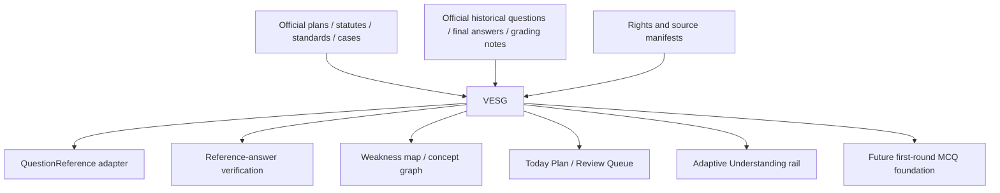

# 답안길 Versioned Exam Scope & Evidence Graph 마스터플랜 Addendum v10

## 공식 범위와 실제 기출을 하나의 검증 가능한 학습 지도에 결합하는 공통 인프라

이 문서는 기존 통합 마스터플랜 v8과 적응형 이해 레이어 v9를 대체하지 않는다.
v8의 `Professional Exam Reasoning OS`, `Exam Compiler`, 역사적 기출·권리·검증
계약과 v9의 이해 간극·다음 행동 rail을 연결하는 **공통 출제범위·근거·버전
인프라**를 추가한다.

내부 명칭은 다음과 같이 고정한다.

```text
Versioned Exam Scope & Evidence Graph
short name: VESG
한국어 제품·운영 표현: 버전형 시험범위·근거 그래프
```

VESG가 답해야 하는 질문은 다섯 가지다.

1. 목표 시험에서 **공식적으로 어디까지 출제 가능한가**.
2. 그 시험일에 **어떤 법령·기준·판례 상태로 답해야 하는가**.
3. 실제 기출에서 **무엇이 어떤 형태·배점·결합으로 관측됐는가**.
4. 아직 직접 출제되지 않았더라도 **어떤 인접 변형과 공식 미출제 범위를 방어해야 하는가**.
5. 제한된 시간에서 **무엇을 먼저, 어느 깊이까지 공부해야 하는가**.

> VESG는 평면적인 목차도, 단순 기출빈도표도, AI가 만든 출제예측표도 아니다.
> `공식 출제경계 × 시험일 규범 × 기출 관측 × 버전 교차 × 인접 변형 × 검증된 학습 우선순위`를 분리 보존한 뒤 필요할 때 결합하는 근거 그래프다.

이 문서만으로 다음을 승인하지 않는다.

- database schema, migration, RLS, API, runtime 또는 UI 변경
- 실제 기출 원문, 교재, 사설 모범답안 또는 강의자료의 수집·복제·재배포
- Owner 또는 외부 학습자의 실제 콘텐츠 처리
- 1차 learner-facing navigation, Adaptive MCQ runtime 또는 결제 활성화
- `official answer`, `official grading`, 확정 점수, 합격확률 또는 출제확률 표시
- AI 추출 결과의 무검토 자동 공개
- production telemetry, 외부 알림, 공개 기출 아카이브 또는 범용 시험 확장

실제 구현은 live authority를 다시 읽은 별도 Work에서 수행한다.

---

## 0. 한 페이지 결론

### 0.1 최종 제품 결정

현재 답안길에는 `QuestionReference`, source-rights registry, reference-answer
release gate, weakness mapping, Review Queue, Today Plan과 concept graph가 이미
각자의 역할을 가진다. 그러나 이들 위에서 다음을 일관되게 결정하는 단일
source of evidence가 부족하다.

```text
이 논점은 왜 시험범위인가?
어느 시험제도 구간의 기출인가?
당시 정답과 목표 시험일 정답은 같은가?
직접 출제됐나, 문제 해결에만 필요했나, 아직 미출제인가?
연관 논점을 어디까지 확장해야 하나?
우선순위 점수는 어떤 근거로 계산됐나?
```

VESG를 다음 계층에 둔다.



VESG는 위 계층의 학습판단을 대신하지 않는다. 다음의 **검증 가능한 입력**만 제공한다.

- canonical scope node
- official/derived/observed status
- applicable norm snapshot
- historical question linkage
- rights and source provenance
- current-validity status
- one-hop adjacent candidates
- explainable priority features
- confidence and human-review state

### 0.2 다섯 개의 범위 보기를 분리한다

| 보기 | 핵심 질문 | 절대 혼동하면 안 되는 것 |
| --- | --- | --- |
| `Official Scope` | 공식적으로 출제 가능한가 | 자주 출제됐는가 |
| `Target-Date Norm` | 목표 시험일에 무엇이 유효한가 | 과거 시험 당시 정답 |
| `Observed Exam` | 실제로 무엇이 출제됐는가 | 앞으로의 출제확률 |
| `Adjacent & Unobserved` | 미출제·변형 방어범위는 무엇인가 | 공식범위 밖의 무한 확장 |
| `Learning Priority` | 지금 무엇을 먼저 공부할까 | 범위 포함·제외 판정 |

따라서 최소한 다음 필드를 서로 분리한다.

```ts
type ScopeDecisionAxes = {
  scopeStatus: ScopeStatus;
  currentValidity: CurrentValidity;
  observationStatus: ObservationStatus;
  priorityScore: number | null;
  priorityTier: "A" | "B" | "C" | "D" | null;
  confidence: "low" | "medium" | "high";
};
```

`priorityScore`가 낮다고 시험범위에서 삭제하지 않는다.
`기출 관측 없음`을 `범위 밖`으로 바꾸지 않는다.
`최근 출제`를 `다음 시험 미출제`로 해석하지 않는다.

### 0.3 첫 구축 순서를 고정한다

```text
VESG1  감정평가실무 2013-2026
  ↓
VESG2  감정평가이론 + 감정평가 및 보상법규 2013-2026
  ↓
VESG3  1차 전 과목 2016-2026, 선택지 명제 단위
```

이 순서는 변경 가능한 추천이 아니라 이 addendum의 첫 구축 결정이다.

- 답안길의 현재 learner-facing 핵심은 2차이므로 실무를 먼저 완성한다.
- 실무에서 확립한 `문제 → 물음 → 처리단계 → 규범 → 결과` 파이프라인을 이론·법규에 확장한다.
- 1차는 Foundation data lane으로 구축하되 현재 권위가 허용하기 전에는 learner-facing runtime이나 navigation을 열지 않는다.
- 1차는 문제 단위가 아니라 **각 선택지의 독립 명제와 오류지점**까지 분해한다.

---

## 1. 연구 근거와 출처 정책

### 1.1 Owner 첨부 공식 출제영역의 역할

Owner가 제공한 과거 공식 출제영역 문서는 2차를 다음과 같은 상위 구조로 제시한다.

```text
감정평가실무
- 감정평가실무의 기초
- 물건별 감정평가
- 목적별 감정평가
- 감정평가의 응용

감정평가이론
- 감정평가의 원리
- 감정평가 방식
- 감정평가 방식의 응용

감정평가 및 보상법규
- 부동산 가격공시에 관한 법률
- 감정평가 및 감정평가사에 관한 법률
- 공익사업을 위한 토지 등의 취득 및 보상에 관한 법률
```

이 문서는 삭제하지 않는다. `HISTORICAL_OFFICIAL_SCOPE`로 보존하고 현행 공식 경계 및 각 기출의 세부 논점을 연결하는 root taxonomy로 사용한다.

다만 1차 관계법규에는 과거 법률명과 체계가 포함되어 있으므로 목표 시험의 현행 경계를 단독으로 결정하게 해서는 안 된다.

```text
과거 공식 출제영역
= 역사적 root 및 crosswalk 근거

목표연도 시행계획 + 시험일 현재 법령
= 현재 공식 경계의 최상위 근거
```

### 1.2 공식 웹 출처 레지스트리

VESG의 초기 source registry에는 최소한 다음 official-family를 둔다.

| Source family | 사용 목적 | 기본 권위 |
| --- | --- | --- |
| Q-Net 목표연도 시행계획 | 시험일, 과목, 적용기준, 시행조건 | `scope_authority=highest` |
| 감정평가법 시행령 제9조·별표 1 | 법정 시험과목과 시험방법 | `scope_authority=highest` |
| Q-Net 공식 기출문제 | 실제 출제 관측 | `exam_evidence=highest` |
| Q-Net 1차 최종정답 | 해당 회차 정답 | `answer_authority=highest_for_exam` |
| 공개된 2차 채점평·통계 | 요구 수준·오류·배점 해석 | `exam_evidence=high` |
| 국가법령정보센터 현행·연혁 | 시험일 법령과 버전 교차 | `answer_authority=highest` |
| 한국회계기준원 시행 중 K-IFRS·연혁 | 1차 회계의 목표일 기준 | `answer_authority=highest` |
| 국토교통부 감정평가 규칙·실무기준·업무요령 | 실무·이론의 공식 적용기준 | `answer_authority=high` |
| 대법원 판례 원문·공식 판례공보 | 법규 법리와 사실요소 | `answer_authority=high` |
| 법제처 법령해석·중토위 업무편람 | 공식 보충자료 | `answer_authority=medium_to_high` |
| 협회·사설 기본서·강의 | 용어·후보논점 발견 | `discovery_only` |

초기 공식 entry point:

- Q-Net 감정평가사 2026 시행공고: `https://q-net.or.kr/crf002.do?gId=60&gSite=L&id=crf00201`
- Q-Net 감정평가사 기출문제: `https://q-net.or.kr/cst003.do?gId=60&gSite=L&id=cst00309`
- 감정평가법 시행령: `https://www.law.go.kr/LSW/lsInfoP.do?chrClsCd=010202&lsiSeq=265547&urlMode=lsInfoP`
- 한국회계기준원 시행 중 기준서: `https://www.kasb.or.kr/front/board/ingAccountingList.do`
- 국토교통부 감정평가 실무기준 고시 검색: `https://www.molit.go.kr/USR/I0204/m_45/lst.jsp`
- 대법원 판례 검색 진입점: `https://portal.scourt.go.kr/pgp/index.on`

URL은 영구 식별자가 아니다. 각 수집물에는 retrieval time, issuer, title, publication/effective date, response hash와 원문 locator를 함께 저장한다.

### 1.3 출처는 하나의 서열이 아니라 세 축으로 평가한다

```ts
type SourceAuthority = {
  scopeAuthority: 0 | 1 | 2 | 3 | 4 | 5;
  answerAuthority: 0 | 1 | 2 | 3 | 4 | 5;
  examEvidence: 0 | 1 | 2 | 3 | 4 | 5;
};
```

Q-Net 기출문제는 `examEvidence`는 최고지만 현재 법령의 정답을 단독 확정하지 않는다. 현행 법령은 `answerAuthority`는 최고지만 실제 출제빈도를 말하지 않는다. 사설 기본서는 세부 목차를 발견하는 데 유용해도 공식 범위와 정답을 확정하지 않는다.

### 1.4 source-derived와 design inference를 구분한다

```text
SOURCE_EXPLICIT     원문이 직접 명시
SOURCE_DERIVED      공식 원문 적용에 필수인 하위항목
EXAM_OBSERVED       기출에서 직접 관측
REVIEWED_INFERENCE  검토자가 승인한 인접·분류 추론
MODEL_CANDIDATE     AI가 제안했으나 아직 미승인
```

`MODEL_CANDIDATE`는 learner-facing 범위, 정답, 우선순위 근거에 사용하지 않는다.

---

## 2. VESG의 5층 범위 모델

### 2.1 Layer 1 — Official Scope Boundary

목표 시험연도 시행계획과 시행령 별표를 이용해 공식 외곽선을 만든다.

```text
OfficialScope(targetExam)
= target-year plan
+ statutory subjects
+ official published scope taxonomy
```

이 층은 과목·법률·시험형식·적용기준과 공식 범위 밖 후보를 결정한다. 빈도·배점 중요도·예상 출제확률·답안 깊이·개인 학습순서는 결정하지 않는다.

외부 법령·기준은 다음 중 하나일 때만 `OFFICIAL_DERIVED`로 편입한다.

1. 대상 법령이 직접 준용한다.
2. 공식 기준이 적용요소로 직접 요구한다.
3. 기출 해결에 실제로 필요했고 현행 규범에서도 유지된다.
4. 판례가 대상 쟁점의 판단기준으로 직접 연결한다.

그 외에는 `RELATED_REFERENCE` edge만 만들고 공식 핵심범위를 무한 확장하지 않는다.

### 2.2 Layer 2 — Target-Date Norm Closure

목표 시험일 `D`에 유효한 정답 규범을 닫는다.

```text
TargetDateNormClosure(D)
= official scope
+ effective statutes / decrees / rules at D
+ effective K-IFRS at D
+ effective appraisal rules / practice standards at D
+ controlling cases and official guidance required by the issue
```

```ts
type NormVersion = {
  normVersionId: string;
  issuer: string;
  normType:
    | "statute"
    | "decree"
    | "rule"
    | "administrative_rule"
    | "accounting_standard"
    | "case"
    | "official_guidance";
  canonicalName: string;
  articleOrParagraph?: string;
  promulgatedAt?: string;
  validFrom: string;
  validTo?: string | null;
  sourceDocumentId: string;
  contentDigest: string;
};
```

공포일과 시행일을 분리한다. 시험일 이후 시행되는 개정은 `FUTURE_WATCH`로 두고 목표 정답에 선반영하지 않는다. 시험일 전에 시행되는 개정은 `TARGET_CURRENT`로 승격한다.

### 2.3 Layer 3 — Observed Exam Scope

기출을 연도별 PDF 묶음이 아니라 최소 출제단위로 분해한다.

```text
exam
→ subject
→ question
→ subquestion
→ point allocation
→ command verb
→ required judgment/calculation
→ core issue
→ supporting issue
→ applicable norm snapshot
→ answer status
```

1차는 한 단계 더 내려간다.

```text
question
→ option
→ proposition
→ true/false under exam-date norm
→ exact error point
→ current validity
→ trap type
```

기출에 직접 질문된 논점과 문제 해결에 필요했던 요소를 `OBSERVED_DIRECT`, `OBSERVED_COMPONENT`로 분리한다.

### 2.4 Layer 4 — Official-Unobserved & One-Hop Adjacent Scope

```text
OfficialUnobserved
= official current scope nodes without a verified question link

OneHopAdjacent
= reviewed single transformation from an observed unit
  that remains inside the official boundary
```

`OFFICIAL_UNOBSERVED`는 제거 대상이 아니라 신작 문제 방어범위다. 한 단계 이상 확장은 실제 공동출제, 동일 공식 규정의 직접 연결, 필수 선수개념, 판례·공식 기준의 직접 연결 중 하나가 없으면 금지한다.

### 2.5 Layer 5 — Explainable Learning Priority

우선순위는 범위 판정과 별개이며 출제확률이 아니라 **학습시간 배분점수**다.

입력 feature:

- 체제 보정 출제빈도
- 누적 문항노출 또는 배점
- 최근성
- 선수개념·교차과목 중심성
- 공식 정답·채점평 강조
- 개정·신설 위험
- 변형 가능성

```text
CorpusPriority(node, targetYear)
LearnerPriority(node, learnerEvidence, todayConstraints)
```

VESG는 전자만 산출한다. 후자는 기존 Today Plan·Review Queue policy가 authorized learner evidence와 결합해 계산한다.

---

## 3. 시간과 정답을 덮어쓰지 않는 버전 계약

### 3.1 과거 기출에는 두 정답 상태가 필요하다

```ts
type HistoricalAnswerBinding = {
  answerAsExamined: AnswerState;
  answerAsOfTargetDate: AnswerState;
  changeType: NormChangeType;
  reviewedAt: string;
  evidenceLinks: string[];
};
```

- `answerAsExamined`: 해당 시험일 당시 정답·법령·기준
- `answerAsOfTargetDate`: 목표 시험일에 같은 사실관계를 물었을 때의 정답

과거 정답을 현재 정답으로 덮어쓰지 않는다.

### 3.2 변경상태 코드

```ts
type NormChangeType =
  | "UNCHANGED"
  | "RENUMBERED"
  | "RENAMED"
  | "AMENDED_SAME_RESULT"
  | "ANSWER_CHANGED"
  | "SPLIT"
  | "MERGED"
  | "REPEALED"
  | "HISTORICAL_ONLY"
  | "OUTSIDE_CURRENT_SCOPE"
  | "REVIEW_REQUIRED";
```

### 3.3 Exam Regime

```ts
type ExamRegime = {
  regimeId: string;
  examMode: "first" | "second";
  subject: string;
  validFromExamYear: number;
  validToExamYear?: number | null;
  reason:
    | "subject_structure"
    | "statutory_framework"
    | "appraisal_rule_framework"
    | "accounting_standard_framework"
    | "scoring_or_format"
    | "reviewed_other";
  evidenceLinks: string[];
};
```

초기 engineering partition:

- 2차 주 분석: 2013-2026
- 1차 주 분석: 2016-2026
- 그 이전 자료는 삭제하지 않고 별도 historical regime으로 보존
- 법규·회계·실무는 실제 규범변경 검토 후 개별 question unit에 체제가중치 적용
- 이론의 안정된 개념은 오래된 문제라도 상대적으로 높은 재사용가치를 가질 수 있음

이 연도 경계는 그 이전이 시험범위 밖이라는 뜻이 아니라 첫 구축의 modern-regime corpus boundary다.

### 3.4 목표연도 snapshot

```text
TARGET_SCOPE_2027_DRAFT
→ 2027 시행계획 발표 시 official-plan diff
→ 시행 예정 규범의 effective-date resolution
→ TARGET_SCOPE_2027_CANDIDATE
→ 시험일 직전 final source check
→ TARGET_SCOPE_2027_FROZEN
```

snapshot은 immutable하다. 수정은 새 snapshot을 만들고 이전 snapshot과 diff를 보존한다.

---

## 4. 그래프 모델

### 4.1 노드 종류

```ts
type ScopeNodeType =
  | "SUBJECT"
  | "OFFICIAL_DOMAIN"
  | "TOPIC"
  | "ISSUE"
  | "CONCEPT"
  | "FORMULA"
  | "PROCEDURE_STEP"
  | "STATUTE"
  | "ARTICLE"
  | "STANDARD"
  | "CASE"
  | "QUESTION"
  | "QUESTION_UNIT"
  | "OPTION_PROPOSITION"
  | "ANSWER_PATTERN"
  | "TRAP"
  | "NORM_VERSION"
  | "EXAM_REGIME";
```

### 4.2 관계 종류

```ts
type ScopeEdgeType =
  | "IS_PART_OF"
  | "REQUIRES"
  | "APPLIES_TO"
  | "GOVERNED_BY"
  | "INTERPRETED_BY"
  | "CONTRASTS_WITH"
  | "EXCEPTION_TO"
  | "TESTED_BY"
  | "REQUIRED_TO_SOLVE"
  | "CO_OCCURS_WITH"
  | "CHANGED_TO"
  | "RENAMED_TO"
  | "SPLIT_INTO"
  | "MERGED_INTO"
  | "TRANSFORMS_TO"
  | "SUPPORTED_BY"
  | "RELATED_REFERENCE";
```

### 4.3 node 상태

```ts
type ScopeStatus =
  | "OFFICIAL_EXPLICIT"
  | "OFFICIAL_DERIVED"
  | "OFFICIAL_UNOBSERVED"
  | "PRIVATE_CANDIDATE"
  | "OUTSIDE_CURRENT_SCOPE";

type ObservationStatus =
  | "OBSERVED_DIRECT"
  | "OBSERVED_COMPONENT"
  | "ADJACENT_ONE_HOP"
  | "NOT_OBSERVED";

type CurrentValidity =
  | "TARGET_CURRENT"
  | "FUTURE_WATCH"
  | "HISTORICAL_ONLY"
  | "ANSWER_CHANGED"
  | "REPEALED"
  | "REVIEW_REQUIRED";
```

하나의 node가 `OFFICIAL_DERIVED + OBSERVED_COMPONENT + TARGET_CURRENT`처럼 여러 축을 동시에 가진다.

### 4.4 canonical label과 동의어

```ts
type ScopeLabel = {
  nodeId: string;
  label: string;
  labelType:
    | "canonical"
    | "official_alias"
    | "historical_alias"
    | "academy_alias"
    | "abbreviation";
  sourceId?: string;
  validFrom?: string;
  validTo?: string | null;
};
```

사설 명칭은 canonical node를 찾기 위한 alias일 뿐 공식성을 부여하지 않는다.

---

## 5. 제안 데이터 모델

이 절은 구현 DDL이 아니라 다음 Work가 지켜야 할 logical schema다.

### 5.1 `source_document`

```text
source_id
issuer
source_type
title
publication_date
effective_from
effective_to
retrieved_at
canonical_url
content_hash
mime_type
scope_authority
answer_authority
exam_evidence
rights_status
extraction_status
verification_status
```

### 5.2 `source_locator`

```text
locator_id
source_id
page
line_start
line_end
question_number
subquestion_number
option_number
article_number
paragraph_number
locator_label
```

### 5.3 `norm_version`

```text
norm_version_id
source_id
norm_name
article_number
paragraph_number
valid_from
valid_to
target_exam_year
status
content_digest
```

### 5.4 `scope_node`

```text
node_id
exam_vertical
exam_mode
subject
node_type
canonical_label
parent_node_id
scope_status
observation_status
current_validity
valid_from
valid_to
regime_id
confidence
review_status
```

### 5.5 `scope_edge`

```text
edge_id
from_node_id
to_node_id
relation_type
source_id
locator_id
confidence
review_status
```

### 5.6 `exam_question`

```text
exam_question_id
exam_year
exam_round
exam_date
exam_mode
subject
question_number
source_id
source_hash
rights_manifest_id
regime_id
```

### 5.7 `question_unit`

```text
question_unit_id
exam_question_id
subquestion_number
points
command_verb
required_output
fact_pattern_summary
core_issue_node_ids
supporting_issue_node_ids
original_norm_snapshot_id
answer_as_examined_status
target_answer_status
verification_status
```

### 5.8 `option_proposition`

```text
option_proposition_id
question_unit_id
option_number
proposition_summary
truth_as_examined
truth_as_target_date
exact_error_point
trap_type
norm_version_ids
verification_status
```

### 5.9 `version_crosswalk`

```text
crosswalk_id
old_node_id
new_node_id
change_type
change_summary
effective_date
answer_impact
source_id
review_status
```

### 5.10 `priority_snapshot`

```text
priority_snapshot_id
node_id
target_exam_year
model_version
frequency_score
mark_or_exposure_score
recency_score
centrality_score
grading_emphasis_score
change_risk_score
transformability_score
total_score
tier
explanation
calculated_at
```

### 5.11 `review_log`

```text
review_id
object_type
object_id
reviewer
decision
reason
evidence_links
reviewed_at
prior_version
new_version
```

### 5.12 `graph_build_snapshot`

```text
build_snapshot_id
target_exam_year
source_manifest_digest
taxonomy_version
norm_snapshot_digest
graph_digest
priority_model_version
built_at
validation_result
supersedes_snapshot_id
```

---

## 6. 기존 답안길 계약과의 호환

### 6.1 `QuestionReference`를 폐기하지 않는다

현재 `QuestionReference`의 다음 값은 유지한다.

```text
id
examYear
examRound
examMode
subject
topicTags
issueTags
conceptTags
skeletonId
sourceRightsStatus
rawTextAvailable
rawTextStoragePolicy
citationLabel
createdAt
updatedAt
```

VESG는 이를 대체하기보다 canonical linkage를 제공한다.

```ts
type QuestionReferenceVESGLink = {
  questionReferenceId: string;
  examQuestionId: string;
  questionUnitIds: string[];
  scopeNodeIds: string[];
  examRegimeId: string;
  normSnapshotId: string;
  sourceDocumentId: string;
  rightsManifestId: string;
  graphSnapshotId: string;
};
```

기존 free-text tag는 검색과 backward compatibility에 남기되 공식 범위·현행성·우선순위의 source of truth로 사용하지 않는다.

### 6.2 source-rights registry가 먼저다

공식 공개파일이라도 재배포권을 자동 가정하지 않는다.

```text
rights clear for full text
→ authorized private/full-text path

rights unclear
→ metadata, locator, hash and deep link only

third-party textbook/model answer/academy material
→ no ingestion without license
```

VESG core graph에는 raw question body가 없어도 된다. canonical node, question identifier, source locator, extraction hash, derived non-expressive labels과 검증 상태만으로 구축 가능해야 한다.

### 6.3 reference answer와 분리

```text
question verification
≠ answer verification
≠ grading authority
```

법규 답안은 question exam date의 norm과 target date의 norm을 각각 연결한다. 실무 계산은 별도 independent recalculation 및 unit check를 통과해야 한다.

### 6.4 mastery와 분리

```text
많이 출제된 논점
≠ 사용자가 숙달한 논점

그래프 중심성이 높은 논점
≠ 사용자에게 오늘 반드시 필요한 논점
```

Today Plan은 VESG feature와 실제 learner evidence를 기존 policy에서 결합한다.

---

## 7. 과목별 최소 분석단위

### 7.1 감정평가실무

공식 root는 `기초 / 물건별 / 목적별 / 응용`으로 유지한다. 각 question unit은 다음 조합으로 분해한다.

```text
대상물건
× 평가목적
× 평가방식
× 평가절차
× 자료처리
× 평가조건
× 기준시점
× 특수쟁점
× 법령·실무기준
× 요구 결과물
```

필수 추출:

- 문제와 각 물음
- 물음별 배점
- 요구된 판단·계산·서술
- 사용·배제할 자료
- 처리방침
- 필수 계산순서와 중간단계
- 단위·반올림·시점
- 다른 방식에 의한 합리성 검토
- 함정자료와 누락자료
- 관련 이론·법규 node
- 당시 norm과 목표 norm의 차이

실무의 최소 단위는 숫자 하나가 아니라 **하나의 판단 또는 계산결과를 만들어내는 완결된 처리단계**다.

### 7.2 감정평가이론

```text
공식 root
× 핵심개념
× 이론계열
× 관련 평가방식
× 비교대상
× 논술명령
× 실무연결
× 비판·한계
× 개선방안
```

논술명령은 정의·설명·구별·비교·논함·검토·비판·타당성 평가·적용방안·문제점 및 개선으로 독립 저장한다. 동일 개념의 설명형·비교형·비판형·실무적용형을 별도 observed pattern으로 본다.

### 7.3 감정평가 및 보상법규

```text
대상 법률
→ 조문
→ 쟁점
→ 행정법 일반법리
→ 판례
→ 핵심 사실요소
→ 사안 적용
→ 결론
→ 권리구제수단
```

처분성, 원고·피고적격, 소송형태, 제소기간, 원처분·재결 관계, 재량·기속, 하자와 승계, 보상항목 요건, 보상기준·기준시점, 증감청구 구조, 판례 결론을 바꾼 사실과 반대사안의 조건을 별도 태그로 둔다. 판례 제목이나 결론만 저장하지 않고 `decisive_fact_tags`를 검토한다.

### 7.4 1차 공통

```text
question
→ option proposition
→ 참/거짓
→ 정확한 오류지점
→ 근거 조문·기준서·공식
→ 함정 유형
→ 당시와 목표일 결론
```

공통 trap taxonomy:

- 주체 변경
- 원칙·예외 전환
- 필요조건·충분조건 혼동
- 기간·금액·비율 변경
- 항상·원칙적으로·예외적으로의 강도 변경
- 요건·효과 혼동
- 인식·측정·표시 단계 혼동
- 명목·실질 혼동
- 유량·저량 혼동
- 방향·부호·그래프 이동 혼동

### 7.5 1차 과목별 축

| 과목 | 최소 분해축 |
| --- | --- |
| 민법 | 편·장·절, 조문, 요건, 효과, 판례법리, 예외, 함정 |
| 경제학 | 모형, 가정, 변수, 그래프, 수식, 비교정태, 정책변화, 계산 |
| 회계학 | K-IFRS 기준서, 인식, 측정, 표시, 공시, 분개, 계산, 오류 |
| 관계법규 | 법률, 조문, 시행령·규칙, 주체, 요건, 절차, 기한, 예외, 제재 |
| 부동산학원론 | 영역, 개념, 모형, 공식, 정책수단, 사례, 계산 |

회계학은 기준서명뿐 아니라 기준서 버전과 effective interval을 연결한다.

---

## 8. one-hop 변형과 공식 미출제 방어

AI는 변형 후보를 만들 수 있지만 승격 조건은 다음과 같다.

```text
inside official boundary
AND exactly one reviewed transformation
AND non-duplicate
AND independent learning value
AND source-linked rationale
```

### 8.1 1차 변형축

- 주체 변경
- 요건 하나 변경
- 원칙·예외 전환
- 기간·비율·금액 변경
- 정문·오문 전환
- 판례 핵심 사실 변경
- 계산변수 변경
- 두 개념 결합

### 8.2 실무 변형축

- 대상물건
- 평가목적
- 적용방식
- 기준시점
- 자료의 추가·누락
- 평가조건
- 일부·일괄
- 정상·특수상황
- 일반·보상·담보·경매의 목적 결합

### 8.3 이론 변형축

- 설명 → 비교
- 비교 → 비판
- 개념 → 실무적용
- 단일이론 → 상충이론 조정
- 장점 → 한계·개선
- 방식 단독 → 시장가치·최유효이용 등과 결합

### 8.4 법규 변형축

- 처분 단계
- 청구인·피고·재결기관
- 소송형태
- 절차하자·실체하자
- 구제수단
- 원처분·재결
- 보상항목·행정법 일반이론 결합
- 판례 결정적 사실 변경

`TRANSFORMS_TO` edge는 기본적으로 한 hop이다. 두 hop 이상은 공식 직접근거, 공동출제, 필수 선수관계 또는 판례의 직접 연결 중 하나가 있어야 한다.

---

## 9. 학습 우선순위 모델

### 9.1 초기 corpus score

```text
Priority
= 0.25F
+ 0.20M
+ 0.15R
+ 0.15C
+ 0.10G
+ 0.10Δ
+ 0.05T
```

| 기호 | 의미 |
| --- | --- |
| `F` | exam-regime 보정 출제빈도 |
| `M` | 1차 문항·선지노출 또는 2차 배점 |
| `R` | 최근성 |
| `C` | 선수·교차과목 graph 중심성 |
| `G` | 공식 최종정답·채점평 강조 |
| `Δ` | 개정·신설·기준변경 위험 |
| `T` | reviewed transformability |

초기값일 뿐 최종 모델이 아니다. walk-forward backtest를 통과한 과목별 weight만 채택한다.

### 9.2 최근성

```text
recency = 2 ^ (-elapsedYears / halfLife) × regimeWeight
```

초기 후보:

- 1차 half-life: 5년
- 2차 half-life: 8년
- current regime: 1.00
- transition regime: 0.65
- historical regime: 0.25

실제 값은 과목별 backtest로 조정한다.

### 9.3 범위 최저선

| tier | 의미 |
| --- | --- |
| A | 반복·고배점·중심·현행 중요 |
| B | 빈번한 변형 또는 필수 선수 |
| C | 공식 범위이나 저빈도·미출제 |
| D | 역사적·보조·후보 |
| Excluded | 현행 공식 경계 밖 |

강제규칙:

- `OFFICIAL_EXPLICIT`, `OFFICIAL_DERIVED`, `OFFICIAL_UNOBSERVED`는 C 아래로 내려가지 않는다.
- 최근 개정은 관측 0이어도 `CHANGE_WATCH` 가산 가능하다.
- 사설 자료에만 존재하면 `PRIVATE_CANDIDATE`이며 자동 승격하지 않는다.
- 작년 출제됐다는 이유로 감점하지 않는다.
- 오래 미출제됐다는 이유로 자동 가산하지 않는다.

허용 표현은 `A등급 — 공식범위, 현행체제 3회, 누적 45점, 교차과목 선수, 최근 개정 검토` 같은 근거 설명이다. `다음 시험 출제확률 82%`, `올해 반드시 출제`, `작년에 나와서 올해는 안 나옴`은 금지한다.

---

## 10. backtest와 모델 선택

### 10.1 walk-forward only

```text
data through year N
→ build priority snapshot
→ compare with actual exam N+1
→ repeat
```

2022년을 평가할 때 2022년 이후 데이터는 사용할 수 없다.

### 10.2 기준모형

- 공식 목차만
- 단순 누적빈도
- 최근 5개년
- 최근 출제연도
- VESG full model

### 10.3 1차 평가

- 상위 A/B node가 다음 해 문항·선지를 포괄한 비율
- 상위 20% 범위의 전체 문항 설명력
- 신규 option trap 포착률
- official-unobserved 신작 방어율
- 동일 공부량에서 놓친 문항수

### 10.4 2차 평가

- 다음 해 실제 배점 중 A/B 포괄비율
- 인접 변형이 신규 세부물음을 포착한 비율
- 대분류만 맞고 세부요구를 놓친 비율
- 변경된 법령·기준을 낡은 정답으로 제시한 건수
- 범위 압축 시 놓친 배점

### 10.5 목적함수

```text
minimize:
  missed_actual_marks
+ stale_answer_risk × high_penalty
+ official_scope_omission × high_penalty
+ unnecessary_scope_expansion
```

낡은 정답과 공식 범위 누락의 비용을 불필요한 추가범위보다 크게 둔다.

---

## 11. ingestion·검토 파이프라인

```text
source discovery
→ authority and rights gate
→ exact-byte acquisition / hash
→ text and layout extraction
→ question / subquestion / option segmentation
→ candidate taxonomy mapping
→ norm-version binding
→ human review
→ graph build
→ deterministic validation
→ immutable snapshot
→ read adapter
```

### 11.1 source acquisition

issuer, official title, canonical URL, retrieved timestamp, original filename, MIME, byte length, SHA-256, publication/effective date, rights status를 저장한다. 원문 byte를 보존할 권리가 불명확하면 hash·locator·metadata만 보존한다.

### 11.2 extraction

가능한 경우 text layer를 우선하고 OCR은 최후수단이다. 표·수식·도면·각주가 있는 페이지는 page image 검토가 필요하다.

```text
EXACT_TEXT
NORMALIZED_TEXT
OCR_CANDIDATE
MANUAL_CORRECTION
```

원문과 수정문을 덮어쓰지 않고 lineage를 보존한다.

### 11.3 segmentation

- 2차: 문제 → 물음 → 배점 → 요구동사 → 처리·논증단계
- 1차: 문제 → 각 선택지 → 독립 명제 → 오류지점
- 표·조건·공통자료는 여러 unit이 참조하는 shared fact block으로 분리
- question number와 page locator 필수

### 11.4 candidate mapping 및 review

AI는 canonical node, alias, command verb, trap, norm citation, adjacent transform 후보를 제시할 수 있으나 `MODEL_CANDIDATE`로 시작한다.

```text
Review A: 원문을 보며 분류
Review B: 기존 분류를 가리고 근거만으로 재판단
```

불일치 시 `CONFLICT`로 남기며 자동 공개하지 않는다. 법규·회계·실무 norm change는 subject validator review가 필수다.

### 11.5 snapshot build

동일 source manifest와 model version에서 동일 graph digest가 나와야 한다. 비결정적 LLM 출력은 snapshot builder의 직접 입력이 될 수 없고 승인된 structured records만 build input으로 사용한다.

---

## 12. 정확성·권리·완전성 게이트

### 12.1 기출 완전성

```text
orphan_exam_question = 0
unallocated_second_round_points = 0
unsegmented_first_round_option = 0
missing_question_source_locator = 0
```

### 12.2 근거 추적성

```text
official_node_without_evidence = 0
current_answer_without_norm_version = 0
edge_without_reason_or_evidence = 0
learner_visible_model_candidate = 0
```

### 12.3 현행성

```text
law_question_without_exam_date_binding = 0
accounting_question_without_standard_version = 0
changed_answer_not_flagged = 0
future_norm_applied_before_effective_date = 0
```

### 12.4 rights

```text
uncleared_raw_text_in_global_graph = 0
third_party_full_text_without_license = 0
public_availability_treated_as_redistribution_right = 0
```

### 12.5 graph integrity

```text
unknown_node_reference = 0
duplicate_canonical_node = 0 after reviewed alias merge
parent_cycle = 0
invalid_version_interval = 0
cross-regime_link_without_crosswalk = 0
```

### 12.6 priority integrity

```text
priority_without_feature_breakdown = 0
official_node_below_floor = 0
future_data_leakage_in_backtest = 0
probability_claim_from_priority = 0
```

### 12.7 release state

```ts
type GraphReleaseState =
  | "DRAFT"
  | "SOURCE_VERIFIED"
  | "SUBJECT_REVIEWED"
  | "NORM_BOUND"
  | "BACKTESTED"
  | "OWNER_PRIVATE_READY"
  | "BLOCKED";
```

각 단계는 앞 단계를 모두 만족해야 한다.

---

## 13. 사용자 경험 연결

### 13.1 논점 카드

```text
논점명
공식 범위 상태
공식 분류 경로
현행 기준일
관련 법령·기준
직접/구성요소/미출제 상태
출제 연도·문제·물음
누적 배점 또는 선지노출
요구행위
함께 출제된 논점
당시 정답과 현재 정답 차이
one-hop 변형
선수개념
우선순위와 산출근거
source / rights / review status
```

### 13.2 Today Plan

```text
VESG corpus priority
+ learner gap evidence
+ due review
+ available time
+ assistance/exposure status
+ subject balance
```

VESG만으로 Today task를 선택하지 않는다.

### 13.3 Adaptive Understanding rail

v9 rail은 canonical node가 검증된 경우 선수개념, 비교 node, 한 단계 조건 변경, related historical-question metadata, 현재 norm과 과거 norm의 차이를 제안할 수 있다. 미검토 `MODEL_CANDIDATE`는 노출하지 않는다.

### 13.4 Evidence Review

Evidence Review는 연결된 공식 범위, 참조 기출 unit, 적용 norm snapshot, reference-answer verification state, 불확실성·충돌을 provenance로 읽을 수 있다.

### 13.5 1차 Foundation

VESG3가 완성돼도 learner-facing 1차 runtime은 자동 활성화되지 않는다. option-level taxonomy, current-answer binding, trap taxonomy, future adaptive-item metadata, held-out contamination-safe split만 준비하며 별도 권위 전에는 navigation·pricing·runtime을 열지 않는다.

---

## 14. 첫 구축 프로그램

### VESG0 — Source Contract & Root Taxonomy

목표:

- source authority matrix 확정
- rights policy와 locator 규칙 확정
- Owner 첨부 과거 공식 출제영역을 historical root로 변환
- 목표연도 official scope root 생성
- node/edge/status enum 및 deterministic ID 규칙 확정

필수 산출물:

```text
source-contract.md
source-manifest.schema
root-taxonomy fixture
norm-version schema
rights matrix
deterministic validation fixture
```

통과조건은 공식 root 전체 source locator, 과거·현행 명칭 crosswalk, 권리 불명확 raw text의 metadata-only 처리, runtime·schema mutation 0이다.

### VESG1 — 감정평가실무 2013-2026

이것이 첫 실제 corpus build다.

```text
official source inventory
→ exact question manifest
→ year/subject/question verification
→ subquestion and points segmentation
→ procedure-step decomposition
→ object/purpose/method/condition/norm mapping
→ target-date norm crosswalk
→ review
→ graph snapshot
```

필수 산출물:

- 2013-2026 official question inventory
- question/subquestion/points registry
- practical procedure-step taxonomy
- object × purpose × method matrix
- applicable norm-version links
- historical/current answer-change flags
- official-unobserved practical nodes
- one-hop practical transform candidates
- rights-safe QuestionReference adapter fixture

완료 gate:

```text
all available official practical questions accounted for
all subquestion points allocated
all unit nodes source-linked
all legal/standard-dependent units norm-bound
no unreviewed candidate learner-visible
```

### VESG2 — 감정평가이론·법규 2013-2026

이론은 concept, command verb, comparison target, practical linkage, criticism/limitation/improvement pattern을 추출한다.

법규는 statute/article, issue, administrative-law doctrine, decisive case facts, application, remedy, exam-date and target-date answer를 추출한다.

필수 산출물:

- theory concept × command matrix
- law issue × doctrine × remedy matrix
- case decisive-fact registry
- norm-version and crosswalk coverage
- cross-subject edges to practical
- official-unobserved and one-hop candidates

완료 gate:

```text
theory question units command-tagged
law units exam-date norm-bound
changed/repealed law results explicitly flagged
case conclusion never stored without decisive facts
```

### VESG3 — 1차 2016-2026 선택지 명제 단위

과목은 민법, 경제학원론, 회계학, 감정평가 관계법규, 부동산학원론이다.

```text
question
→ five options
→ proposition
→ answer as examined
→ exact error point
→ current answer
→ trap
→ canonical node
```

필수 산출물:

- all questions and options inventory
- official final-answer binding
- option proposition registry
- subject-specific taxonomy
- K-IFRS version links
- law version links
- trap corpus
- held-out-safe dataset partition metadata

완료 gate:

```text
unsegmented_option = 0
option_without_exam_answer = 0
law_or_accounting_option_without_target-date review = 0
current learner-facing first-round activation = 0
```

### VESG4 — Current Norm Closure & Crosswalk

- 2027 draft target snapshot
- law/rule/standard version intervals
- historical-to-current node crosswalk
- changed-answer review queue
- future-effective watch

### VESG5 — Priority & Backtest

- subject-specific feature extraction
- walk-forward evaluation
- baseline comparison
- tier floors
- explainability output
- leakage tests

### VESG6 — Read Adapters

별도 authorized Work에서만 `QuestionReference` linkage, weakness/concept graph, Today Plan, Evidence Review provenance panel, v9 understanding rail, future first-round Foundation adapter를 검토한다. 그래프가 unavailable하거나 stale하면 기존 안전한 fallback을 유지한다.

### VESG7 — Owner-private Evaluation

synthetic 또는 rights-cleared fixtures만 사용해 known historical-question lookup, old/current answer distinction, official-unobserved visibility, one-hop boundary, source provenance, priority explanation, stale-snapshot refusal, rights-safe output을 검증한다. Real content, Production, external learner, public archive는 별도 gate다.

---

## 15. 구현 작업 단위와 의존성

```text
VESG0
  └─ VESG1
       └─ VESG2
            └─ VESG3
                 ├─ VESG4
                 └─ VESG5
                      └─ VESG6
                           └─ VESG7
```

병렬화 허용:

- VESG1 내부의 source inventory와 taxonomy candidate discovery
- VESG2 이론·법규 extraction 초안
- VESG3 과목별 extraction 초안

병렬화 금지:

- 서로 다른 worker가 canonical node를 독립 확정
- norm crosswalk review 없이 current answer 공개
- rights gate 전에 raw file ingest
- backtest 전에 priority weights 확정
- VESG3 완료를 1차 runtime 승인으로 해석

---

## 16. deterministic identifier 규칙

ID에 learner data나 원문 표현을 넣지 않는다.

```text
src_<issuer>_<doc-family>_<date>_<digest8>
reg_<exam-mode>_<subject>_<from-year>
node_<exam>_<subject>_<type>_<stable-slug>_<digest6>
q_<exam>_<year>_<subject>_<number>
qu_<question-id>_<subquestion>
opt_<question-id>_<option>
norm_<family>_<effective-date>_<digest8>
snap_<target-year>_<taxonomy-version>_<digest8>
```

동일 의미의 alias가 생겨도 canonical node ID를 재발급하지 않고 alias와 merge record를 추가한다. 잘못된 merge는 새 graph snapshot에서 되돌리고 이전 snapshot을 보존한다.

---

## 17. 운영·갱신 주기

### 목표연도 계획 발표 시

1. 목표연도 시행계획 수집·hash
2. 전년도 plan과 diff
3. 과목·법률·적용기준 변화 검토
4. `TARGET_SCOPE_*_DRAFT` 갱신
5. unresolved change는 `BLOCKED`

### 법령·기준 변경 시

1. 공포와 시행일 분리 기록
2. 영향 node와 historical questions 계산
3. `ANSWER_CHANGED` 후보 생성
4. subject validator review
5. 새 norm snapshot 발행
6. affected reference answers 재검증 queue

### 새 기출 공개 시

1. official source와 hash
2. rights gate
3. question/unit/option 분해
4. 기존 node 매핑 및 신규후보
5. priority feature 재계산
6. backtest dataset에는 해당 연도 이후 evaluation부터 사용

### 정정답·채점평 공개 시

기존 question source와 별도 source document로 저장하고 answer binding과 grading emphasis를 업데이트한다. 원래 가답안·기존 snapshot을 삭제하지 않는다.

---

## 18. 주요 위험과 방어

| 위험 | 방어 |
| --- | --- |
| 기출에 없으면 범위 밖 처리 | `OFFICIAL_UNOBSERVED` 강제 상태 |
| 오래된 정답을 현재 답으로 사용 | dual answer + norm interval |
| AI가 과도한 세부범위 생성 | model candidate + one-hop + review |
| 빈도를 출제확률로 오해 | priority/probability 분리, 확률표시 금지 |
| 사설 목차가 공식범위로 승격 | discovery-only authority |
| 공개파일을 자유재배포로 오해 | rights manifest first |
| 1차 구축이 제품 노출로 이어짐 | Foundation/runtime gate 분리 |
| canonical taxonomy 중복 | stable ID + alias + merge review |
| 법령 공포일을 시행일로 오해 | separate promulgated/effective fields |
| backtest에 미래정보 유출 | walk-forward and snapshot freeze |
| 그래프 failure가 학습 흐름 중단 | read-only adapter + safe fallback |
| raw learner data와 corpus graph 혼합 | separate stores and identifiers |

---

## 19. 비목표

VESG는 공식 출제위원 syllabus, 공식 모범답안·채점기준, 합격확률·점수예측·출제확률 엔진, 교재·강의·사설 문제 통합 아카이브, raw learner notebook 저장소, 범용 지식그래프, social graph, 자동 mastery 원장 또는 AI가 독자적으로 개정법을 판단하는 시스템이 아니다.

---

## 20. Owner 결정으로 고정하는 항목

1. 공통 인프라 이름은 **Versioned Exam Scope & Evidence Graph**다.
2. v8·v9 위에 additive common infrastructure로 둔다.
3. 공식 범위·현행 정답·기출 관측·인접범위·우선순위를 분리한다.
4. 과거 기출은 `answer_as_examined`와 `answer_as_of_target_date`를 함께 보존한다.
5. 기출 미관측은 범위 밖이 아니다.
6. 변형은 기본 one-hop이다.
7. 1차는 선택지 명제 단위로 분해한다.
8. 2차는 물음·배점·요구행위·처리/논증단계로 분해한다.
9. 모든 법령·기준은 effective interval을 가진다.
10. priority는 학습시간 배분점수이며 출제확률이 아니다.
11. 공식 node에는 C-tier floor를 둔다.
12. 사설 자료는 discovery-only다.
13. raw text는 rights manifest를 통과한 경우에만 authorized store에 둔다.
14. 기존 `QuestionReference`와 source-rights 계약을 폐기하지 않는다.
15. 첫 구축은 **실무 2013-2026 → 이론·법규 2013-2026 → 1차 2016-2026 선택지 단위** 순서다.
16. 1차 corpus 구축은 learner-facing runtime 승인이 아니다.
17. 실제 schema·migration·ingestion·runtime은 별도 Work가 필요하다.
18. 모든 release는 source manifest, graph digest, norm snapshot과 검증결과를 가진 immutable snapshot이다.

---

## 21. Definition of Done

전략 단계 완료:

- 이 문서가 repository에 versioned strategy addendum으로 존재
- v8/v9와의 관계, non-authorization, 첫 구축 순서가 명확
- source, rights, version, graph, priority, backtest, quality gate가 정의됨

VESG0 완료:

- source authority·rights·ID·status schema 승인
- historical official root와 current official root crosswalk
- deterministic fixtures 통과

VESG1 완료:

- 감정평가실무 2013-2026 공식 기출 inventory
- 모든 물음·배점·처리단계 연결
- norm-dependent unit의 버전 binding
- orphan·unallocated point 0

VESG2 완료:

- 이론·법규 2013-2026 unit graph
- 이론 command와 법규 remedy/case-fact 구조
- changed-answer flag 검토
- cross-subject edges 검증

VESG3 완료:

- 1차 2016-2026 모든 문제·선지 명제화
- official final answer와 target-date review
- trap taxonomy
- learner-facing first-round activation 0

공통 release 완료:

- source provenance 100%
- 공식 node evidence 100%
- rights violation 0
- stale/future norm 오적용 0
- future-data leakage 0
- unreviewed model candidate learner exposure 0
- reproducible graph digest
- Owner-private read evaluation 통과

---

## 22. 최종 제품 문장

> **답안길은 공식 출제영역을 외곽선으로, 시험일 현재 규범을 정답 기준으로, 역대 기출의 물음·선택지를 실제 관측으로, 공식 미출제와 한 단계 변형을 불의타 방어범위로, 검증된 빈도·배점·최근성·중심성을 학습 우선순위로 분리해 보존하는 Versioned Exam Scope & Evidence Graph를 공통 인프라로 사용한다. 첫 구축은 감정평가실무 2013-2026, 감정평가이론·법규 2013-2026, 1차 2016-2026 선택지 명제 순으로 진행한다.**
